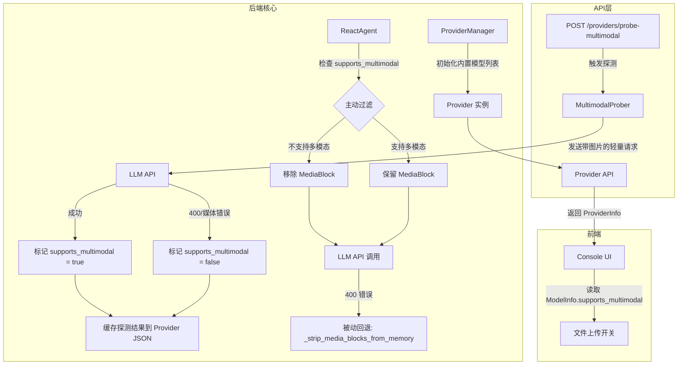

# 设计文档：多模态模型支持

## 概述

本设计为 CoPaw 引入主动的多模态能力标识系统。当前系统仅在模型返回 400 错误后被动剥离媒体内容块（`_reasoning` / `_summarizing` 中的 fallback 逻辑）。本方案在 `ModelInfo` 上新增 `supports_multimodal` 布尔字段，使系统在发送请求前即可判断模型能力，实现：

1. 后端 `ReactAgent` 在构建请求前主动过滤不支持的媒体块
2. 前端根据当前模型能力自适应 UI（禁用/启用文件上传）
3. 通过主动探测（probe）自动检测模型的多模态能力，无需手动维护映射表
4. 保留现有被动回退逻辑作为兜底安全网

核心设计原则：**默认安全**（`supports_multimodal` 默认 `false`），**渐进增强**（主动过滤 + 被动回退双层保障），**自动探测**（通过发送带图片/视频的轻量请求自动检测能力，支持在配置页面手动触发）。

## 架构



### 数据流

1. `ProviderManager` 初始化时，内置模型的 `supports_multimodal` 默认为 `false`（未探测状态）
2. 用户激活模型或手动触发探测时，`MultimodalProber` 向模型发送一个带 1x1 像素图片的轻量请求
3. 根据模型响应自动设置 `supports_multimodal`，结果缓存到供应商 JSON 文件
4. 前端通过 `GET /providers` 获取包含 `supports_multimodal` 的 `ModelInfo`
5. 用户发送消息时，`ReactAgent` 检查当前模型的 `supports_multimodal`：
   - `false`：在构建请求前移除所有 `image`/`audio`/`video` 类型的内容块
   - `true`：保留所有媒体块
6. 若标记为 `true` 的模型仍然报错，现有被动回退逻辑兜底处理

## 组件与接口

### 1. ModelInfo 扩展（后端 Python）

**文件**: `src/copaw/providers/models.py` 和 `src/copaw/providers/provider.py`

两处 `ModelInfo` 类均新增字段：

```python
class ModelInfo(BaseModel):
    id: str = Field(..., description="Model identifier used in API calls")
    name: str = Field(..., description="Human-readable model name")
    supports_multimodal: bool = Field(
        default=False,
        description="Whether this model supports multimodal input (image/audio/video). "
        "Composite flag: true if any media type is supported.",
    )
    supports_image: bool = Field(
        default=False,
        description="Whether this model supports image input",
    )
    supports_video: bool = Field(
        default=False,
        description="Whether this model supports video input",
    )
```

`supports_multimodal` 是复合标志：当 `supports_image` 或 `supports_video` 任一为 `true` 时，`supports_multimodal` 也为 `true`。ReactAgent 的主动过滤逻辑使用 `supports_multimodal` 做快速判断，前端可根据细粒度字段决定允许上传的文件类型。

**设计决策**: `provider.py` 和 `models.py` 中存在两个 `ModelInfo` 定义。为保持向后兼容和最小改动，两处同步添加字段。长期建议统一为单一定义。

### 2. 多模态能力探测器

**文件**: `src/copaw/providers/multimodal_prober.py`（新建）

通过向模型发送带最小媒体内容的轻量请求来主动探测多模态能力。分别探测图片和视频支持，复用现有 `check_model_connection` 的模式。

```python
"""Multimodal capability probing for models."""

import logging
from dataclasses import dataclass

from openai import APIError, AsyncOpenAI

logger = logging.getLogger(__name__)

# 1x1 transparent PNG (67 bytes), used as minimal probe image
_PROBE_IMAGE_B64 = (
    "iVBORw0KGgoAAAANSUhEUgAAAAEAAAABCAYAAAAfFcSJAAAADUlEQVR4"
    "nGNgYPgPAAEDAQAIicLsAAAAASUVORK5CYII="
)

# Minimal 1-frame MP4 (~200 bytes), used as minimal probe video
_PROBE_VIDEO_B64 = "AAAAIGZ0eXBpc29tAAACAGlzb21pc28yYXZjMW1wNDE..."


@dataclass
class ProbeResult:
    """Result of multimodal capability probing."""
    supports_image: bool = False
    supports_video: bool = False
    image_message: str = ""
    video_message: str = ""

    @property
    def supports_multimodal(self) -> bool:
        return self.supports_image or self.supports_video


async def probe_image_support(
    base_url: str, api_key: str, model_id: str, timeout: float = 10,
) -> tuple[bool, str]:
    """Probe image support by sending a 1x1 PNG."""
    client = AsyncOpenAI(base_url=base_url, api_key=api_key, timeout=timeout)
    try:
        res = await client.chat.completions.create(
            model=model_id,
            messages=[{
                "role": "user",
                "content": [
                    {"type": "image_url", "image_url": {
                        "url": f"data:image/png;base64,{_PROBE_IMAGE_B64}",
                    }},
                    {"type": "text", "text": "hi"},
                ],
            }],
            max_tokens=1, stream=True, timeout=timeout,
        )
        async for _ in res:
            break
        return True, "Image supported"
    except APIError as e:
        if e.status_code == 400 or _is_media_keyword_error(e):
            return False, f"Image not supported: {e}"
        return False, f"Probe inconclusive: {e}"
    except Exception as e:
        return False, f"Probe failed: {e}"


async def probe_video_support(
    base_url: str, api_key: str, model_id: str, timeout: float = 10,
) -> tuple[bool, str]:
    """Probe video support by sending a minimal video."""
    client = AsyncOpenAI(base_url=base_url, api_key=api_key, timeout=timeout)
    try:
        res = await client.chat.completions.create(
            model=model_id,
            messages=[{
                "role": "user",
                "content": [
                    {"type": "video_url", "video_url": {
                        "url": f"data:video/mp4;base64,{_PROBE_VIDEO_B64}",
                    }},
                    {"type": "text", "text": "hi"},
                ],
            }],
            max_tokens=1, stream=True, timeout=timeout,
        )
        async for _ in res:
            break
        return True, "Video supported"
    except APIError as e:
        if e.status_code == 400 or _is_media_keyword_error(e):
            return False, f"Video not supported: {e}"
        return False, f"Probe inconclusive: {e}"
    except Exception as e:
        return False, f"Probe failed: {e}"


async def probe_multimodal_support(
    base_url: str, api_key: str, model_id: str, timeout: float = 10,
) -> ProbeResult:
    """Probe all multimodal capabilities (image + video)."""
    img_ok, img_msg = await probe_image_support(
        base_url, api_key, model_id, timeout,
    )
    vid_ok, vid_msg = await probe_video_support(
        base_url, api_key, model_id, timeout,
    )
    return ProbeResult(
        supports_image=img_ok, supports_video=vid_ok,
        image_message=img_msg, video_message=vid_msg,
    )


def _is_media_keyword_error(exc: Exception) -> bool:
    error_str = str(exc).lower()
    keywords = ["image", "video", "vision", "multimodal", "image_url",
                "video_url", "does not support"]
    return any(kw in error_str for kw in keywords)
```

探测时机：
- **模型激活时**：用户通过 `activate_model` API 切换模型时，若该模型尚未探测过，自动触发异步探测
- **手动触发**：新增 API 端点 `POST /providers/{id}/models/{model_id}/probe-multimodal` 允许用户手动触发探测
- **模型发现时**：`fetch_models` 返回新模型后，可选择批量探测

### 3. Provider 集成探测逻辑

**文件**: `src/copaw/providers/provider.py`

在 `Provider` 基类新增探测方法：

```python
async def probe_model_multimodal(
    self,
    model_id: str,
    timeout: float = 10,
) -> tuple[bool, str]:
    """Probe if a model supports multimodal input.

    Default implementation returns (False, "not supported").
    Subclasses with API access should override.
    """
    return False, "Provider does not support multimodal probing"
```

**文件**: `src/copaw/providers/openai_provider.py`

```python
async def probe_model_multimodal(
    self,
    model_id: str,
    timeout: float = 10,
) -> tuple[bool, str]:
    from .multimodal_prober import probe_multimodal_support
    return await probe_multimodal_support(
        base_url=self.base_url,
        api_key=self.api_key,
        model_id=model_id,
        timeout=timeout,
    )
```

类似地为 `AnthropicProvider` 和 `GeminiProvider` 实现（使用各自的 API 格式发送带图片的请求）。

### 4. ProviderManager 探测集成

**文件**: `src/copaw/providers/provider_manager.py`

```python
async def probe_model_multimodal(
    self,
    provider_id: str,
    model_id: str,
) -> dict:
    """Probe a model's multimodal capabilities and persist the result."""
    provider = self.get_provider(provider_id)
    if not provider:
        return {"error": f"Provider '{provider_id}' not found"}

    result = await provider.probe_model_multimodal(model_id)

    # Update the model's capability flags
    for model in provider.models + provider.extra_models:
        if model.id == model_id:
            model.supports_image = result.supports_image
            model.supports_video = result.supports_video
            model.supports_multimodal = result.supports_multimodal
            break

    # Persist to disk
    self._save_provider(
        provider,
        is_builtin=provider_id in self.builtin_providers,
    )
    return {
        "supports_image": result.supports_image,
        "supports_video": result.supports_video,
        "supports_multimodal": result.supports_multimodal,
        "image_message": result.image_message,
        "video_message": result.video_message,
    }
```

在 `activate_model` 中集成自动探测：

```python
async def activate_model(self, provider_id: str, model_id: str):
    # ... existing validation ...
    self.active_model = ModelSlotConfig(provider_id=provider_id, model=model_id)
    self.save_active_model(self.active_model)

    # Auto-probe multimodal if not yet probed
    provider = self.get_provider(provider_id)
    if provider and not provider.is_local:
        for model in provider.models + provider.extra_models:
            if model.id == model_id and not model.supports_multimodal:
                asyncio.create_task(
                    self._auto_probe_multimodal(provider_id, model_id)
                )
                break

async def _auto_probe_multimodal(self, provider_id: str, model_id: str):
    """Background probe that doesn't block model activation."""
    try:
        result = await self.probe_model_multimodal(provider_id, model_id)
        logger.info(
            "Auto-probe for %s/%s: image=%s, video=%s",
            provider_id, model_id,
            result.get("supports_image"), result.get("supports_video"),
        )
    except Exception as e:
        logger.warning("Auto-probe multimodal failed: %s", e)
```

### 5. 探测 API 端点

**文件**: `src/copaw/app/routers/providers.py`

新增端点：

```python
@router.post(
    "/{provider_id}/models/{model_id}/probe-multimodal",
    summary="Probe model multimodal capability",
)
async def probe_model_multimodal(
    provider_id: str,
    model_id: str,
    request: Request,
) -> dict:
    """Probe image and video support by sending lightweight test requests."""
    manager = ProviderManager.get_instance()
    result = await manager.probe_model_multimodal(provider_id, model_id)
    return result
```

响应格式：

```json
{
  "supports_image": true,
  "supports_video": false,
  "supports_multimodal": true,
  "image_message": "Image supported",
  "video_message": "Video not supported: 400 ..."
}
```

### 6. ReactAgent 主动过滤

**文件**: `src/copaw/agents/react_agent.py`

在 `_reasoning` 方法调用 `super()._reasoning()` 之前，新增主动过滤逻辑：

```python
def _get_current_model_supports_multimodal(self) -> bool:
    """Check if the current active model supports multimodal input."""
    try:
        manager = ProviderManager.get_instance()
        active = manager.get_active_model()
        if not active:
            return False
        provider = manager.get_provider(active.provider_id)
        if not provider:
            return False
        for model in provider.models + provider.extra_models:
            if model.id == active.model:
                return model.supports_multimodal
        return False
    except Exception:
        return False

def _proactive_strip_media_blocks(self) -> int:
    """Proactively strip media blocks from memory before model call.

    Only called when the active model does not support multimodal.
    Returns the number of blocks stripped.
    """
    # Reuses existing _strip_media_blocks_from_memory logic
    return self._strip_media_blocks_from_memory()
```

修改 `_reasoning` 方法：

```python
async def _reasoning(self, tool_choice=None) -> Msg:
    # 主动过滤层
    if not self._get_current_model_supports_multimodal():
        n = self._proactive_strip_media_blocks()
        if n > 0:
            logger.warning(
                "Proactively stripped %d media block(s) - "
                "model does not support multimodal.",
                n,
            )

    # 原有逻辑（含被动回退）
    try:
        return await super()._reasoning(tool_choice=tool_choice)
    except Exception as e:
        if not self._is_bad_request_or_media_error(e):
            raise
        n_stripped = self._strip_media_blocks_from_memory()
        if n_stripped == 0:
            raise
        # 若模型标记为多模态但仍报错，记录警告
        if self._get_current_model_supports_multimodal():
            logger.warning(
                "Model marked as multimodal but rejected media. "
                "Capability flag may be inaccurate."
            )
        logger.warning(
            "_reasoning failed (%s). Stripped %d media block(s), retrying.",
            e, n_stripped,
        )
        return await super()._reasoning(tool_choice=tool_choice)
```

同样修改 `_summarizing` 方法。

### 7. Provider API 变更

现有 `GET /providers` 和 `GET /providers/{id}` 返回的 `ProviderInfo` 已包含 `models` 和 `extra_models` 列表，`ModelInfo` 新增的 `supports_multimodal`、`supports_image`、`supports_video` 字段会自动序列化到 JSON 响应中。

新增端点：

- `POST /providers/{id}/models/{model_id}/probe-multimodal`：手动触发多模态能力探测，分别测试图片和视频支持，返回详细结果

### 8. 前端 TypeScript 类型更新

**文件**: `console/src/api/types/provider.ts`

```typescript
export interface ModelInfo {
  id: string;
  name: string;
  supports_multimodal: boolean;
  supports_image: boolean;
  supports_video: boolean;
}

export interface ProbeMultimodalResponse {
  supports_image: boolean;
  supports_video: boolean;
  supports_multimodal: boolean;
  image_message: string;
  video_message: string;
}
```

**文件**: `console/src/api/modules/provider.ts`

新增 API 调用方法：

```typescript
probeMultimodal(providerId: string, modelId: string): Promise<ProbeMultimodalResponse> {
  return request.post(`/providers/${providerId}/models/${modelId}/probe-multimodal`);
}
```

### 9. 配置页面集成探测测试

**文件**: `console/src/pages/Settings/Models/components/modals/RemoteModelManageModal.tsx`

在现有的模型列表中，每个模型旁边已有"测试连接"按钮。新增"测试多模态"按钮，点击后调用探测 API 并显示结果。

UI 交互流程：

1. 用户在 Settings → Models → 某个供应商 → Manage Models 中看到模型列表
2. 每个模型旁边显示：
   - 现有的"测试连接"按钮（`ApiOutlined` 图标）
   - 新增的"测试多模态"按钮（`EyeOutlined` 图标）
   - 已探测过的模型显示能力标签（如 `图片` `视频`）
3. 点击"测试多模态"后：
   - 按钮显示 loading 状态
   - 后端依次探测图片和视频支持
   - 返回结果后显示 message 提示（如"支持图片，不支持视频"）
4. 探测结果自动持久化，刷新页面后仍然显示

```tsx
// RemoteModelManageModal.tsx 中新增的探测逻辑（伪代码）
const [probingModelId, setProbingModelId] = useState<string | null>(null);

const handleProbeMultimodal = async (modelId: string) => {
  setProbingModelId(modelId);
  try {
    const result = await api.probeMultimodal(provider.id, modelId);
    const parts = [];
    if (result.supports_image) parts.push("图片");
    if (result.supports_video) parts.push("视频");
    if (parts.length > 0) {
      message.success(`支持: ${parts.join(", ")}`);
    } else {
      message.info("该模型不支持多模态输入");
    }
    onSaved(); // 刷新模型列表以显示更新后的标签
  } catch (error) {
    message.error("探测失败");
  } finally {
    setProbingModelId(null);
  }
};

// 在模型列表项中添加按钮和标签
<Button
  type="text"
  size="small"
  icon={<EyeOutlined />}
  onClick={() => handleProbeMultimodal(m.id)}
  loading={probingModelId === m.id}
>
  测试多模态
</Button>
{m.supports_image && <Tag color="blue">图片</Tag>}
{m.supports_video && <Tag color="purple">视频</Tag>}
{!m.supports_multimodal && m.supports_multimodal !== undefined && (
  <Tag color="default">纯文本</Tag>
)}
```

前端 Console 聊天组件根据当前激活模型的能力字段控制文件上传：
- `supports_image=false`：禁用图片上传
- `supports_video=false`：禁用视频上传
- `supports_multimodal=false`：禁用所有媒体上传，显示提示


## 数据模型

### ModelInfo（扩展后）

| 字段 | 类型 | 默认值 | 说明 |
| --- | --- | --- | --- |
| `id` | `str` | 必填 | 模型 API 标识符 |
| `name` | `str` | 必填 | 人类可读名称 |
| `supports_multimodal` | `bool` | `false` | 是否支持多模态输入（复合标志） |
| `supports_image` | `bool` | `false` | 是否支持图片输入 |
| `supports_video` | `bool` | `false` | 是否支持视频输入 |

### 内置模型能力（通过探测自动检测）

所有内置模型的 `supports_multimodal` 初始值为 `false`。当用户激活模型时，系统自动发送探测请求检测能力。探测结果持久化到供应商 JSON 文件，后续无需重复探测。

探测覆盖的供应商类型：

| 供应商类型 | 探测方式 | 说明 |
| --- | --- | --- |
| OpenAI 兼容 | 发送带 image_url 的 chat completion | 覆盖 OpenAI、Azure、DashScope、Kimi、DeepSeek 等 |
| Anthropic 兼容 | 发送带 image source 的 messages API | 覆盖 Anthropic、MiniMax |
| Gemini | 发送带 inline_data 的 generateContent | 覆盖 Google Gemini |
| Ollama / LM Studio | 通过 OpenAI 兼容接口探测 | 本地模型 |
| llama.cpp / MLX | 不支持探测（默认 false） | 本地模型无 API |

### 持久化格式

`ModelInfo` 的 `supports_multimodal` 字段通过 Pydantic 的 `model_dump()` 自动序列化到供应商 JSON 配置文件中。现有的 `_save_provider` / `load_provider` 逻辑无需修改，因为 Pydantic 的 `model_validate` 会自动处理新字段的默认值（`false`），确保向后兼容。

### 序列化示例

```json
{
  "id": "openai",
  "name": "OpenAI",
  "models": [
    {"id": "gpt-4o", "name": "GPT-4o", "supports_multimodal": true, "supports_image": true, "supports_video": false},
    {"id": "gpt-4.1-nano", "name": "GPT-4.1 Nano", "supports_multimodal": true, "supports_image": true, "supports_video": false}
  ],
  "extra_models": []
}
```


## 正确性属性（Correctness Properties）

*属性（Property）是指在系统所有合法执行中都应成立的特征或行为——本质上是对系统应做什么的形式化陈述。属性是人类可读规格说明与机器可验证正确性保证之间的桥梁。*

### Property 1: ModelInfo 默认值不变量

*For any* `ModelInfo` instance created without explicitly specifying `supports_multimodal`, the field SHALL be `false`.

**Validates: Requirements 1.1**

### Property 2: ModelInfo 序列化往返

*For any* `ModelInfo` with any valid `id`, `name`, and `supports_multimodal` value, serializing to JSON (via `model_dump()`) then deserializing (via `model_validate()`) SHALL produce an equivalent `ModelInfo` object with the same `supports_multimodal` value.

**Validates: Requirements 1.4, 1.5**

### Property 3: ProviderInfo 模型字段完整性

*For any* `ProviderInfo` instance, every `ModelInfo` in its `models` and `extra_models` lists SHALL have a `supports_multimodal` boolean field present in its serialized representation.

**Validates: Requirements 1.2, 3.1**

### Property 4: 主动媒体过滤正确性

*For any* message containing media blocks (image/audio/video) and any model, the media blocks SHALL be stripped from memory before the model call if and only if the model's `supports_multimodal` is `false`. When `supports_multimodal` is `true`, all media blocks SHALL remain unmodified.

**Validates: Requirements 2.1, 2.3**

### Property 5: 主动过滤日志记录

*For any* non-multimodal model and any message containing at least one media block, when proactive stripping occurs, a warning log SHALL be emitted containing the count of stripped blocks.

**Validates: Requirements 2.2**

### Property 6: 探测结果持久化

*For any* model that has been successfully probed, the `supports_multimodal` value SHALL be persisted to the provider's JSON configuration file and SHALL survive application restart (i.e., reloading from disk produces the same value).

Validates: Requirements 4.1, 4.2

### Property 7: 多模态标记模型的错误回退

*For any* model marked as `supports_multimodal=true` that raises a media-related error (400 or keyword match), the system SHALL strip media blocks and retry, and SHALL log a warning indicating the capability flag may be inaccurate.

**Validates: Requirements 5.1, 5.2**

## 错误处理

### 分层错误处理策略

```
用户消息（含媒体）
    │
    ▼
┌─────────────────────────┐
│ 第一层：主动过滤         │  检查 supports_multimodal
│ (ReactAgent 请求前)      │  false → 移除媒体块 + 警告日志
└─────────────────────────┘
    │
    ▼
┌─────────────────────────┐
│ 第二层：被动回退         │  捕获 400 / 媒体关键词错误
│ (ReactAgent 请求后)      │  → _strip_media_blocks_from_memory + 重试
└─────────────────────────┘
    │
    ▼
┌─────────────────────────┐
│ 第三层：最终错误         │  两层均失败
│                          │  → 向用户返回清晰错误信息
└─────────────────────────┘
```

### 具体错误场景

| 场景 | 处理方式 |
|------|----------|
| 非多模态模型 + 用户发送图片 | 主动过滤移除图片，正常处理文本 |
| 多模态模型 + 用户发送图片 | 保留图片，正常发送 |
| 多模态标记错误 + 模型拒绝媒体 | 被动回退剥离媒体并重试，记录能力标记可能不准确的警告 |
| 被动回退也失败 | 向用户返回错误信息："当前模型无法处理该类型的媒体内容" |
| 模型发现返回未知模型 | 默认 `supports_multimodal=false`，激活时自动探测 |
| 旧版配置文件无 `supports_multimodal` 字段 | Pydantic 自动填充默认值 `false`，向后兼容 |
| 探测请求超时或网络错误 | 保持 `supports_multimodal=false`（安全默认），不阻塞模型激活 |
| 探测时 API key 无效或余额不足 | 返回探测失败信息，保持默认值 `false` |

### 向后兼容性

- 新增字段有默认值 `false`，旧配置文件加载时自动兼容
- 现有被动回退逻辑完全保留，不影响已有行为
- 前端 TypeScript 接口新增可选字段，不破坏现有代码

## 测试策略

### 双重测试方法

本功能采用单元测试 + 属性测试（Property-Based Testing）的双重策略：

- **单元测试**：验证具体示例、边界情况和错误条件
- **属性测试**：验证跨所有输入的通用属性

### 属性测试配置

- **库**: [Hypothesis](https://hypothesis.readthedocs.io/)（Python 属性测试库）
- **最小迭代次数**: 每个属性测试至少 100 次
- **标签格式**: `# Feature: multimodal-model-support, Property {N}: {property_text}`
- 每个正确性属性由一个属性测试实现

### 属性测试计划

| Property | 测试描述 | 生成策略 |
|----------|----------|----------|
| Property 1 | 生成随机 id/name，不指定 supports_multimodal，验证默认 false | `st.text()` for id/name |
| Property 2 | 生成随机 ModelInfo（含随机 bool），序列化后反序列化，验证等价 | `st.builds(ModelInfo)` |
| Property 3 | 生成随机 ProviderInfo（含随机模型列表），验证所有模型有 supports_multimodal 字段 | `st.builds(ProviderInfo)` with nested `st.lists(st.builds(ModelInfo))` |
| Property 4 | 生成随机消息内容（含/不含媒体块）+ 随机 supports_multimodal 值，验证过滤行为 | `st.booleans()` + custom media block strategy |
| Property 5 | 生成随机媒体块数量，对非多模态模型执行过滤，验证日志包含正确数量 | `st.integers(min_value=1, max_value=10)` |
| Property 6 | 探测后序列化再反序列化，验证 supports_multimodal 值不变 | `st.booleans()` for probe result + serialize/deserialize cycle |
| Property 7 | 模拟多模态模型抛出媒体错误，验证回退行为和日志 | Mock model + `st.sampled_from(error_types)` |

### 单元测试计划

- 验证具体内置模型（如 gpt-4o）激活后探测结果正确（Requirements 1.3）
- 验证探测请求超时时不阻塞模型激活（Requirements 4.6）
- 验证前端 UI 在非多模态模型下禁用上传按钮的行为（Requirements 3.2, 3.3, 3.4）
- 验证主动过滤 + 被动回退均失败时的错误消息（Requirements 5.3）
- 验证旧配置文件加载时的向后兼容性
