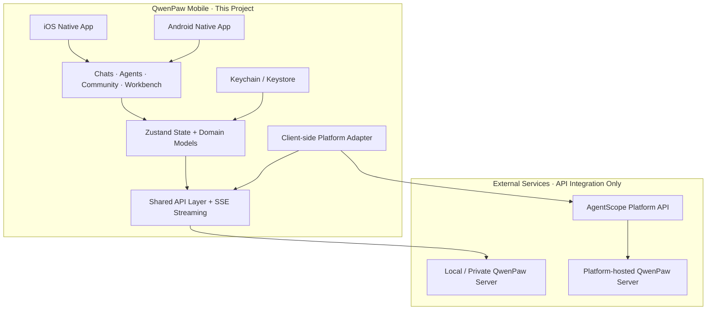

# QwenPaw Mobile Architecture

QwenPaw Mobile 基于 React Native + Expo 构建，一套代码支持 iOS 与
Android。本项目仅负责 Mobile Client，通过公开 API 接入外部 QwenPaw
Server 与 AgentScope Platform。

## 架构亮点

- **多端共享**：iOS / Android 复用 UI、业务逻辑、状态管理和 API，平台
  差异仅保留在原生边界。
- **统一连接**：Platform、局域网和私有部署共享同一套 `Connection` 与
  会话体验。
- **共享 API 层**：Mobile 侧将 QwenPaw API、Platform 公开 API 适配与 SSE
  流式消息统一收敛，页面不感知底层协议。
- **模块化**：`app / features / store / api / storage / theme` 分层，各业务模块
  可独立演进。
- **生产级保障**：single-flight 刷新、有界重试、显式状态机、Keychain /
  Keystore 安全存储，并支持无公网 tunnel 的局域网直连。

> Shared core, native edges, secure connections, explicit state machines.
