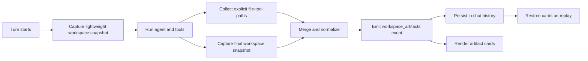

# Chat Workspace Artifacts Design

## Status

- Issue: [#6083](https://github.com/agentscope-ai/QwenPaw/issues/6083)
- Reference implementation: [PR #6306](https://github.com/agentscope-ai/QwenPaw/pull/6306)
- Target branch: `fix/desktop-artifacts-6083`
- Manifest version: `1`

## Problem

QwenPaw can create files in an agent workspace, but the chat does not provide a
durable, WorkBuddy-style artifact experience. Users must leave the conversation,
find the agent workspace, and determine which files belong to the latest turn.

The first delivery for #6083 added a Desktop-only action that opens the selected
agent workspace in the operating system file manager. This design extends that
foundation so each assistant turn can present the files it created or changed.

## Goals

1. Show turn-scoped file cards directly in the chat.
2. Discover files created by file tools and by indirect execution such as Shell,
   Python, or skills.
3. Preserve artifact cards after page refresh and session replay.
4. Support preview, download, system open, and file-manager reveal actions.
5. Bind every artifact to the agent workspace that produced it.
6. Enforce the same path-security boundary in browser and Desktop flows.
7. Keep artifact discovery best-effort so it never blocks the assistant reply.

## Non-goals

- Parsing assistant prose with a regular expression to guess file paths.
- Storing file bytes or absolute workspace paths in chat history.
- Rendering Office documents inside the application in the first release.
- Version control, collaborative editing, or cloud synchronization.
- Scanning ignored dependency and internal-state directories as user artifacts.

## User experience

At the end of a turn that changes workspace files, the conversation displays one
compact artifact group. The summary shows up to four files with file name, type,
size, and change state. Actions are selected according to the runtime:

- Preview supported image, PDF, Markdown, text, and CSV files.
- Download a file in browser and Desktop.
- Open a file with the operating system default application on Desktop.
- Reveal a file in the operating system file manager on Desktop.
- Open an all-artifacts drawer for the turn.
- Open an all-changes view including modified and deleted paths.

Office files (`.xlsx`, `.docx`, and `.pptx`) use download in browser and the
system default application on Desktop.

## Architecture



### Discovery sources

Artifact discovery combines two sources:

1. Explicit registration from `write_file`, `edit_file`, `append_file`, and
   `send_file_to_user` results.
2. A before/after workspace snapshot diff that catches files produced by Shell,
   Python, skills, and third-party tools.

Explicit registrations take precedence and remain available if the final scan
is incomplete. Snapshot entries use normalized POSIX-style relative paths as
stable identifiers on all operating systems.

### Manifest v1

```ts
interface WorkspaceArtifactManifest {
  version: 1;
  agent_id: string;
  chat_id: string;
  turn_id: string;
  created_at: string;
  artifacts: WorkspaceArtifact[];
  changes: WorkspaceChange[];
  truncated: boolean;
}

interface WorkspaceArtifact {
  path: string;
  name: string;
  extension: string;
  mime_type: string;
  size: number;
  modified_at: string;
  change: "created" | "modified";
  preview: "image" | "pdf" | "markdown" | "csv" | "text" | "none";
}

interface WorkspaceChange {
  path: string;
  change: "created" | "modified" | "deleted";
}
```

The manifest contains metadata only. It never contains file bytes or an absolute
path. Historical rendering must use `agent_id` from the manifest rather than the
currently selected agent.

### Event and history integration

The backend emits a versioned internal tool event named `workspace_artifacts`.
It travels through the existing tool-call event and message persistence pipeline.
The Chat V1/V2 adapters register a dedicated card so live streaming and restored
history share the same renderer.

If no user-visible changes exist, no event is emitted. Discovery errors are
logged and omitted from the response rather than replacing or delaying it.

## Workspace scan rules

The scanner records relative path, regular-file size, and nanosecond modification
time where available. It does not hash file contents during the default scan.

Default exclusions:

- `.git/`, `.qwenpaw/`, `node_modules/`, and `__pycache__/`
- `.pytest_cache/` and tool-specific cache directories
- `history.db`, `history.db-wal`, and `history.db-shm`
- lock files, editor swap files, and incomplete temporary downloads
- agent runtime state that is not a user-authored deliverable

Limits:

- Visit at most 10,000 files per snapshot.
- Keep at most 100 artifact entries per turn.
- Show at most four artifact rows in the compact card.
- Mark the manifest as truncated when a limit is reached.

## Security boundary

Every file operation resolves the manifest relative path under the workspace for
the manifest's `agent_id`. The backend and Tauri layer must both reject:

- absolute input paths;
- `..` traversal;
- symbolic links or junctions that escape the workspace;
- paths belonging to another agent;
- directories presented as files;
- missing or deleted files for read/open/download actions.

The canonical resolved file path must be a descendant of the canonical workspace
root. Error messages exposed to the UI must not disclose unrelated absolute paths.

## API and Desktop operations

Browser-compatible endpoints provide metadata, text content, binary content, and
download responses using `agent_id` plus relative path. Existing workspace file
APIs should be reused where they already satisfy the security contract.

Desktop adds narrowly scoped Tauri commands:

- open a workspace file with the system default application;
- reveal a workspace file in the system file manager;
- retain the existing command for opening the workspace directory.

Commands must use argument arrays rather than shell command strings and provide
Windows, macOS, and Linux implementations.

## Frontend design

The artifact group is a restrained neutral surface aligned with existing chat
cards. Lucide React is the only icon source. Rows use consistent 8/12/16 pixel
spacing, visible keyboard focus, concise action labels, and an overflow menu on
narrow screens. The layout collapses to a single-column file list on mobile.

The preview drawer reuses `FilePreview` support where practical. Unsupported or
oversized files show metadata and available external actions without attempting
to load their contents.

## Verification matrix

| Layer | Required evidence |
| --- | --- |
| Snapshot and collector | Unit tests for create, modify, delete, exclusions, limits, path normalization, and scan failure |
| Turn integration | Event emitted once, no-op turn omitted, agent/chat/turn identity retained, reply unaffected by scan failure |
| History | Live card and refreshed card render the same manifest |
| File access | Traversal, symlink/junction escape, cross-agent path, directory, and missing file rejected |
| Frontend | Compact card, overflow, preview, all-artifacts, all-changes, loading and error states |
| Desktop | Open/reveal commands and permission registration tested on supported platforms where available |
| End to end | Agent creates XLSX and Markdown files, cards appear, refresh persists, preview/download/open/reveal work |

## Rollout

The manifest is explicitly versioned. Unknown versions fall back to a generic
tool card rather than failing the chat. The feature initially activates for local
agent workspaces only; compatibility with remote workspaces requires a separate
transport contract.
