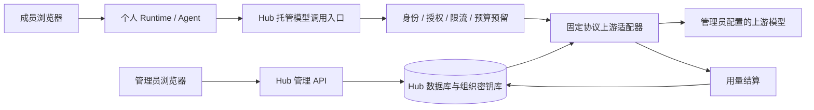

# Hub 模型托管、密码重置、邀请码与 Token 预算设计

状态：用户已批准方案，核心功能已实现，验证记录见第 12 节。日期：2026-09-14。

依据：[Hub roadmap](../../qwenpaw-hub-roadmap.zh.md)。本期按用户指定的四项交付，批量开通采用邀请码；不把 roadmap P1 的简单分组、组级统计一并纳入。

## 1. 代码基线与本次交付

已执行 `git fetch upstream main` 和 `git merge --ff-only upstream/main`，结果为 Already up to date。最新 upstream/main 为 `0b8a12f55`。按用户要求新建并切换到 `feat/hub-managed-models-governance`，基于原分支的 `84ef72b91`，包含 upstream/main，另保留一个文件预览鉴权修复提交。保留工作区原有未跟踪文件。

方案评审后已按用户授权开始实现；未配置真实供应商 Key，未创建 Git commit。临时验证账户仅存在于测试目录。

| 核对位置 | 现有能力与设计影响 |
| --- | --- |
| `src/qwenpaw/hub/control_app.py` | 已有用户、角色、禁用、自助改密、审计与注册入口；新增能力接入现有身份依赖 |
| `src/qwenpaw/hub/auth.py` | `change_password()` 已更新密码哈希和 `token_version`；`register()` 有首次管理员引导和开放注册逻辑 |
| `src/qwenpaw/hub/database.py` | 单机 SQLite WAL、Hub 用户与设置表；预算需要事务化专用表 |
| `src/qwenpaw/hub/credentials.py` | 已有加密库；`resolve_environment()` 会投影 tenant/runtime scope，组织 Key 必须排除在这些作用域之外 |
| `src/qwenpaw/agents/model_factory.py` | 模型覆写、默认模型、重试、fallback 均需受管解析；仅改设置页会遗漏真实调用路径 |
| `src/qwenpaw/app/routers/providers.py` | Provider CRUD、测试、发现、模型选择已有多条入口，需要服务端策略校验 |
| `src/qwenpaw/token_usage/model_wrapper.py` | Runtime 内的使用统计可服务个人展示，不能成为组织预算的可信账本 |
| `src/qwenpaw/hub/process_isolation.py` | macOS Local 明确拒绝其他 localhost 端口，需为托管调用增加精确网络许可 |
| `console/src/pages/Hub/`、`console/src/pages/Chat/ModelSelector/` | 复用管理页面与模型选择器，拆出对应子组件，不继续扩大单个页面文件 |

## 2. 建议批准的产品范围

1. **Hub 成员采用组织托管模型。** 管理员配置一次，成员只选授权模型；成员不能查看、创建或修改组织 Provider、Endpoint、Key。Hub 受管模式关闭成员个人 Provider 配置入口及相应 API。独立 App 保持个人配置行为。
2. **首批支持 OpenAI Chat Completions 协议。** 目标为支持该协议的 Qwen 云端与企业内网服务；交付非流式、流式、工具调用及实际验证过的图像输入。原生 Anthropic、Responses、音视频生成和 embedding 不在首批协议范围。不承诺所有“兼容”服务天然可用。
3. **管理员重置普通成员密码。** 管理员自己继续使用自助改密；本期不做重置其他管理员、临时密码或强制首次改密。
4. **批量生成单次邀请码。** 管理员生成 N 个码，员工持码自助设置账号密码；每码只能开通一个普通成员。建议默认有效期 7 天，单批最多 100 个，可在创建时调整有效期。
5. **组织及个人自然月 Token 预算。** 两级同时约束，含后台任务及所有托管模型调用；不做现金充值、共享组额度、商业计费。

邀请码只证明持码者获得开通资格，不验证企业邮箱或实名。分享给错误的人也可能被兑换，管理员可撤销尚未兑换的码；已兑换账号通过现有禁用功能处理。

## 3. 总体架构与信任边界



建议内置一个范围有限的调用服务，首期与 Hub 同进程部署，独立模块和路由。复用现有 HTTP/流式基础设施与模型格式化能力，不额外部署通用网关，也不把 Agent 执行搬到 Hub。仅支持单 Hub 服务实例；数据库文件不共享到网络盘，不宣称多副本可用。

### 3.1 组织密钥

- 复用加密原语，组织模型 Key 保存到专用控制面 scope，由专用服务访问，不加入 tenant/runtime 环境投影。不得提供通用 scope 参数让成员读取该作用域。
- Key API 只写不回显，管理员也只得到 `has_key`、更新时间、版本；轮换通过替换完成，不提供“显示原 Key”。成员目录的 DTO 从允许字段构造，完全不含 Key、上游地址及 Provider 连接信息。
- 加密主密钥、Hub 数据库、备份均在 Runtime 可读目录与挂载之外；校验文件权限和 Windows ACL，验证运行账号及沙箱不可读取。静态加密不能替代运行时隔离。
- 上游请求由服务端重新构造认证头；拒绝客户端提供认证头、转发地址、任意 path 或覆盖连接的扩展字段。禁止自动跟随上游重定向，避免携带认证头跨地址发送。
- 日志和审计只记录允许字段；不记录密码、邀请码原文、认证头、请求正文或上游原始错误。错误转为稳定错误码及 request ID。响应的服务端诊断元数据和模型标识同样只输出受管视图。

### 3.2 Runtime 调用凭证

新建专用的不透明随机凭证，绑定 `user_id + runtime_id`，数据库保存摘要。它只有“读取自己的模型目录、调用自己的授权模型”权限，不复用浏览器 JWT、管理员令牌或已有 Runtime 内部控制令牌。

Runtime 启动时由控制面注入此凭证和托管入口地址，凭证可被该成员的 Agent 读取，这是允许的：它不能获得上游 Key，也不能绕过授权和预算。凭证不得进入成员 API 响应及日志。每个请求由服务端从凭证解析身份，不信任请求中的用户 ID；校验账户启用、Runtime 归属和凭证有效状态。

每次启动轮换凭证；停止、禁用、重建撤销旧凭证。密码重置沿用登录 token version，不额外终止后台任务或轮换 Runtime 凭证，避免把密码管理扩成任务生命周期策略。

### 3.3 网络与部署

托管调用入口仅提供固定调用/目录路由，管理 API 仍要求管理员身份，模型凭证不能用于登录或反向代理任意 Runtime。

| 后端 | 实施要求 |
| --- | --- |
| Linux Local | 验证现有隔离网络可访问配置的托管入口，同时保持宿主文件不可读 |
| macOS Local | 在 Seatbelt 策略中精确增加托管服务地址/端口许可及探针；不移除 localhost 全局拒绝 |
| Windows Local | 验证 AppContainer 出站通道；现有反向隧道是控制面访问 Runtime，不直接当作模型出站通道。若 localhost 不可达，使用受控可达地址并做实际平台测试 |
| Docker | 注入容器实际可达的 Hub 地址，Linux 与 Docker Desktop 分别测试；不假定容器 localhost 是宿主机 |

地址由部署配置指定并在启动时探测；跨非本机可信通道使用 TLS。平台通道未通过探针即给出明确错误，禁止退回把上游 Key 注入 Runtime。继续使用 `pathlib` 等跨平台路径能力。

## 4. 模型目录、授权与免配置使用

### 4.1 最小数据结构

| 表/设置 | 关键字段与用途 |
| --- | --- |
| `hub_model_connections` | ID、协议、base_url、secret 引用、启用状态、连接级配额作用域、revision |
| `hub_managed_models` | 稳定 ID、连接 ID、上游 model ID、展示名称/说明、上下文和输出上限、启用状态、revision |
| `hub_model_grants` | model ID、主体类型 all/user、主体 ID；唯一约束防重复 |
| `hub_settings` | 组织默认模型、用户默认预算、预算时区、目录发布 revision、受管策略 |
| `hub_resource_extensions` | 复用扩展存储记录用户授权范围内的模型偏好、Runtime 已观察版本，不保存 Key |
| `hub_model_runtime_tokens` | 凭证摘要、user/runtime ID、撤销时间、创建时间 |

组织模型保留稳定 ID，轮换 Key、修改上游配置不改写个人配置文件。成员选择使用现有 model slot 表达，增加明确的内置受管 Provider 标识，由模型工厂识别；这是新增能力，不为本分支历史格式增加兼容层。

### 4.2 解析规则

每次新的模型调用，包含主模型、显式 override、摘要压缩、fallback、定时任务和辅助模型：

1. 若存在明确的受管模型选择，检查其最新授权与启用状态；失权时明确报错，不偷偷切换模型。
2. 未选择时使用当前组织默认模型。默认模型必须对所有成员授权且启用，保存时原子验证；要下架它，必须同时替换默认值或明确暂停组织模型服务。
3. 新成员、新 Agent、未配置模型的旧 Agent 自动获得默认值；旧个人 Provider 配置保留在原处但不参与受管调用，界面说明组织托管已接管模型选择。
4. 个人提示词、工作区、会话与技能保持原有归属；发布组织模型不覆写这些文件。

仅在前端隐藏配置不够：Hub 代理层及 Runtime Provider 写入 API 都执行策略，测试/发现接口不得接受成员提供的上游参数。模型工厂对持久配置、请求 override 和 fallback 统一校验。成员直接修改自己的文件也不能获得组织连接或扩大托管权限。

受管限制覆盖产品接口与托管调用。Agent 仍可能执行任意联网代码、使用成员自行获得的其他 Key；本期不提供全网模型访问阻断，也不把外部调用记为组织账单。

### 4.3 发布和生效

连接保存、连通性测试、模型发布是明确动作；失败测试不自动改变当前可用发布。授权、默认模型、连接及 Key 版本在请求开始时固定成一致快照，后续轮换影响新请求。

- 管理配置提交后显示“已保存，待 Runtime 确认”；在线 Runtime 在下次调用前及目录刷新时拉取，报告观察版本。建议在线刷新间隔 30 秒。
- 管理员可见发布版本、各 Runtime 已观察版本、最近成功调用版本和最后错误，离线标记待同步；观察到目录不等于实际调用成功。
- Key 轮换无需重启；网关按最新凭据版本加载，不能沿用无版本的永久内存缓存。
- 撤权、禁用与下架在提交后的新请求立即拒绝；已获准的在途调用允许结束并计费，本期不做强行终止策略。
- 升级接入受管能力时，旧 Runtime 需要一次受控重启以获得入口/凭证；此后目录与 Key 更新不要求重启。不为旧 Runtime 增加回退协议，页面明确“待升级/重启”。

## 5. 管理员重置密码

新增 `POST /api/hub/admin/users/{user_id}/password`，body 为 `new_password`，成功返回 204。

使用现有 `require_admin`，目标限定普通成员，包括被禁用的普通成员。调用现有 `HubAuthService.change_password()`；复用当前密码校验（目前至少 8 位）及哈希实现，原密码与旧登录 token 失效。重置不会重新启用禁用账号。

用户管理行内增加“重置密码”，弹窗展示目标用户名、新密码及确认密码；后端不需要接收确认字段。提示管理员自行安全交付新密码，本期不发送邮件或消息。

审计 `user.password_reset` 只含操作者、目标、结果和 request ID。不存在目标返回 404，非成员目标/自身返回明确业务错误。用户 ID、工作区、历史会话和 Runtime 均保持原状。

## 6. 邀请码批量开通

### 6.1 流程与权限

管理员选择数量、有效期、批次备注、可选额外模型授权及个人预算覆盖值 → 一次性生成并展示/下载邀请码 → 管理员自行分发 → 成员填写邀请码、用户名、密码 → 开通普通成员 → 自动继承全员模型和默认预算 → 按现有 Runtime 创建流程进入工作界面。

建议用 32 个随机字节生成 URL-safe 码，不用顺序 ID 或短数字码。仅保存摘要，管理页后续只能查看码 ID、批次、状态、到期时间及兑换账号；原码只在创建响应出现一次。原码不放 URL query 或访问日志。下载从本次浏览器内存生成，并正确转义 CSV 字段。

每码单次；需要 100 个成员就生成 100 个码。首期不做可无限转发的多人共享码、CSV 导入账号、邮箱发送或组管理。创建批次支持幂等请求 ID；重试不重复生成，若首次原码响应丢失，只能撤销该批并重新生成，不能回读原文。

### 6.2 数据与并发

- `hub_invite_batches`：ID、创建者、备注、创建请求 ID、创建时间。
- `hub_invites`：ID、batch ID、摘要唯一索引、expires_at、revoked_at、redeemed_by、redeemed_at、授权与预算快照。
- 兑换在同一 SQLite 写事务内校验码、有效期、未消费状态、用户名唯一性，创建用户、写授权/预算和标记兑换。复用账号创建内部事务函数，不能调用一个自行提交的 create_user 后再消费码。
- 两人同时兑换仅一人成功；用户名冲突/密码非法不消耗码；进程崩溃不能留下“占用了码但没有账号”的半完成状态。
- Runtime provisioning 在事务提交后执行；失败不回滚已创建账号，成员可以登录重试，不需要新码。响应丢失后使用刚设置的账号密码登录。
- 附带模型授权在兑换时重新检查：被下架的模型不授予，页面提示采用当前默认模型；预算继承项在兑换时取组织当前默认值，显式覆盖值沿用邀请码快照。

### 6.3 注册入口防绕过

保留现有“零用户时创建首位管理员”。管理员开启邀请注册后，非首次注册必须持有效码，固定 `role=user`，不读取 `registration_default_role`。原开放注册入口也执行这项检查，不能绕到 `/api/auth/register` 无码开户。

现有开放注册开关在邀请模式下停用且管理页明确显示；部署切换需管理员显式启用邀请注册，避免升级时意外改变既有注册行为。邀请码过期/无效/已使用对未登录者统一错误，沿用认证请求限流并增加针对兑换的尝试限制；撤销批次只撤销未兑换码。

## 7. Token 预算：准入、结算和误差边界

### 7.1 产品口径

- 组织总额度与用户额度均为自然月整数 Token，任意一级不足即拒绝下一次模型调用。
- `null` 表示无限额，0 表示禁止；用户未设置覆盖值时继承组织的成员默认额度，区别于显式无限额。
- 统计 `input_tokens + output_tokens`，缓存命中 Token 若已在 input 中则不重复累加；推理 Token 若已在 output 中亦不重复累加。适配器统一口径并记录缺失字段。
- 建议新部署月界线默认 UTC，管理员可在首次启用前选择 IANA 时区；启用后的变更下个月生效。周期保存明确起止时间；不通过定时清零计数实现换月。
- 开始调用时固定所属周期，跨月完成仍结算到原周期。降低额度不打断在途调用，剩余额度显示为 0，并拒绝新的超额准入。
- UI 展示已确认用量、保守扣额、在途预留、可用余额、周期结束时间。80%/100% 提醒首期在管理页及成员页展示，不外发消息。

### 7.2 可信账本

新增 `hub_model_requests`（服务端 request ID、身份、模型/连接与版本、周期、状态、预留量、实际量、用量质量、错误类别、时间）、`hub_token_budgets`（主体、限额及生效周期）和 `hub_token_periods`（主体、周期、已结算量、预留量）。请求按 user/time、model/time 建索引。

用量只从服务端收到的上游结果结算；客户端提供的 usage、user ID、价格不被采信。组织总账独立于 Runtime 本地统计，不能把两者相加。请求账本和聚合账同事务写入，结算状态使用条件更新，重复回调只结算一次。

### 7.3 预留不是简单估算

仅“先请求，结束后加 Token”会被并发突破；仅预留平均输出也不能控制长响应。建议首期采用保守准入：

`reservation = input_upper_bound + enforced_output_limit`

`available = limit - settled_charge - in_flight_reserved`

1. 适配器能可靠计算输入（含模板、工具定义等）时使用经验证的上界；普通 tokenizer 的文本估算不直接宣称为上界。
2. 没有可靠输入上界、含无法准确计数的图片等输入时，使用该已验证模型的最大输入窗口作为保守上界；窗口定义需区分共享上下文和独立输入上限。代价是小余额时可能拒绝本来能完成的短请求。
3. 上游必须可强制限定本次总输出（包含其推理消耗口径）；服务端验证参数并固定 `n=1`，不给客户端绕过输出上限的扩展字段。余额不足时首期明确拒绝，不静默降低回答长度。
4. 缺乏可信上下文上界或不能强制输出上限的模型，不允许发布到有限预算模式。先显示原因，不把“兼容接口”视作已验证预算能力。

组织和个人的检查与预留在一个 `BEGIN IMMEDIATE` 短事务内完成，网络请求在事务外执行；不能分别检查后各自写入。拒绝未成功预留的请求，数据库不可用时停止新调用。

### 7.4 请求状态与异常处理

```text
reserved → dispatched → settled(actual)
    └→ released（可证明未发送上游）
                  dispatched → settled(conservative)
```

- 完整 usage：按真实输入+输出结算，释放差额；SSE 最终 usage 只结算一次，不能对累计 chunk 求和。
- 取消、断网、超时：终止转发并尝试取消上游；若无法得到完整 usage，按全额预留结算，标记 conservative，不能计为 0。上游可能继续执行，但其已强制输出上限仍纳入预留。
- 明确未发送的本地失败：释放预留。已发送后的错误除非适配器能证明未消耗，否则保守结算，不凭 HTTP 状态猜测免费。
- 重启恢复：未 dispatched 的预留可释放；已 dispatched 无最终结果的请求按预留结算。发送前持久化 dispatched，接受“标记后尚未实际发送就崩溃”的保守多扣，避免免费重复调用。
- 不能只因超时租约到期就释放可能仍在上游执行的请求。账本保留可解释状态；本期不实现供应商账单自动追溯或任意手动改账，管理员可以提高额度。
- 如果真实 usage 仍超出预留，完整记录超出量并阻止后续超额准入，同时暂停该模型的有限预算准入，提示校验计数/上限配置。

**承诺边界：** 对验证通过且遵守上限的模型，在途预留与结算合计不突破准入时额度；保守扣额可能高于实际用量。对上游违背声明上限或供应商账单的额外费用，不承诺零误差现金封顶。不能可靠计数的模型优先牺牲额度利用率，不用一个不明误差的估算包装硬上限。

### 7.5 重试、后台任务与共享限流

每次实际上游尝试都有独立 request ID 和预留；一次用户消息的多轮工具调用、压缩、fallback 都分别计入。网关首期不自动重试上游；Runtime 重试策略保留有限瞬时失败重试，但预算耗尽、权限拒绝、模型下架为不可重试错误，也不能用 fallback 绕过组织额度。

组织调用入口限制连接级和模型级并发、请求速率；多个别名映射同一连接/上游模型时合并计数。连接可引用同一个 quota scope，以覆盖多个连接配置实际共用供应商配额的情况；不根据 Key 字符串猜测配额归属。

限流与预算的任一步失败均释放尚未发送的资源。初期不建排队系统，繁忙返回 429 和 Retry-After；预算不足返回稳定 `hub_budget_exceeded` 业务码，客户端不把它当普通 429 自动重试。SDK 内部自动重试关闭，所有实际发送均可计数。单实例共享限流状态；重启时采用冷却窗口及未完成记录，避免立即放大上游并发。

## 8. API 与界面草案

以下为建议接口，不是已实现契约；统一复用现有鉴权、分页和错误规范。

| 权限 | 接口 | 用途 |
| --- | --- | --- |
| admin | `/api/hub/admin/model-connections` GET/POST；`/{id}` PATCH | 连接管理，读取不返回 Key |
| admin | `.../model-connections/{id}/test` POST | 从实际托管调用通道测试，记录测试请求并受组织额度/限流约束 |
| admin | `/api/hub/admin/models` GET/POST；`/{id}` PATCH | 目录、发布、启停 |
| admin | `.../models/{id}/grants` PUT | 全员/指定成员授权 |
| admin | `.../model-policy` GET/PUT | 组织默认模型、发布版本 |
| admin | `.../users/{id}/password` POST | 重置普通成员密码 |
| admin | `.../invite-batches` POST/GET；`/{id}/revoke` POST | 批量生成、查看、撤销 |
| public | `/api/auth/register` POST | 复用入口，邀请模式校验 `invite_code` |
| admin | `/api/hub/admin/budgets` GET/PUT；`/usage` GET | 额度管理、成员/模型/时间统计 |
| member | `/api/hub/me/models` GET；`/model-preference` PUT | 安全目录、授权范围内选择 |
| member | `/api/hub/me/usage` GET | 自己的额度、用量和限制原因 |
| runtime token | `/api/hub/model-runtime/catalog` GET；`/v1/chat/completions` POST | Runtime 专用目录与托管调用，独立认证依赖 |

管理员连通性测试绑定管理员身份、组织预算和共享限流；未发布连接通过 admin test 路由测试，不向成员开放临时上游覆盖。零额度时可进行无模型消耗的配置检查，不能以“测试”绕过调用预算。

管理界面增加“组织模型”“邀请码”“用量与预算”；现有成员管理增加密码重置和个人额度入口。成员默认进入工作页，顶部展示当前组织模型及预算摘要，没有 Key/Endpoint 表单。未配置模型时提示“组织尚未提供模型，请联系管理员”，不引导成员申请 Key。

使用 Lucide React 图标，无 emoji；沿用单一中性色和现有强调色，明确字号、间距及表单宽度。桌面表格在移动端转换为卡片，弹窗适配窄屏；复用现有组件和 package，不手写动画引擎，不顺带重做无关页面。

## 9. 代码组织与落地顺序

建议新增 `src/qwenpaw/hub/model_service/`，分别放目录/授权、调用路由、上游适配器、预算服务与存储。邀请码单独放 `hub/invitations.py`，管理路由按职责拆文件再由 `control_app.py` 装配。Runtime 新增轻量 managed provider，复用现有格式化，不把 Hub 数据库客户端安装到 Runtime 调用链。

数据库按当前 upstream schema 增加表、约束和索引，不改写用户工作区；不增加本分支旧格式双读、静默转换或兼容层。启动只做幂等建表，验证现有数据不变；备份/恢复需同时覆盖控制库和加密主密钥。

Python 在 conda `QwenPaw` 环境实现与测试，英文 docstring/注释、79 列、项目内相对引用及 F-string 按仓库要求执行。新增 UI 文案提供现有语言体系对应翻译。

| 阶段 | 内容 | 完成标准 |
| --- | --- | --- |
| A | 密码重置、邀请码事务与 UI | 管理员开通/重置端到端成立，邀请码无并发重复兑换 |
| B | 托管目录、Key 隔离、调用通道、Runtime 接入 | 新成员免配置完成对话/工具调用，成员不可读 Key |
| C | 月预算、预留结算、共享限流、用量页 | 并发、取消、重试、重启和换月测试通过 |
| D | 联调、平台验证、生效反馈与文档 | 目标部署全链路验证，发布验收通过 |

模型托管可以分步开发，但有限预算模式必须在阶段 C 完成后才能承诺预算限制；不能只完成前端额度输入就上线该承诺。

## 10. 实施与验收 checklist

- [x] 阅读 roadmap，核对现有认证、模型、凭据、隔离与统计路径。
- [x] 拉取并确认当前分支包含最新 upstream/main。
- [x] 新建并切换到 `feat/hub-managed-models-governance` 功能分支。
- [x] 形成四项功能设计，明确首期范围与预算误差边界。
- [x] 用户已确认方案并授权开发，要求模块化、自测、额外单测不提交。
- [x] 实现密码重置：新密码可登录、旧密码与旧 token 失效、成员越权被拒绝、禁用状态/历史数据保持。
- [x] 实现邀请码：无原文落库/日志；并发兑换恰一成功；冲突回滚；过期/撤销生效；原注册接口不能绕过。
- [ ] 实现模型目录/默认值/授权/版本，覆盖新员工、新 Agent、旧配置、override、fallback 和后台调用。
- [ ] 验证 Key 不出现在浏览器响应、配置导出、环境变量、Runtime 工作区/挂载、工具可读路径、日志和错误中。
- [ ] 验证伪造用户 ID、修改模型 ID/地址/认证头、旧凭证、旧目录缓存均不能扩大权限。
- [ ] 验证发布、轮换、下架、撤权、停用在新请求生效；在途请求行为与页面提示一致。
- [x] 实现预算原子准入；组织/个人双重约束；缺失 usage 保守扣额；结算幂等及账本恢复。
- [x] 覆盖并发抢占、流式累计 usage、工具多轮、取消、上游错误、重试、服务崩溃、跨月、时区和调低额度。
- [x] 验证多用户、多别名、共用 quota scope 的总速率/并发；后台调用不能绕过。
- [ ] 后端新增单测全部通过，运行相关 Hub、Provider、模型工厂和认证回归；前端权限/表单/预算状态测试通过。
- [x] 执行修改文件的 pre-commit 与前端类型检查；不为无关格式问题扩大 diff。
- [ ] 在目标云端和内网协议端点验证真实流式、工具、取消及 usage，不用 mock 代替上游验收。
- [ ] Windows/Linux/macOS Local 与支持的 Docker 组合逐项验证网络通道和密钥隔离；未实测组合注明未验证。
- [ ] 检查桌面/平板/手机布局，更新 Hub 使用和部署文档。

开发后的检查结果与剩余部署验收见第 12 节；未实测的平台和真实供应商不会标记为已验收。

## 11. 本次 review 请确认的选择

1. **协议范围：** 首期 OpenAI Chat Completions，优先 Qwen 兼容接口和企业内网端点；其他原生协议后续单独扩展。
2. **成员配置：** Hub 受管模式关闭个人 Provider 配置；成员仅可选择组织授权模型，个人 App 不受影响。
3. **邀请码：** 批量单次码、默认 7 天、每批最多 100 个、只开普通成员；本期不做共享多次码和用户组。
4. **预算：** 组织+个人月度 Token；输入缺少精确上界时按模型输入窗口保守预留，usage 不完整时扣预留；接受可用余额利用率偏低以获得可解释的控制边界。
5. **密码重置：** 管理员只重置普通成员；旧登录凭证失效，但不停止其在途/后台任务。

建议按以上默认方案批准；真实协议端点及测试凭据在实现联调阶段由部署环境提供，不写入设计文档或仓库。


## 12. 实施记录（2026-09-14）

### 已落地

- `hub/model_service/` 按目录、预算、协议、共享限流、网关、Runtime 策略和路由拆分；控制应用负责装配。
- 组织连接使用控制面专用 scope 和不可变 Key 引用，轮换影响新请求；连接和模型编辑要求当前 revision，拒绝覆盖并发更新。
- Runtime 专用凭证只保存摘要，启动轮换，账户禁用/停止后拒绝使用；组织 Key 不下发。Docker localhost 配置在启动时明确拒绝。
- `providers/hub_managed.py` 为内存 Provider；模型工厂、ProviderManager 与 Runtime API 接入受管目录，SDK 自动重试关闭，所有上游尝试在 Hub 计量。
- 新成员直接继承默认模型；成员与 Agent 的授权模型选择沿用现有 model slot，不另建配置格式，不迁移或覆盖个人文件。
- 管理端新增组织模型、邀请码、用量与预算三个独立页面模块；成员模型页为受管选择视图，工作界面显示月度余额。
- 普通成员密码重置复用既有哈希/token version；邀请码包含可选模型授权和预算覆盖，兑换事务与账户创建共用连接。

### 实现中的简化选择

- 用请求账本直接聚合月度余额，避免同时维护一份易漂移的汇总计数表；两级准入仍在同一写事务内完成。
- 首期统一使用已声明的最大输入窗口做保守预留，没有加入不可靠的通用 tokenizer 估算；输出上限由服务端裁剪。
- 预算时区在首次产生调用后固定，暂不做“下月更改时区”的调度流程，界面明确提示。请求跨月仍按准入周期结算。
- 成员模型选择沿用已有 API；连接与模型更新使用 PUT + revision，模型授权跟模型一起原子提交，不增加单独 grants API。
- 管理员在模型卡片上测试已保存的连接/模型，调用同一网关与预算逻辑，允许组织正式启用前测试；不提供任意请求转发。
- 邀请码下载为一次性 TXT，后续只显示批次进度。管理员自行交付邀请码和重置后的密码，不发送外部消息。
- 受管模型首期不自动重试或执行个人 fallback 链；失败直接反馈，避免隐式调用个人连接。工具多轮和辅助模型通过同一托管入口核算。
- 首次启用要求已有 Runtime 重启；目录及 Key 更新无需重启。当前已构造的会话模型保留选择，组织默认值在重新构造模型时应用；网关的最新授权和连接版本每次调用都生效。

### 验证和部署边界

在 conda `QwenPaw` 下显式使用当前分支 `src`，避免环境中的另一份安装干扰。已运行后端 Hub/Provider/模型工厂相关回归、额外临时测试、前端相关测试、TypeScript 检查及浏览器操作。结果如下；临时测试和截图置于仓库外，不加入提交。

| 检查 | 结果 |
| --- | --- |
| Hub、Runtime boundary、ProviderManager、模型工厂及 active-model 路由回归（含临时测试） | 419 passed，2 skipped；使用当前分支源码 |
| 额外临时自测 | 25 passed；邀请码并发/到期/授权、密码、Key 轮换、额度竞争/结算/跨月/取消/恢复、SDK 流式与工具往返、macOS 实际隔离 |
| 前端相关 Vitest | 5 files，29 passed |
| TypeScript、新增模块 ESLint | 通过 |
| `npm run build` | 通过，含 Monaco CSS、预压缩及初始包检查 |
| 修改 Python 文件的 pre-commit | 通过，包括 mypy、black、flake8、pylint |
| 浏览器真实管理操作 | 新增模型、批量生成邀请码、调整预算通过；桌面/390px 手机截图已检查；无页面运行错误 |

临时验证文件：`/tmp/hub-governance-validation/test_governance.py`。测试使用模拟供应商端点，SDK、Hub 路由、身份和预算链路为实际代码；没有把模拟结果表述为真实供应商已认证。所有业务变更及文档当前均未 commit。

macOS 实际 Seatbelt 验证覆盖新增托管端口可达、宿主模拟密钥文件不可读。Windows/Linux/Docker 的真实部署以及真实云端/企业内网模型仍需对应环境联调；本次没有这些环境或真实模型凭据，不能用 mock 结果替代供应商验收。

预算是托管 Token 的调用控制，不是供应商现金账单；缺失 usage、取消和重启保守扣额。共享并发限制针对 Hub 持有的活跃调用；上游断连后仍自行继续运行的内部任务不在 Hub 可强制终止的边界内。
