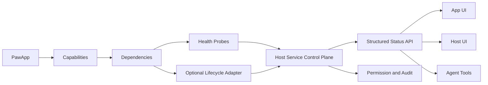

# PawApp SDK 服务依赖状态与生命周期管理 Proposal

> 实现状态（2026-08-07）：静态 dependency 合约、probe、状态与 capability 路由、
> typed lifecycle action、readiness、幂等、可选 Agent tools、前端
> `paw.dependencies` 以及 managed-service 映射已在 `dev/datapaw-app` 实现。
> Dynamic dependency provider 仍作为后续扩展；QwenPaw-Data 当前在 App 启动时
> 发现并注册已配置数据源。

- 状态：Draft，待 PawApp SDK owning team 评审
- 日期：2026-08-07
- 适用范围：所有需要 backend、sidecar、数据库、消息系统或外部 API 的 PawApp
- 非目标：在 SDK 中硬编码 QwenPaw-Data、Neo4j、PostgreSQL 或 Docker 业务逻辑

## 摘要

本 Proposal 建议为 PawApp SDK 增加一套**通用、可选、向后兼容**的服务依赖状态和生命周期
合约，使 PawApp 可以：

- 声明自己依赖哪些服务和能力；
- 区分进程存活、服务就绪和具体能力是否可用；
- 向 UI 和 Agent 暴露结构化、脱敏的状态；
- 对明确归属本地 App / Host 的服务提供受权限控制的启动、停止和重启动作；
- 对企业外部服务只做监测、诊断和 remediation 指引；
- 在依赖故障时返回 typed error，而不是泄露底层连接异常或统一返回 500。

核心原则：

> Host control plane 负责确定性地监测和管理服务；Agent 负责理解状态、请求允许的动作、
> 重试原任务和向用户解释结果。Agent 不应成为长期运行的 service supervisor。

该能力不是 QwenPaw-Data 运行的硬前置条件。QwenPaw-Data 可以在 App 内先实现状态与本地
启动逻辑；本 Proposal 的价值是将已经证明通用的模式沉淀到 PawApp SDK，供多个 App 复用。

## 为什么要做

### 1. 当前的“服务存活”不能代表“App 能工作”

一个 PawApp backend 或 managed sidecar 可能已经启动并通过浅层 `/health`，但它依赖的
数据库、图存储或外部 API 仍然不可用。

例如：

- Context API 进程在线；
- `/health` 返回 `ok`；
- Graph Store 没有监听；
- App 的图查询返回连接拒绝；
- UI 在真正发起查询之前一直显示正常。

SDK 需要区分：

- **Liveness**：进程是否还活着；
- **Readiness**：服务是否可以接受请求；
- **Dependency health**：下游依赖是否可达、认证是否正确；
- **Capability health**：某项用户能力是否真正可用。

### 2. “已注册”不等于“可连接”

数据源、模型或外部服务通常先登记配置，再由 App 选择。当前 UI 很容易把登记列表展示成
可用列表，但选中一个配置并不会自动证明其 endpoint 正在监听。

SDK 应提供统一状态模型，让 App 可以明确展示：

- 已注册但尚未检查；
- 可用；
- 离线；
- 认证失败；
- 配置错误；
- 未安装；
- 外部管理，App 无权启动。

### 3. 每个 App 自己实现会产生协议漂移

如果没有通用合约，每个 App 都会分别实现：

- 健康检查字段；
- 状态枚举；
- start / stop / restart API；
- polling / SSE；
- 超时与重试；
- Agent tool；
- 权限与审计；
- UI badge 和错误文案。

这些实现会快速分化。Host 无法统一展示 App 状态，Agent 也无法可靠理解不同 App 的错误。

### 4. Agent 不应该临时猜测基础设施命令

Agent 可以帮助恢复服务，但不能自己推断并拼装 `docker run`、`systemctl restart` 或
Kubernetes 命令。这样会带来：

- 权限边界不清；
- 错误目标或重复启动；
- 凭证泄露；
- 无法审计；
- 外部共享服务被错误重启；
- 不同操作系统行为不一致。

正确方式是：App / Host 预先注册有限、typed、可审计的 lifecycle actions；Agent 只能调用
已经声明并被策略允许的动作。

### 5. Host 需要统一的降级语义

一个依赖离线不一定意味着整个 App 不可用。例如 Graph Store 离线时，SQLite 配置管理或
部分数据源操作仍可能正常。

SDK 应支持 capability-scoped degradation：

```text
App                    degraded
├── configuration      healthy
├── context-search     degraded
├── context-graph      unavailable
└── sql-query          healthy
```

这样 UI 和 Agent 都可以继续使用未受影响的能力，而不是把整个 App 判定为失败。

## 设计目标

1. 提供通用 dependency、capability、probe 和 lifecycle action 合约；
2. 同一份状态同时服务于 App UI、Host UI、Agent 和诊断工具；
3. 将服务所有权与健康状态分开表达；
4. 支持 managed process、local managed resource 和 external resource；
5. 默认脱敏，不向浏览器或 Agent 暴露凭证、完整 DSN、内部日志和 PID；
6. 所有管理动作必须可授权、可审计、幂等并且有超时；
7. 采用 opt-in additive API，现有 PawApp 不需要升级；
8. 不在 SDK core 中包含任何特定数据库或容器运行时业务逻辑。

## 非目标

- 不让 LLM 负责持续 polling 或进程监督；
- 不让 SDK 猜测如何启动未知服务；
- 不自动重启企业外部数据库；
- 不把 Docker 作为唯一运行时；
- 不用 health API 替代正式的 observability / metrics 系统；
- 不要求每个 PawApp 必须声明 dependency；
- 不改变现有 `PawApp` 的默认路由或生命周期行为。

## 概念模型



概念说明：

- **Service**：由 Host 或 App 直接管理的运行单元，例如 managed sidecar；
- **Dependency**：App 使用的下游资源，可能是 service、数据库或外部 API；
- **Capability**：面向用户的功能，可依赖一个或多个 dependency；
- **Probe**：确定性检查，产生结构化健康结果；
- **Lifecycle adapter**：可选的 start / stop / restart / provision 实现；
- **Control plane**：Host 中统一执行 probe、状态聚合、权限和动作的组件。

## 状态模型

不建议用一个枚举同时表示生命周期和健康状态。建议拆分为三个维度。

### Ownership

```text
host_managed       Host 明确拥有并管理
app_managed        App 注册受控 lifecycle adapter
external           外部系统管理，只监测
```

### Lifecycle state

```text
unknown
not_installed
stopped
starting
running
stopping
failed
unmanaged
```

### Health state

```text
unknown
checking
healthy
degraded
unavailable
```

认证失败、配置错误、超时等使用稳定 `error_code` 表达，不需要无限扩大状态枚举：

```text
AUTHENTICATION_FAILED
CONFIGURATION_INVALID
CONNECTION_REFUSED
PROBE_TIMEOUT
START_FAILED
READINESS_TIMEOUT
ACTION_NOT_ALLOWED
NOT_MANAGED
```

## 建议的 Backend SDK API

以下 API 仅表达合约形状，具体命名由 PawApp SDK owning team 决定。

```python
from qwenpaw.pawapp import (
    DependencyHealth,
    DependencyLifecycle,
    DependencyProbe,
    PawApp,
)

app = PawApp("Example", app_id="example")

graph = app.dependency(
    "graph-store",
    display_name="Graph Store",
    ownership="external",
    capabilities=["context-graph", "context-search"],
    required=False,
    probe=DependencyProbe(
        callback=check_graph_store,
        timeout_seconds=3,
        cache_seconds=10,
    ),
)

worker = app.dependency(
    "local-worker",
    display_name="Local Worker",
    ownership="app_managed",
    capabilities=["background-analysis"],
    probe=DependencyProbe(callback=check_worker),
    lifecycle=DependencyLifecycle(
        start=start_worker,
        stop=stop_worker,
        restart=restart_worker,
    ),
)
```

Probe callback 返回结构化结果：

```python
return DependencyHealth(
    health="healthy",
    lifecycle="running",
    latency_ms=18,
    message="Ready",
)
```

失败时返回稳定错误，不抛出原始驱动异常到浏览器：

```python
return DependencyHealth(
    health="unavailable",
    lifecycle="unmanaged",
    error_code="CONNECTION_REFUSED",
    message="Graph store is not accepting connections",
    remediation="Contact the service owner or start the configured local service",
)
```

## 动态依赖

数据库连接、租户 endpoint 等依赖可能在运行时新增。SDK 可以提供 optional provider：

```python
app.dependency_provider(
    "data-sources",
    list_dependencies=list_registered_sources,
    probe=probe_registered_source,
)
```

Provider 返回稳定 ID 和脱敏显示信息。Host 不持久化凭证，也不要求知道 datasource-specific
schema。

MVP 可以先只支持静态 dependency；动态 provider 作为第二阶段能力，不阻塞基础状态合约。

## 建议的状态 API

Host 提供统一、app-scoped API：

```http
GET /api/pawapps/{app_id}/dependencies
GET /api/pawapps/{app_id}/capabilities
GET /api/pawapps/{app_id}/dependencies/{dependency_id}
POST /api/pawapps/{app_id}/dependencies/{dependency_id}/actions/{action}
```

公开状态示例：

```json
{
  "app_id": "example",
  "summary": "degraded",
  "dependencies": [
    {
      "id": "graph-store",
      "display_name": "Graph Store",
      "ownership": "external",
      "lifecycle": "unmanaged",
      "health": "unavailable",
      "error_code": "CONNECTION_REFUSED",
      "message": "Graph store is not accepting connections",
      "capabilities": ["context-graph", "context-search"],
      "actions": ["check"],
      "last_checked_at": "2026-08-07T16:30:00+08:00",
      "latency_ms": 5
    }
  ]
}
```

响应中不得包含：

- 密码或 token；
- 完整 DSN；
- 带 credentials 的 URL；
- 原始 stack trace；
- 不必要的 PID；
- 未经授权的日志内容。

## Lifecycle actions

### 支持的动作

```text
check
start
stop
restart
provision
open_settings
```

实际可用动作由 ownership、adapter 和 Host policy 共同决定。

### 行为要求

- 动作必须是 typed action，不接受任意 shell command；
- 同一个 dependency 的 mutating action 使用 single-flight；
- 支持 `Idempotency-Key`；
- action 有明确 timeout；
- start 后必须执行 readiness probe；
- readiness 失败返回 `READINESS_TIMEOUT`，不能假装启动成功；
- 所有动作记录 actor、app、dependency、结果和时间；
- 外部服务默认只有 `check` 和 `open_settings`；
- `provision` 与 `start` 分离，避免静默创建基础设施；
- Host shutdown 只停止明确声明为 session-owned 的服务。

### Lifecycle adapter 边界

SDK core 只定义接口和执行规则，不硬编码 Docker、systemd、Kubernetes 或某个云厂商。

具体 adapter 可以来自：

- PawApp 自身；
- Host 官方 runtime integration；
- 企业控制面 connector；
- 本地开发工具包。

Agent 不能提交 adapter 参数以外的命令字符串。

## Frontend SDK

建议增加 app-scoped dependencies namespace：

```ts
const paw = window.QwenPaw.paw.forApp("example");

const snapshot = await paw.dependencies.list();
const graph = await paw.dependencies.get("graph-store");

await paw.dependencies.check("graph-store");
await paw.dependencies.action("local-worker", "start");

const subscription = paw.dependencies.subscribe((next) => {
  renderStatus(next);
});
```

Frontend SDK 负责：

- app scope；
- authenticated request；
- typed status；
- typed errors；
- status subscription；
- permission challenge 的统一处理。

业务 App 负责：

- 状态放在哪里展示；
- 哪些 capability 对用户最重要；
- 业务术语和 remediation 文案；
- 是否提供 start / restart 按钮。

Host 可以额外提供标准状态组件，但不应要求所有 App 使用同一种页面布局。

## UI 展示建议

Host 与 App 至少应展示：

1. App summary：`Healthy`、`Degraded`、`Unavailable`；
2. 依赖列表：名称、状态、最近检查时间、延迟；
3. capability impact：哪些功能受影响；
4. 可执行动作：`Recheck`、`Start`、`Restart`、`Open settings`；
5. 脱敏错误和 remediation；
6. 动作执行进度和最终 readiness 结果。

数据源选择器不应只展示“已注册”。建议直接显示：

```text
Demo Warehouse       Healthy
Finance Replica      Authentication failed
Local Demo           Stopped · Start
Production Lake      External · Healthy
```

## Agent 应该做什么

Agent 是 control plane 的使用者，而不是 control plane 本身。

### Agent 可以做

1. 在依赖敏感操作前读取缓存状态；
2. 遇到 typed dependency error 后执行一次即时 recheck；
3. 对 `app_managed` / `host_managed` 服务，在 policy 允许时请求 start 或 restart；
4. 等待 readiness；
5. 对原始业务操作最多自动重试一次；
6. 清楚说明恢复了什么、哪些能力仍不可用。

### Agent 不应该做

- 持续 polling；
- 自己管理 PID；
- 拼接 Docker / shell 命令；
- 猜测端口或密码；
- 重启 external dependency；
- 无限重试；
- 在用户无感知时 provision 新基础设施；
- 将完整内部诊断信息暴露给普通用户。

### 建议的通用 Agent tools

```text
pawapp_dependency_status
pawapp_dependency_action
```

Tool 必须自动 scope 到当前 App。`dependency_action` 只能接受 SDK 注册过的 dependency ID、
action enum 和有限参数，并继续经过 Host permission / audit。

App 仍可提供更高层业务 tool，但不需要重复实现底层状态协议。

## 错误模型

依赖错误不应统一返回 500。建议使用：

- `503 Service Unavailable`：依赖临时不可用；
- `424 Failed Dependency`：当前操作明确依赖另一个失败能力时；
- `409 Conflict`：生命周期动作与当前状态冲突；
- `403 Forbidden`：当前 actor 无权执行动作；
- `404 Not Found`：dependency 或 action 未注册。

错误 payload：

```json
{
  "code": "DEPENDENCY_UNAVAILABLE",
  "message": "The graph capability is temporarily unavailable",
  "dependency_id": "graph-store",
  "capability": "context-graph",
  "retryable": true,
  "allowed_actions": ["check"],
  "remediation": "Start the configured local service or contact its owner"
}
```

SDK 应保留原始异常用于受权限控制的 diagnostics，但不将其作为公共 API 响应。

## Probe 与性能策略

- 默认使用短超时和缓存，不在每个请求前同步探测；
- UI 打开时读取 snapshot，并通过 event subscription 更新；
- 业务调用失败时允许 bypass cache recheck；
- 对持续失败使用 exponential backoff；
- probe 使用 bounded worker / queue；
- 慢 probe 不阻塞 App 主 event loop；
- Host 应记录 probe latency、timeout、failure 和 queue saturation；
- readiness probe 可以比 liveness probe 更深，但应有明确成本预算。

## 安全与治理

1. 默认只读状态无需基础设施管理权限；
2. start / stop / restart / provision 分别定义风险等级；
3. 所有 mutating action 经过 Host authorization；
4. Agent 调用与用户点击使用相同权限模型；
5. lifecycle callback 只能来自已安装并信任的 App / adapter；
6. 公开状态必须脱敏；
7. diagnostics 使用独立权限和审计；
8. 禁止通过 dependency API 传入任意 executable、shell 或 environment；
9. 对 action 进行 rate limit 和 single-flight；
10. 外部共享服务默认禁止 lifecycle mutation。

## 怎么做

建议分阶段交付，避免一次性将 status、container management 和 Agent automation 全部合入。

### Phase 1：状态模型和只读 API

- 增加 dependency / capability 数据模型；
- 增加 probe registry；
- 增加 app summary 聚合；
- 增加脱敏状态 API；
- 增加 typed dependency errors；
- 不提供 mutating action。

验收重点：Host、App UI 和 Agent 能读取同一份状态。

### Phase 2：Frontend SDK 和标准 UI 接口

- 增加 `paw.dependencies` namespace；
- 增加 snapshot 与 subscription；
- 提供可选的标准 status badge / panel；
- App 可以继续使用自己的 UI。

### Phase 3：受控 lifecycle actions

- 增加 lifecycle adapter contract；
- 增加 check / start / stop / restart；
- 增加 permission、audit、idempotency 和 readiness wait；
- 先支持 managed process，再通过独立 integration 支持其他 runtime。

### Phase 4：Agent integration

- 增加 scoped status / action tools；
- 增加 typed failure recovery policy；
- 最多自动恢复一次并重试一次；
- 默认不允许 provision 和 external restart。

### Phase 5：动态 dependency provider

- 支持 runtime-discovered datasource / tenant endpoint；
- 保持 Host 对领域 schema 无感知；
- 增加批量 probe、并发限制和分页。

## 向后兼容性

### 1. 完全 opt-in

只有显式调用 `app.dependency()` 或注册 provider 的 App 才启用新能力。没有声明 dependency 的
现有 App：

- 不增加路由；
- 不增加后台 probe；
- 不改变 startup / shutdown；
- 不新增 Agent tools；
- 不要求修改 manifest；
- 不要求重新构建前端。

### 2. 现有 `managed_service()` 保持兼容

如果 SDK 已提供 `managed_service()`：

- 保留现有构造参数和默认行为；
- 可以在内部将它投影为一个 `host_managed` dependency；
- 现有 `status()` response shape 不删除字段；
- 新字段只能 additive；
- 不因 dependency contract 自动改变 restart policy。

### 3. 现有 Frontend SDK 保持兼容

`paw.dependencies` 是新增 namespace。现有 `paw.api`、`paw.chat`、`paw.storage`、`paw.toast`、
`paw.notify` 和 task API 行为不变。

### 4. 现有 Agent 行为保持兼容

新 tools 只为声明 dependency 且启用 Agent integration 的 App 注册。默认不改变其他 Agent 的
prompt、tool list、approval 或 retry 行为。

### 5. 状态字段采用 additive evolution

公共状态 schema 使用版本字段，例如：

```json
{ "schema_version": "1", "summary": "healthy", "dependencies": [] }
```

同一个 major schema 内只能增加 optional field，不能删除、重命名或改变既有字段语义。

### 6. 生命周期默认行为不变

引入 dependency 不代表自动启动：

- 默认 `auto_start = "never"`；
- App 必须显式声明 `on_demand` 或 `app_start`；
- Host policy 可以进一步收紧；
- external dependency 永远不会因为声明而自动启动。

### 7. 分阶段迁移

已有 App 可以按以下顺序自愿迁移：

1. 先注册只读 probe；
2. 验证状态 UI；
3. 将既有自定义 health endpoint 映射到 dependency contract；
4. 再决定是否注册 lifecycle adapter；
5. 最后选择是否允许 Agent recovery。

不要求一次完成。

## QwenPaw-Data 作为验证案例

QwenPaw-Data 只用于验证 Proposal 是否覆盖真实场景，不进入 SDK core：

| 验证对象 | Ownership | 预期行为 |
| --- | --- | --- |
| Context API | `host_managed` | Host 启停、liveness、readiness |
| Graph Store | local 时 `app_managed`，企业时 `external` | 本地可启动，外部只监测 |
| Demo PostgreSQL | `app_managed` | 可展示 stopped 并提供显式 start |
| Enterprise datasource | `external` | connection probe、无 lifecycle mutation |

验收场景：

1. Context API 在线但 Graph Store 离线，App summary 为 `degraded`；
2. datasource 已注册但停止，选择器显示 `Stopped` 而不是假装可用；
3. 用户授权后启动本地 demo service，readiness 成功后原查询重试；
4. 外部 datasource 离线时不出现 restart；
5. Agent 能解释 capability impact，不暴露底层 credentials；
6. 其他未采用 dependency contract 的 PawApp 行为完全不变。

## 评审问题

1. Dependency lifecycle 是否应进入 PawApp SDK core，还是拆成独立 Host service package？
2. `424 Failed Dependency` 是否符合当前 QwenPaw API 错误规范？
3. Host 是否需要提供统一 status panel，还是只提供数据和标准组件？
4. Agent tools 应由 Host 统一注册，还是由每个 App opt-in 注册？
5. Dynamic dependency provider 是否应进入 v1，还是推迟到 v2？
6. Managed service 是否应在内部自动投影为 dependency？
7. 哪些 lifecycle actions 需要强制用户确认，哪些可以由 local policy 自动批准？

## 验收标准

- SDK core 不包含 QwenPaw-Data、Neo4j、PostgreSQL、Docker 或特定云厂商逻辑；
- 未 opt-in 的现有 App 测试与运行行为不变；
- liveness、readiness、dependency health 和 capability health 可以分别表达；
- 状态 API 默认脱敏；
- external dependency 不可被默认启动或重启；
- lifecycle action 经过 permission、audit、idempotency、timeout 和 readiness；
- Agent 不执行任意基础设施命令；
- 同一份状态可以被 Host UI、App UI 和 Agent 使用；
- QwenPaw-Data 验证场景通过；
- 文档包含迁移指南、API reference、安全模型和完整示例。
