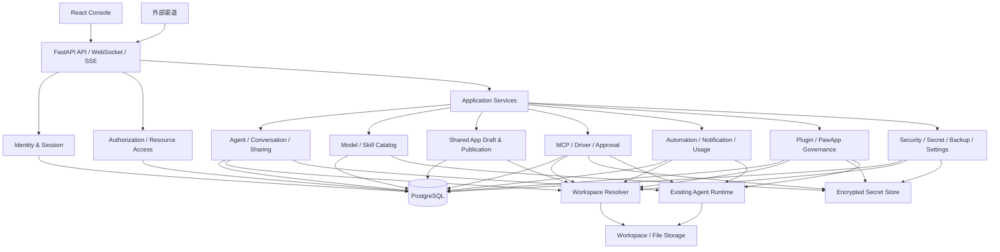
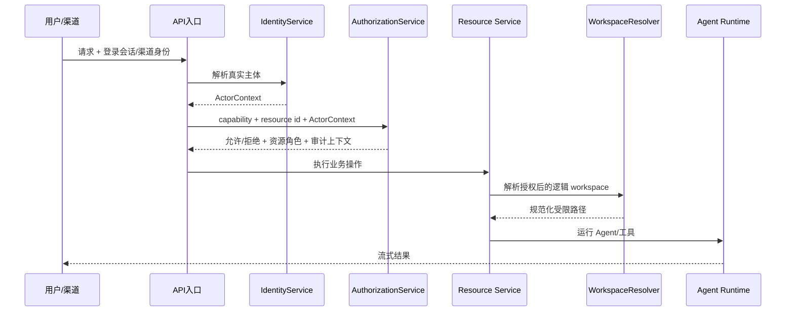

# QwenPaw 多用户目标架构方案

> **状态说明（2026-08-20）**：所有页面、菜单和专项权限边界已经完成源码、浏览器核验并逐组确认；遗留 PostgreSQL 和存储边界也已重新审计。用户已整体确认本总体架构，可以据此设计详细实施计划；具体业务源码仍须按计划逐任务确认后修改。

## 1. 文档状态

- 基线：`dev-my-fix` / `4726195905e0f96a6529b77dfbf0210d01f127ee`
- 输入：项目现状审计、历史对话，以及用户已逐项确认的 Agent、模型、技能、MCP、频道、应用插件、自动化、统计和平台运维权限边界。
- 性质：目标架构设计稿，不是实施结果。
- 约束：本方案确认前不修改业务源码；确认后再拆分逐步实施和验收任务。

## 2. 设计目标

本次改造不是简单增加登录框，而是在完整保留原项目功能的前提下建立以下能力：

1. 多个用户可独立登录、退出和管理自己的会话。
2. 用户可创建、修改、删除和运行自己的 Agent。
3. Agent 支持所有者、协作者、使用者和管理员四类访问语义。
4. 管理员可管理用户、平台配置、模型供应商、模型目录、技能池和公共共享应用。
5. 私有 Agent 可定向分享；公共共享应用必须经过管理员审核发布。
6. 会话、文件、记忆、任务、运行状态和审批按用户与 Agent 隔离。
7. 模型、技能、MCP、渠道和跨 Agent 工具保留原有能力，同时执行统一授权。
8. PostgreSQL 成为身份、权限、资源归属、版本和审计的事实来源。
9. 大文件、workspace、技能内容和媒体继续使用文件系统，未来可平滑切换对象存储。
10. 改造可分阶段验证和回退，避免再次出现大范围修改后原功能整体缺失。

## 3. 已确认的业务边界

### 3.1 角色与资源关系

- **平台管理员**：首先是完整的普通平台用户，拥有自己的 Agent、会话、文件、任务和使用记录，也能选择 Agent 正常对话；在此基础上额外拥有用户管理、平台配置、模型治理、技能池治理、公共应用发布、全局审计以及查看和配置所有用户 Agent 的管理能力。
- **Agent 所有者**：管理自己的 Agent、成员、草稿和定向分享，可以申请发布公共共享应用。
- **Agent 协作者**：可以编辑被授权 Agent 的配置、提示词、技能、MCP 和草稿 workspace，但不能转移所有权或绕过发布审核。
- **Agent 使用者**：可以运行 Agent、创建自己的会话和私有运行数据，不能修改 Agent 配置。

“管理员”是平台角色；“所有者、协作者、使用者”是相对于具体 Agent 或共享应用的资源角色。两者不能合并成一个全局角色字段。

管理员权限采用增量授权，而不是独立账号体系：`admin = member 基础能力 + 管理 capability`。管理员自己的日常使用数据仍按本人用户 ID 归属，不得自动进入系统公共空间；查看或修改其他用户资源时必须进入显式的管理员代操作上下文并记录审计。

### 3.2 模型

- 供应商、API Key、Base URL、协议、模型目录和本地模型运行时只由管理员配置。
- 普通用户只能看到管理员授权、当前可用的模型目录。
- 用户创建或编辑自己的 Agent 时可以设置默认模型。
- 普通私有 Agent 的对话页可以切换当前会话模型；新会话回到 Agent 默认模型。
- 公共共享应用锁定发布版本的默认模型，普通使用者不能在对话页切换。
- 删除模型前必须检查并列出引用；紧急停用后显式不可用，禁止静默回退。

### 3.3 技能

- 技能池由管理员治理。
- 普通用户可以把已授权的技能池版本载入自己可编辑的 Agent。
- 载入后修改的技能与池版本脱离；支持恢复池版本或显式更新。
- 用户私有技能发布到技能池需要提交申请，由管理员审核。

### 3.4 MCP 和外部能力

- MCP 归属于 Agent 或共享应用版本。
- 所有者和协作者可以配置自己有编辑权的 Agent；使用者只能调用。
- 公共共享应用的 MCP、外部工具和密钥引用随草稿提交管理员审核。
- 普通使用者不能查看、编辑或导出密钥。
- 外部副作用仍由实际调用用户确认，并形成脱敏审计。

### 3.5 分享与发布

- 定向分享通过 Agent 成员 ACL 完成，不要求管理员逐次审批，但管理员可以审计和强制撤销。
- 公共共享应用是独立发布对象，不用 `is_shared` 布尔值代替。
- 编辑只进入草稿；审核通过后原子切换线上版本。
- 线上版本使用只读发布基线，每个用户拥有独立的私有运行 workspace。

### 3.6 频道

- 原项目支持一个 Agent 同时启用多个不同类型频道；当前内置配置通常是每种频道类型一个配置实例。
- Agent 所有者和协作者可以为自己有编辑权的 Agent 创建配置、启用、停用、修改和解绑频道，不因平台角色是普通用户或管理员而区别对待。
- 管理员配置自己的 Agent 时走与普通用户相同的资源权限；治理其他用户 Agent 的频道时使用管理员代操作并记录审计。
- 同一外部 Bot 身份不能同时绑定到多个运行中的 Agent，必须保留原项目的冲突检测。
- 频道 Token、Secret 和登录凭据进入 Secret Store；普通接口只返回配置状态和脱敏信息，任何角色都不能回读明文。
- 外部渠道身份必须映射到明确的平台用户、访客主体或访问规则，不能默认继承 Agent 所有者身份。

### 3.7 ACP 与语音转写

- 目标产品不开放 ACP：从目标菜单、普通业务 API 和新权限模型中移除 ACP 入口，不为其建设首期数据库模型或新功能。
- 为降低原项目回归风险，首期不物理删除 ACP/Harness 源码；通过明确的产品能力开关禁用路由和菜单，并只保留读取历史数据所需的兼容能力。
- 语音转写保留原有关闭、本地 Whisper、远程 Whisper API、模型选择和测试能力。转写基础设施与供应商由管理员配置，普通用户直接使用管理员启用的能力。

### 3.8 应用中心与插件

- 插件和 PawApp 的安装、升级、强制重装、全局停用和卸载仅管理员执行，因为它们会执行后端 Python、前端 JavaScript、安装依赖并影响全部 Agent。
- 普通用户保留应用中心，只能使用管理员已安装、启用并授权的应用；首期授权范围为全部成员、指定用户和停用。
- Agent 所有者和协作者可以配置已安装插件能力在自己可编辑 Agent 中的启停、非敏感参数和 Agent 级 Secret 引用，但不能安装代码或改变全局版本。
- 插件新增模型供应商仍由管理员配置；插件新增频道类型由用户按 Agent 频道绑定规则使用。
- 管理员使用应用时以本人普通用户身份运行并拥有独立应用数据，只有显式代操作才进入管理上下文。
- PawApp 的用户、Agent、会话、存储、工具调用和审批必须从服务端 `ActorContext` 解析，禁止信任客户端传入的 `user_id` 或 `agent_id` 作为授权事实。

### 3.9 自动化、收件箱与统计

- Agent 所有者和协作者可以管理可编辑 Agent 的定时任务与心跳，使用者不能修改 Agent 级自动化。
- 自动化执行使用授权人的受限 `ActorContext`；不允许通过关闭 Tool Guard 永久绕过审批，文件写入、删除、外部投递、网络写入和 MCP 副作用等能力必须进入明确的长期自动化授权范围。
- 协作者创建外部投递或高风险自动化时，需要 Agent 所有者确认；授权失效、用户禁用或依赖资源停用时任务自动暂停并通知授权人。
- Heartbeat 继续作为 Agent 级自动化，`main` 使用专用自动化会话，`last` 只能解析授权用户自己的最后有效目标，禁止跨用户复用会话。
- 通知和审批按接收用户隔离；管理员个人收件箱与平台治理视图分离，管理员不能代替普通用户批准其个人工具副作用。
- Agent 所有者和协作者只能查看不含其他用户消息内容、会话标题或逐用户明细的 Agent 匿名聚合统计；使用者查看自己的统计。
- Token 统计分为个人、Agent 聚合和管理员平台全局三层；首期不建设计费、余额和配额系统。

### 3.10 平台运维与安全治理

- 部署级环境变量、工具后台默认策略、平台安全基线、平台备份恢复和全局调试日志仅管理员管理。
- 部署级环境变量和 Agent Secret 均采用不可回读语义；任何角色只能创建、替换、轮换、撤销和查看已配置状态，不能通过普通 API 取回明文。
- Agent 所有者和协作者通过独立 Agent Secret 绑定入口配置频道、MCP 和插件凭据，不能访问部署级环境变量。
- Tool Guard、File Guard、Sandbox、Skill Scanner 和全局白名单由管理员定义最低基线；Agent 所有者和协作者只能增加更严格的 Agent 策略。
- 免认证主机默认关闭，不能直接映射为普通用户、Agent 所有者或管理员；兼容模式只能使用受限服务主体并记录高风险审计。
- 平台完整备份、导入、导出、删除和恢复仅管理员执行；普通用户使用独立 Agent 可移植包，默认不包含有效 Secret、平台配置、技能池或其他用户数据。
- 全局日志仅管理员查看且必须服务端脱敏；普通用户继续通过自己的对话、Run、Trace 和收件箱查看本人运行过程与错误。
- 界面语言和时区属于用户个人偏好；上传限制、后台策略和安全基线属于平台设置。

## 4. 候选架构比较

### 方案 A：一次性把全部文件和业务数据迁入 PostgreSQL

做法：用户、Agent、配置、会话、消息、技能文件、workspace 文件、凭据和运行状态全部改成数据库表或大对象。

优点：

- 数据入口统一。
- 查询和备份形式统一。
- 表面上容易做事务。

缺点：

- 需要重写现有 workspace、文件工具、技能目录、DriverCard、SQLite 会话和备份逻辑。
- 大量原有功能会同时失去兼容层，回归范围过大。
- PostgreSQL 不适合直接承担任意 workspace 文件、媒体和本地工具工作目录。
- 迁移失败时难以按模块回退。

结论：不推荐。它重复了历史改造中“大爆炸迁移”的主要风险。

### 方案 B：每个用户复制一套现有单用户目录

做法：保留现有代码，以用户 ID 选择不同的 `~/.qwenpaw/<user>` 根目录；管理员另外维护全局目录。

优点：

- 初期改动较小。
- 单个用户的大部分功能容易运行。

缺点：

- 无法自然表达协作者、定向分享、公共发布版本和跨用户审计。
- 全局模型、技能池和共享应用会产生重复或同步冲突。
- 仅靠目录路径不能提供可靠授权，路径篡改风险高。
- 后续仍必须补数据库，形成两次迁移。

结论：只能作为短期演示方案，不满足已经确认的产品目标。

### 方案 C：模块化单体 + PostgreSQL 控制面 + workspace 数据面

做法：保持当前 FastAPI、React 和 Agent 运行时总体结构；增加统一身份与授权层。PostgreSQL 保存结构化业务事实，文件系统保存 workspace 内容，专用 Secret Store 保存敏感值。所有文件访问先通过数据库解析所有权和逻辑定位。

优点：

- 能逐模块迁移，保留现有 Agent、技能、MCP 和文件工具实现。
- PostgreSQL 负责其擅长的身份、关系、状态、版本、索引和审计。
- workspace 继续满足本地工具、Markdown、技能和媒体的文件语义。
- 可以先兼容现有文件格式，再逐步收紧事实来源。
- 单个部署单元便于当前项目维护，不引入不必要的微服务复杂度。

缺点：

- 必须严格定义数据库与文件系统的一致性边界。
- 迁移期间存在新旧存储双读或兼容适配器。
- 备份恢复需要同时覆盖数据库、workspace 和 Secret Store。

结论：推荐。该方案最符合 KISS、YAGNI 和渐进式迁移要求。

## 5. 推荐总体架构



### 5.1 架构原则

1. **数据库是授权事实来源**：用户不能通过提交路径、Agent ID 或会话 ID 自行取得资源。
2. **workspace 是内容存储，不是权限系统**：目录存在不代表当前用户可读。
3. **单一访问入口**：页面 API、后台任务、工具调用和外部渠道使用同一资源授权服务。
4. **配置与运行分离**：Agent 草稿、发布快照、用户会话覆盖和运行时状态分别建模。
5. **密钥与普通配置分离**：任何业务表、发布快照、日志或 DTO 都不返回密钥明文。
6. **先兼容后替换**：保留当前文件格式和运行时，通过适配器接入新身份和数据模型，再逐步移除旧路径。

## 6. 服务边界

推荐仍采用模块化单体，不拆微服务。模块通过应用服务和仓储接口协作，避免路由直接操作任意文件。

### 6.1 IdentityService

职责：

- 用户创建、登录、退出、密码变更和禁用。
- 密码哈希、访问令牌、刷新会话和全设备撤销。
- 当前平台用户解析。
- 外部渠道身份绑定。

不负责 Agent ACL 或模型权限。

### 6.2 AuthorizationService

职责：

- 判断平台角色。
- 解析用户在具体 Agent、会话、发布应用、技能或文件上的资源角色。
- 为路由、后台任务和工具层提供统一 `require_capability` 接口。
- 管理员代操作也返回明确的审计上下文，而不是跳过授权链。

推荐以应用层授权作为主控制；对最敏感的核心表可增加 PostgreSQL RLS 作为纵深防御，但不把全部业务语义塞入复杂 RLS 策略。

### 6.3 AgentService

职责：

- 创建、修改、停用、删除和复制 Agent。
- 管理所有者和成员 ACL。
- 维护 Agent 默认模型、配置版本和 workspace 定位。
- 触发目标 Agent 热重载。

任何删除先执行引用检查和软删除；文件清理进入可审计的异步清理阶段。

### 6.4 ConversationService

职责：

- 会话、消息、草稿、附件、运行状态和当前会话模型。
- 会话默认仅创建者可见。
- 显式分享会话给协作者。
- 恢复用户在指定 Agent 的最近会话和输入草稿。

会话读取必须同时验证 `conversation.user_id` 和 Agent 使用权限。仅有 Agent 管理权限不应自动读取用户私人会话；管理员审计读取需要专门能力和审计原因。

### 6.5 ModelGovernanceService

拆成两个外部接口：

- 管理接口：供应商、密钥、模型目录、授权、连接测试、本地运行时，仅管理员。
- 用户目录接口：只返回模型 ID、名称、能力、状态和是否可用，不暴露供应商管理细节。

模型解析顺序：

1. 管理员部署级兜底模型。
2. Agent 默认模型。
3. 当前用户的当前会话覆盖，仅适用于非公共共享应用。

### 6.6 SkillCatalogService

职责：

- 管理员维护技能池条目和版本。
- 用户读取授权版本并载入可编辑 Agent。
- 私有技能发布申请与审核。
- 记录载入来源、内容哈希、是否已脱离、可更新版本和覆盖审计。

技能内容保存在版本目录或对象存储；数据库只保存元数据、逻辑定位和内容摘要。

### 6.7 PublicationService

职责：

- 管理公共共享应用、草稿、提交、审核、发布、拒绝、下架和回滚。
- 构建不可变发布清单。
- 维护当前线上版本指针。
- 校验模型、技能、MCP、密钥引用和 workspace 基线是否可发布。

发布必须采用“先构建完整版本，再原子切换指针”，避免用户请求读到半完成配置。

### 6.8 DriverService

职责：

- 统一 MCP DriverCard、工具白名单、策略、OAuth 和凭据引用。
- 代替斜杠命令和旧 Runner 中遗留的 `mcp_manager` 分支。
- 为 Agent Runtime 和显式工具调用提供同一查询/调用入口。
- 调用前重新执行用户身份、Agent 权限、发布版本和审批检查。

### 6.9 WorkspaceResolver

职责：

- 根据授权后的资源 ID 返回规范化逻辑 workspace。
- 区分 Agent 草稿 workspace、发布基线和用户私有运行 workspace。
- 禁止 API 直接接收并信任绝对路径。
- 对路径穿越、符号链接逃逸和跨用户访问做统一校验。

### 6.10 AutomationService

职责：

- 管理定时任务、Heartbeat、长期自动化授权和执行状态。
- 使用授权人的受限 ActorContext 触发运行，不继承 Agent 所有者、管理员或最后登录用户身份。
- 校验投递目标、频道绑定、工具能力和授权有效期。
- 在用户禁用、权限撤销或依赖资源停用时自动暂停任务并通知授权人。

### 6.11 NotificationApprovalService

职责：

- 管理用户私人通知、未读回执和删除视图。
- 将工具审批绑定到唯一的 `approval_user_id`。
- 区分用户私人收件箱与管理员平台治理告警。
- 保证通知删除不删除共享 Run、安全审计或其他用户的通知状态。

### 6.12 ExtensionGovernanceService

职责：

- 管理插件/PawApp 安装、版本、能力审核、全局启停和用户授权。
- 将管理员安装治理与 Agent 所有者/协作者的 Agent 级能力配置分离。
- 为 PawApp 提供服务端解析的 ActorContext、Agent、会话、存储和审批接口。
- 插件代码和依赖仍由现有加载器运行，但不得自行成为授权事实来源。

### 6.13 PlatformOperationsService

职责：

- 管理部署设置、安全基线、Secret 生命周期、平台备份恢复和日志访问。
- 将用户语言、时区等个人偏好与平台设置分离。
- 合并平台安全基线与 Agent 收紧策略，拒绝降低基线的配置。
- 编排 PostgreSQL、workspace、内容存储和 Secret Store 的一致性备份与恢复。
- 对环境变量、备份、日志和安全设置的管理操作记录审计。

## 7. PostgreSQL 核心数据模型

字段只列出设计关键项；详细 DDL 在实施计划阶段生成。

### 7.1 身份与会话

```text
users
  id, username, password_hash, status, platform_role,
  created_at, updated_at, last_login_at

user_sessions
  id, user_id, refresh_token_hash, expires_at,
  revoked_at, client_info, created_at

external_identities
  id, user_id?, source, external_subject_id,
  binding_status, metadata, created_at
```

第一阶段平台角色只需要 `admin` 和 `member`，不预设复杂组织和自定义角色系统。资源角色独立建表，符合 YAGNI。

### 7.2 Agent 与成员

```text
agents
  id, owner_user_id, name, description, status,
  visibility, default_model_mode, default_model_id,
  draft_workspace_key, config_version, created_at, updated_at, deleted_at

agent_members
  agent_id, user_id, role, granted_by, created_at, revoked_at
  role = collaborator | user

agent_config_revisions
  id, agent_id, revision, structured_config, content_hash,
  changed_by, created_at
```

所有者保存在 `agents.owner_user_id`，避免成员表中出现多个 owner。所有权转移使用专门事务，同时记录审计。

### 7.3 会话与运行状态

```text
conversations
  id, agent_id, owner_user_id, title, status,
  model_override_id?, created_at, updated_at, deleted_at

conversation_members
  conversation_id, user_id, role, granted_by, created_at

messages
  id, conversation_id, run_id?, sequence, role, message_type,
  content, status, created_by, created_at

runs
  id, conversation_id, initiated_by, status,
  started_at, finished_at, error_summary?

run_events
  id, run_id, sequence, event_type, payload,
  tool_call_id?, created_at

tool_calls
  id, run_id, call_id, source, tool_name, status,
  redacted_arguments, approval_id?, output_ref?, started_at, finished_at

attachments
  id, conversation_id, message_id?, owner_user_id,
  storage_key, media_type, size, content_hash, created_at

user_agent_preferences
  user_id, agent_id, last_conversation_id?, draft_input?, updated_at
```

会话、消息以及可重放的运行事件进入 PostgreSQL，附件、媒体和超大工具输出保存到文件/内容存储并由数据库引用。消息不能只保存最终回答：Reasoning、Skill/Plugin/MCP 调用、命令执行、审批、图片、文件、进度、错误和最终结果必须保留稳定顺序与关联 ID，确保刷新、历史查看和 SSE 重连后仍能完整还原原页面。

### 7.4 模型治理

```text
model_providers
  id, name, type, status, base_url_metadata,
  credential_ref, created_by, updated_at

models
  id, provider_id, model_key, display_name, capabilities,
  status, config, created_at, updated_at

model_grants
  model_id, subject_type, subject_id?, enabled, created_by
```

第一版若所有成员共享同一模型目录，可只实现全体成员授权，不预先实现复杂用户组。表结构保留明确主体类型即可，但服务层只开放当前需求。

### 7.5 技能

```text
skill_pool_items
  id, name, status, current_version_id, created_by, updated_at

skill_pool_versions
  id, skill_id, version, content_key, content_hash,
  metadata, published_by, created_at

agent_skills
  id, agent_id, name, content_key, enabled,
  source_pool_version_id?, detached, config, updated_at

skill_publish_requests
  id, agent_skill_id, submitted_by, status,
  reviewed_by?, review_note?, created_at, reviewed_at?
```

### 7.6 MCP 与凭据

```text
agent_drivers
  id, agent_id, protocol, name, status,
  current_revision_id?, credential_binding_id?, created_by, created_at

driver_revisions
  id, driver_id, revision, config, tool_allowlist,
  policy, content_hash, created_by, created_at

credential_records
  id, scope_type, scope_id, secret_type, encrypted_value,
  key_version, status, created_by, rotated_at?, revoked_at?

credential_bindings
  id, credential_id, consumer_type, consumer_id,
  purpose, created_by, created_at

mcp_oauth_sessions
  id, driver_id, initiated_by, state_hash, status,
  expires_at, completed_at?
```

MCP 配置与修订进入 PostgreSQL；运行时 DriverCard 是可重建物化结果，不再成为授权事实来源。审批统一使用 7.9 的 `approval_requests`，不建立第二套 `tool_approvals`。真实密钥只存在 `credential_records.encrypted_value`，主密钥位于数据库之外，普通 API 不回读明文。

### 7.7 频道

```text
channel_bindings
  id, agent_id, channel_type, display_name, status,
  config, credential_ref?, created_by, updated_by,
  created_at, updated_at

channel_external_identities
  id, channel_binding_id, external_subject_id,
  platform_user_id?, binding_status, metadata, created_at

channel_access_rules
  id, channel_binding_id, scope, subject_pattern,
  effect, created_by, updated_at
```

`channel_bindings` 直接归属 Agent，不建立“管理员先创建连接、再授权给用户绑定”的额外中间层。第一版保持原功能边界：同一 Agent 可绑定多个不同 `channel_type`，内置类型默认每类一个绑定；如果未来需要同一 Agent 绑定多个同类型 Bot，应作为独立新需求评审，不能在本次兼容改造中暗中扩展。

### 7.8 插件与应用授权

```text
plugin_installations
  id, plugin_id, version, plugin_type, source_type, source_ref,
  content_hash, status, installed_by, installed_at, disabled_at?

plugin_capabilities
  plugin_installation_id, capability_type, capability_key,
  declared_config, review_status, reviewed_by?, reviewed_at?

app_grants
  plugin_installation_id, subject_type, subject_id?, enabled,
  granted_by, created_at

agent_plugin_settings
  agent_id, plugin_installation_id, enabled, config,
  credential_ref?, updated_by, updated_at

app_user_data
  plugin_installation_id, user_id, agent_id?, namespace,
  key, value, updated_at
```

插件代码、前端静态资源和依赖留在文件系统；数据库只保存安装事实、能力审核、授权、引用和小型结构化用户数据。大型 PawApp 数据进入内容存储。

### 7.9 自动化、通知、审批与用量

```text
automation_schedules
  id, agent_id, created_by_user_id, automation_owner_user_id,
  type, name, schedule, timezone, task, dispatch, status,
  config_version, created_at, updated_at

automation_grants
  id, schedule_id, authorized_by_user_id, capability,
  resource_scope, target_scope, expires_at?, revoked_at?

automation_executions
  id, schedule_id, run_id?, status, trigger,
  started_at, finished_at, delivery_status, error_summary?

notifications
  id, recipient_user_id, agent_id?, source_type, source_id?,
  event_type, status, severity, title, body, payload_ref?, created_at

notification_receipts
  notification_id, user_id, read_at?, deleted_at?

approval_requests
  id, approval_user_id, agent_id, conversation_id?, run_id?,
  tool_call_id?, capability, redacted_arguments,
  status, created_at, decided_at?, expires_at?

usage_records
  id, occurred_at, user_id?, actor_type, agent_id?,
  conversation_id?, run_id?, automation_schedule_id?,
  provider_id, model_id, prompt_tokens, completion_tokens, call_count
```

调度事实、长期授权、执行摘要、通知、审批和用量进入 PostgreSQL。`HEARTBEAT.md` 等人类可编辑内容继续保留在 workspace，大型运行输出和 Trace 通过内容引用关联。

### 7.10 公共共享应用

```text
shared_apps
  id, agent_id, owner_user_id, status,
  current_publication_id?, created_at, updated_at

shared_app_drafts
  id, shared_app_id, revision, manifest,
  workspace_key, created_by, updated_at

shared_app_publications
  id, shared_app_id, version, immutable_manifest,
  baseline_workspace_key, submitted_by, reviewed_by,
  review_status, published_at?, retired_at?

shared_app_user_workspaces
  shared_app_id, publication_id, user_id,
  workspace_key, quota, status, created_at, updated_at
```

发布清单只保存密钥引用及版本，不保存密钥明文。

### 7.11 平台设置、安全与备份

```text
system_settings
  key, value, version, updated_by, updated_at

system_setting_revisions
  id, key, old_value, new_value, changed_by,
  reason?, created_at

user_preferences
  user_id, language, timezone, preferences, updated_at

security_policies
  id, scope_type, scope_id, policy_type, config,
  version, enforced, updated_by, updated_at

security_events
  id, occurred_at, user_id?, agent_id?, run_id?,
  event_type, severity, action, rule_id?, redacted_detail

backup_artifacts
  id, name, backup_type, storage_key, manifest_hash,
  signature, status, created_by, created_at

backup_operations
  id, artifact_id, operation_type, requested_by, status,
  scope_manifest, started_at, finished_at, error_summary?
```

部署级环境变量的值复用 7.6 的 `credential_records`，`system_settings` 只保存非敏感配置或 Secret 引用。平台备份归档和用户 Agent 可移植包使用不同 `backup_type`、API 和权限链。全量日志不进入业务表，只保存日志访问审计和必要运行摘要。

### 7.12 审计

```text
audit_logs
  id, actor_user_id?, actor_identity_type, action,
  resource_type, resource_id, result,
  reason?, request_id, source, redacted_detail, created_at
```

审计采用只追加写入。管理员查看私人资源、代用户修改、发布审核、密钥替换、模型治理和高风险工具调用必须记录。

## 8. workspace 与文件布局

推荐通过逻辑键管理目录，不把绝对路径暴露给前端：

```text
data/
├─ agents/<agent-id>/draft/...
├─ publications/<publication-id>/baseline/...
├─ users/<user-id>/agents/<agent-id>/runtime/...
├─ users/<user-id>/apps/<shared-app-id>/runtime/...
├─ skill-pool/<skill-id>/<version>/...
└─ staging/<operation-id>/...
```

实际路径由 `WorkspaceResolver` 根据数据库记录生成和校验。发布基线只读；用户运行目录可写；草稿只允许所有者、协作者和管理员访问。

文件操作规则：

- 所有读取、写入、上传、下载、搜索和删除都先解析资源权限。
- 工具运行使用受限根目录，禁止符号链接或相对路径逃逸。
- 删除采用软删除记录 + 隔离目录/回收期 + 后台物理清理。
- 数据库事务不直接假装覆盖文件系统事务；使用 staging、原子目录切换和补偿任务。

## 9. 请求身份与授权流程



`ActorContext` 至少包含：

- 平台用户 ID，若已登录或已绑定。
- 身份类型和来源。
- 外部主体 ID，若来自渠道。
- 当前会话 ID、Agent ID、请求 ID。
- 是否管理员代操作及操作原因。

任何内部工具调用都必须显式传递 `ActorContext`，禁止在后台默认继承 Agent 所有者身份。

## 10. 前端信息架构

### 10.1 普通用户菜单

保留原项目主要功能入口，但只显示有权限的资源：

- 对话。
- 我的 Agent / 已分享给我。
- Agent 配置、技能、MCP 等页面仅在具有编辑权限时显示编辑操作。
- 公共共享应用目录。
- 自有 Agent 的可移植导出/导入入口，不显示平台备份与恢复。
- 个人资料、登录设备和退出。

模型设置、全局技能池管理、用户管理、系统配置、备份恢复和全局审计不显示。

### 10.2 管理员菜单

增加或保留：

- 用户管理。
- 全部 Agent 管理与审计入口。
- 公共共享应用审核与治理。
- 模型设置。
- 技能池管理。
- 系统设置、环境变量、安全基线、频道类型可用性、平台备份、脱敏日志和审计等部署级设置。具体 Agent 的频道和 Secret 绑定仍由该 Agent 所有者/协作者管理。

管理员查看某个用户 Agent 时，界面必须明确显示“管理员代操作”，避免与自己 Agent 混淆。

### 10.3 对话页

- Agent 切换器只列出当前用户可使用的 Agent 和公共应用。
- 普通私有 Agent 显示当前会话模型选择器。
- 公共共享应用只读显示锁定模型，不允许切换。
- 会话列表只显示自己的会话和显式共享会话。
- 登录用户切换后清空前一用户的 Agent、会话、草稿、审批和缓存状态。

## 11. 兼容与迁移策略

### 11.1 迁移原则

- 不双写所有业务数据；只在明确过渡边界使用兼容适配器。
- 每次迁移都可重复执行、可检测状态、可生成报告。
- 原始文件在验证完成前保留只读备份，不直接覆盖。
- 每个模块先建立回归测试，再迁移事实来源。

### 11.2 首次升级

当前单账户实例升级时：

1. 创建首个管理员账户，复用现有账户名但重新建立稳定用户 ID。
2. 扫描现有 Agent，全部归属首个管理员。
3. 为 Agent workspace 建立数据库登记，不立即搬动目录。
4. 通过兼容适配器读取现有会话和消息，按模块导入 PostgreSQL；完成数量、顺序和内容校验前保留原存储只读副本。
5. 导入模型、技能池、MCP 和凭据的非敏感元数据及安全引用。
6. 生成迁移报告并执行逐 Agent 一致性校验。

### 11.3 兼容适配器

迁移期保留：

- `LegacyAgentConfigAdapter`：读取现有 `agent.json` 并映射到领域模型。
- `LegacyConversationStoreAdapter`：读取现有 SQLite/文件会话。
- `DriverCardAdapter`：继续读写当前 DriverCard，但授权和版本由数据库管理。
- `LegacyProviderAdapter`：先保留现有加密供应商文件，数据库保存目录和治理状态。

适配器不得绕过新授权层。只有在新事实来源稳定后才逐个删除，不能长期同时保留两套可写入口。

## 12. 一致性与并发

- 数据库更新使用乐观版本号或更新时间条件，防止协作者覆盖彼此修改。
- 发布、所有权转移、成员变更和模型引用替换使用数据库事务。
- 文件内容先写 staging，校验成功后原子切换逻辑指针。
- 热重载在事务提交后触发；失败时记录为“配置已保存、运行时待重载”，由重试任务恢复。
- 删除和密钥撤销先让运行时不可用，再异步清理文件和连接。
- SSE/WebSocket 事件必须包含用户和资源作用域，推送层不得向同一进程中的其他用户广播私有事件。

## 13. 安全设计

### 13.1 认证

- 密码使用现代自适应哈希。
- 访问令牌短时有效，刷新会话可按设备撤销。
- 用户禁用、密码变更和管理员强制退出可撤销已有会话。
- 登录、失败、注销、刷新和敏感操作记录安全审计。

MFA、企业 SSO、组织和自定义 RBAC 不属于第一版明确需求，不在首期过度设计；架构不阻断后续扩展即可。

### 13.2 授权

- 所有资源 ID 在服务端重新解析。
- 批量操作逐个资源校验，不能只校验第一个对象。
- 管理员能力使用显式 capability，不使用散落的 `is_admin` 条件。
- 后台任务、Agent 工具、斜杠命令和渠道入口与 Web API 使用同一授权服务。

### 13.3 密钥

- 模型、MCP、渠道和技能 Secret 使用同一加密凭据接口，但按作用域隔离。
- 普通响应只返回“是否已配置”和脱敏占位符。
- 任何角色均不能通过普通 API 读取明文；管理员可以替换、轮换、撤销和查看引用影响。
- 日志、错误、审批参数和审计正文执行结构化脱敏。
- 部署环境变量与 Agent Secret 使用不同作用域和入口；Agent 所有者/协作者不能枚举部署级变量。

### 13.4 高风险工具

- MCP `stdio`、远程 URL、内网访问、文件删除、消息发送和其他外部写操作按能力分类。
- 共享应用发布时管理员审核能力清单、网络目标和权限范围。
- 实际副作用调用仍由当前用户审批。
- 紧急停用即时阻断运行，不静默切换替代工具。

### 13.5 平台安全基线

- Tool Guard、File Guard、Sandbox、Skill Scanner 和全局白名单由管理员维护。
- Agent 策略只允许在平台基线上收紧，服务端计算最终有效策略并拒绝降级请求。
- 免认证主机默认关闭；兼容模式只创建受限服务主体，不得映射为用户或管理员。
- 安全策略、白名单、环境变量和日志访问均记录修订或审计。

## 14. 备份、恢复与删除

完整备份必须作为一个一致性集合记录：

- PostgreSQL 业务数据。
- workspace 和技能内容。
- 加密凭据及匹配的主密钥策略。
- 备份清单、版本和校验摘要。

普通用户的导出不是平台完整备份，只能导出其有权管理的可移植数据；默认不包含可用密钥。平台备份、跨实例恢复和覆盖恢复仅管理员可执行。

平台恢复必须在执行前重新确认影响清单，并以统一操作记录编排数据库、workspace、内容存储和 Secret Store。用户 Agent 包导入只能创建当前用户的新 Agent/草稿，不能覆盖平台配置、他人资源或现有 Agent。

删除语义：

1. 服务端引用检查。
2. 标记停用或软删除，立即撤销访问。
3. 保留审计和必要恢复窗口。
4. 后台清理 workspace、运行状态和无引用凭据。
5. 记录清理结果和失败重试。

## 15. 可观测性与审计

请求、Agent 运行和工具调用使用同一 `request_id / run_id` 关联。至少记录：

- 当前平台用户或外部身份。
- Agent、共享应用版本和会话。
- 使用模型。
- 技能或工具名称。
- 审批结果和执行结果。
- 管理员代操作原因。

审计与运行日志分离：运行日志用于诊断，可按保留期清理；安全审计只追加写入并限制访问。敏感参数仅保存脱敏摘要，不能为了“完整审计”存储密钥或完整私人消息。

## 16. 原功能保留策略

多用户改造的验收不是“登录成功”，而是原页面功能在新权限下仍然成立：

- Agent 创建、编辑、复制、启停、删除和热重载。
- 对话、流式输出、历史会话、草稿、附件和工具审批。
- 模型供应商、本地模型、Agent 默认模型和对话切换。
- 技能创建、启停、配置、池载入、更新、广播和发布申请。
- MCP 创建、OAuth、工具白名单、访问策略、自动调用和斜杠命令。
- 文件、任务、记忆、频道、日志、统计和备份恢复。
- Harness 历史数据只读兼容和跨 Agent 工具；ACP 产品入口明确关闭，不作为新功能验收范围。

每个功能都要分别验证管理员、所有者、协作者、使用者和未授权用户，不能只验证管理员路径。

## 17. 推荐方案的明确取舍

本方案明确选择：

- 模块化单体，而不是微服务。
- PostgreSQL 保存控制面和结构化业务事实。
- workspace/文件存储保存内容数据。
- 专用加密凭据存储保存 Secret。
- 应用层统一授权，关键表可用 RLS 纵深防御。
- 兼容适配器渐进迁移，而不是一次性重写。
- 第一版只有管理员/成员平台角色和三种 Agent 资源角色，不建设复杂组织权限平台。
- 管理员是普通用户能力的增量超集，保留自己的 Agent、会话和全部普通使用路径。
- 公共共享应用采用不可变发布版本和用户私有运行 workspace。
- Agent 频道绑定由所有者/协作者管理；平台管理员只额外治理频道类型可用性和他人资源。
- ACP 不开放，语音转写保留并由管理员配置基础设施。
- 插件/PawApp 安装治理仅管理员，普通用户使用获授权应用，Agent 所有者/协作者配置已安装能力的 Agent 级启停和参数。
- 自动化使用授权人的受限 ActorContext 和明确长期授权，不允许关闭 Tool Guard 形成永久绕过；收件箱、审批和统计按已确认范围隔离。
- 部署级环境变量、安全基线、平台备份和全局调试仅管理员管理；Agent Secret 不可回读，Agent 策略只能收紧平台基线。
- 免认证主机默认关闭且不映射为用户身份；语言和时区属于个人偏好。

## 18. 设计确认结果

用户已确认以下整体架构决策：

1. 采用“模块化单体 + PostgreSQL 控制面 + workspace 数据面 + 加密 Secret Store”的推荐方案。
2. PostgreSQL 是身份、权限、资源归属、会话消息、运行事件、版本和审计的事实来源；附件、媒体、超大工具输出和 workspace 文件不直接塞入普通业务表。
3. 应用层统一授权是主防线，关键表可以增加 RLS，但不以复杂 RLS 代替业务授权服务。
4. 升级时现有全部 Agent 先归属首个管理员，目录先登记后渐进迁移。
5. 公共共享应用使用只读发布基线和用户私有运行 workspace。
6. 采用兼容适配器逐模块切换事实来源，每个模块独立回归和确认，不进行一次性大改。
7. 第一版不引入组织、多租户组织树、自定义角色、MFA 或企业 SSO，避免超出当前需求；保留后续扩展能力。
8. Secret、审批、通知和用量分别只有一套事实来源；不再保留重复的 `credential_metadata/tool_approvals` 与新表并行写入。
9. 实施按独立阶段推进，每个阶段先建立原功能回归证据、再迁移、再由用户确认；任何阶段不得以“登录可用”为理由跳过原页面和工具过程验收。
