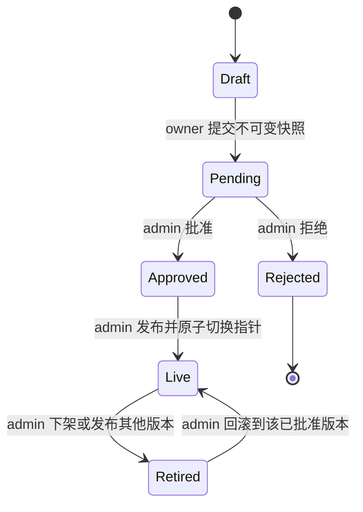

# Task 9.1 共享应用发布与用户运行设计

## 1. 目标与边界

Task 9.1 建立从 Agent 草稿到共享应用运行的完整闭环：所有者保存草稿并提交不可变候选版本，管理员审核后独立发布；普通用户从应用中心启动应用，在锁定模型和独立运行空间中创建私人会话；管理员可下架当前版本，也可将入口回滚到先前已批准版本。

本任务中的“共享应用”是由 Agent 配置、工作区基线和依赖清单组成的已发布运行单元。它与现有 PawApp/插件不同：PawApp 是可安装代码包，归纵向 Task 9.2 治理；共享应用可以声明对已安装插件的依赖，但不能在本任务中安装、升级或授权插件。

本任务不建设组织级应用商店、付费、配额套餐、灰度发布、多人共同审核、发布定时器或跨实例制品分发。它只实现当前计划要求的草稿、提交、审核、发布、下架、回滚、模型锁定、每用户运行空间和私人会话。

## 2. 核心原则

1. **草稿可变，候选版本不可变。** 提交动作同时固化 manifest、依赖引用和工作区基线；管理员审核的是这一完整快照，而不是提交后仍会变化的 Agent。
2. **审核与发布分离。** 审核只把候选版本标记为批准或拒绝；发布动作再次校验依赖，然后原子切换共享应用的当前版本指针。
3. **会话固定到发布版本。** 新会话使用启动时的当前发布版本；后续发布、下架或回滚不重写历史会话的版本。
4. **运行模型由服务端锁定。** 客户端只提交共享应用标识或会话标识，后端从数据库读取可信发布版本并解析模型；共享应用会话不接受用户模型覆盖。
5. **基线只读，用户空间可写。** 发布基线不参与直接运行；每个用户、每个发布版本拥有独立的写入空间。
6. **安全撤销优先。** 依赖失效、凭据绑定撤销或插件停用时，运行明确失败，不静默回退到其他模型、凭据或工具。

## 3. 角色与权限

| 操作 | Agent owner | collaborator | 普通 user | 平台管理员 |
|---|---:|---:|---:|---:|
| 查看并编辑源 Agent | 是 | 按既有 Agent ACL | 否 | 仅显式代管 |
| 保存共享应用草稿 | 是 | 按既有可编辑权限 | 否 | 仅显式代管 |
| 提交候选版本 | 是 | 否 | 否 | 仅显式代管 |
| 查看自己的提交记录 | 是 | 按既有可查看权限 | 否 | 是 |
| 批准或拒绝 | 否 | 否 | 否 | 是 |
| 发布、下架、回滚 | 否 | 否 | 否 | 是 |
| 浏览和启动已发布应用 | 是 | 是 | 是 | 是 |
| 切换共享应用模型 | 否 | 否 | 否 | 否 |

后端新增稳定 capability `publications:review`，只授予平台管理员。所有者权限仍由 Agent ACL 和 `shared_apps.owner_user_id` 共同校验，不能依赖前端菜单隐藏。

管理员审核不可变快照时不自动获得源 Agent 私有工作区的任意编辑权。管理页面只展示发布 manifest、依赖校验结果、基线摘要和审核所需的脱敏信息。

## 4. 数据模型

现有 `shared_apps`、`shared_app_drafts`、`shared_app_publications` 和 `shared_app_user_workspaces` 继续使用，并通过后续增量迁移补齐约束。不会改写或删除现有记录。

### 4.1 共享应用

`shared_apps.status` 只使用：

- `draft`：尚无当前发布版本；
- `active`：`current_publication_id` 指向可启动的已批准版本；
- `retired`：管理员已下架，当前版本指针为空。

`current_publication_id` 是唯一线上入口。应用目录不通过“取最新版本”推断线上版本。

### 4.2 草稿

草稿按 revision 追加保存。一次保存产生新的 `shared_app_drafts` 行；历史 revision 不更新。最新 revision 由同一应用的最大 revision 得到。manifest 包含展示信息和期望运行配置，但提交时仍须从服务端读取源 Agent 事实并重新生成候选快照，不能直接信任客户端 manifest。

### 4.3 发布版本

提交产生一条 `shared_app_publications`：

- `version` 由服务端按草稿 revision 生成，格式为 `r<revision>`；
- `immutable_manifest` 包含源草稿 ID/revision、展示信息、锁定模型、技能/MCP/插件/Secret 引用、有效运行设置和完整性摘要；
- `baseline_workspace_key` 指向该版本的只读基线；
- `review_status` 只使用 `pending`、`approved`、`rejected`；
- `published_at` 记录该版本首次成为当前版本的时间；
- `retired_at` 记录最近一次离开当前版本的时间。

增量迁移增加 `review_note` 和 `reviewed_at`，并增加数据库触发器，禁止更新 `version`、`immutable_manifest`、`baseline_workspace_key`、`submitted_by` 和 `shared_app_id`。审核字段、发布时间和下架时间允许通过受控服务更新。

`immutable_manifest.integrity` 保存规范化 manifest 哈希、工作区文件树哈希和快照格式版本。拒绝的候选版本仍保留，供所有者查看原因和审计；后续清理只能依据明确的保留策略处理，不属于本任务的删除动作。

### 4.4 会话版本绑定

会话表增加可空的 `shared_app_id` 和 `publication_id` 外键，并加入约束：两列必须同时为空或同时非空。普通 Agent 会话保持两列为空；共享应用会话在创建时写入两列，之后不可更改。

这使系统能够保证：

- 发布新版本只影响之后创建的会话；
- 回滚只影响之后创建的会话；
- 历史会话始终按原发布版本回放；
- 下架后历史会话可读取，但不可继续运行；
- 依赖被安全撤销时不会自动改用新依赖。

### 4.5 用户运行空间

`shared_app_user_workspaces` 的主键已包含 `shared_app_id + publication_id + user_id`。新增 `WorkspaceKind.SHARED_APP_RUNTIME`，路径逻辑键采用：

```text
user_workspaces/{user_id}/apps/{shared_app_id}/{publication_id}
```

数据库保存逻辑 workspace key，不把客户端路径作为事实来源。首次创建该用户在该版本下的会话时，服务端使用幂等 upsert 登记空间，然后从发布基线复制到新的可写运行目录。每个用户和每个版本均独立，禁止复用另一个用户或另一个版本的目录。

## 5. 发布状态机



规则如下：

1. 同一草稿 revision 只能成功提交一次。需要修正时先保存新 revision，再提交新版本。
2. 只有 `pending` 可审核；批准和拒绝都不可反向修改。审核结论变更必须提交新候选版本。
3. 只有 `approved` 可发布或回滚。
4. 发布事务把目标版本设为当前版本、应用设为 `active`，并给先前当前版本写入 `retired_at`。
5. 下架事务清空当前指针、应用设为 `retired`，并给原当前版本写入 `retired_at`。
6. 回滚不复制或修改历史 manifest；它验证目标版本仍可运行后，将当前指针切回该版本并清除目标版本的 `retired_at`。
7. 并发发布通过行锁和当前版本前置条件控制。指针已变化时返回 `409 PUBLICATION_STATE_CHANGED`，管理员刷新后重试。

## 6. 提交快照与依赖校验

提交采用“先构建、后落库”的受控流程：

1. 校验调用者是源 Agent owner，读取最新草稿和 Agent 配置版本。
2. 在受控 staging 目录构建工作区快照，拒绝符号链接、路径逃逸、临时运行文件和明文 Secret。
3. 规范化并固定依赖清单：
   - 模型：provider ID、模型 ID/名称和受治理目录版本；
   - 技能：技能 ID、已发布版本和内容哈希；
   - MCP：client ID、配置 revision、允许工具和凭据绑定 ID；
   - 插件：插件 ID、版本和启用状态；
   - Secret：仅 credential binding ID、用途和所需 scope，不保存明文；
   - 运行设置：工具、记忆、安全和循环等实际生效配置摘要。
4. 计算规范化 manifest 和工作区文件树哈希。
5. 将完整 staging 目录原子移动到发布基线路径。
6. 在数据库事务中插入 `pending` 发布版本和审计记录。

若第 1 至 4 步失败，只清理本次 staging。若基线已移动而数据库事务失败，基线保持不可见且无数据库引用，由后续一致性扫描报告；产品请求路径不猜测并删除可能被并发引用的制品。

管理员打开审核页时执行只读校验；点击发布或回滚时再次执行强校验。强校验至少检查：模型仍在治理目录中可用、技能版本存在且哈希一致、MCP 配置 revision 和 credential binding 有效、插件仍安装并启用、Secret scope 满足声明、基线哈希一致。任何一项失败都阻止指针切换，并返回逐项脱敏错误。

已发布版本运行前执行轻量授权与依赖状态检查。依赖失效时返回稳定错误码，不修改当前发布指针：

- `PUBLICATION_MODEL_UNAVAILABLE`
- `PUBLICATION_SKILL_UNAVAILABLE`
- `PUBLICATION_MCP_UNAVAILABLE`
- `PUBLICATION_PLUGIN_UNAVAILABLE`
- `PUBLICATION_CREDENTIAL_REVOKED`
- `PUBLICATION_BASELINE_INVALID`

## 7. 用户启动与聊天运行

用户从应用详情页点击“开始使用”时，后端执行：

1. 读取 `shared_apps.current_publication_id` 并确认应用为 `active`；
2. 检查发布版本为 `approved` 且未下架，并完成轻量依赖校验；
3. 幂等创建当前用户、当前发布版本的运行空间；
4. 创建 owner 为当前用户的私人会话，写入共享应用和发布版本外键；
5. 返回会话 ID、应用展示信息、锁定模型显示名和只读版本号。

聊天请求携带会话 ID。服务端从会话加载发布版本，构造可信 `TrustedPublication` 并交给既有模型解析边界；客户端的 provider、model、publication 或 workspace 声明都不能覆盖数据库结果。前端隐藏模型切换器并显示“由应用版本 rN 锁定”。

聊天事件继续走现有 PostgreSQL Conversation/Run/Event 持久化与 SSE 机制，保持 Reasoning、工具、审批、进度、文件、图片、错误和最终回答顺序。共享应用不会建立公共会话；两个用户启动同一应用时会得到不同会话、不同运行空间和不同事件流。

下架后：

- 应用不再出现在可启动目录中；
- 已有会话历史仍可读取和导出；
- 继续发送消息返回 `409 PUBLICATION_RETIRED`；
- 管理员回滚或重新发布后，只允许基于当前版本新建会话，旧会话仍保持只读。

## 8. API 设计

### 8.1 所有者接口

```text
GET  /api/shared-apps/mine
POST /api/shared-apps
GET  /api/shared-apps/{app_id}/drafts
POST /api/shared-apps/{app_id}/drafts
POST /api/shared-apps/{app_id}/submissions
GET  /api/shared-apps/{app_id}/publications
```

草稿保存请求只接收展示字段和允许发布的显式配置。提交请求包含 `draft_revision` 和草稿 ETag；服务端发现 Agent 配置或草稿 revision 已变化时返回 `409 DRAFT_STALE`。

### 8.2 管理员接口

```text
GET  /api/admin/shared-app-publications?status=pending
GET  /api/admin/shared-app-publications/{publication_id}
POST /api/admin/shared-app-publications/{publication_id}/approve
POST /api/admin/shared-app-publications/{publication_id}/reject
POST /api/admin/shared-app-publications/{publication_id}/publish
POST /api/admin/shared-apps/{app_id}/retire
POST /api/admin/shared-apps/{app_id}/rollback
```

审核请求带 `review_note`；拒绝时理由必填。发布、下架和回滚请求带当前指针 ETag，防止管理员页面过期导致覆盖并发操作。

### 8.3 用户接口

```text
GET  /api/shared-app-catalog
GET  /api/shared-app-catalog/{app_id}
POST /api/shared-app-catalog/{app_id}/conversations
```

目录响应不返回 baseline 路径、credential binding ID、MCP Secret、内部 Agent 路径或未脱敏校验详情。共享应用会话后续复用既有会话/聊天接口，后端根据会话外键进入发布运行路径。

## 9. 前端信息架构

现有“应用中心”保留 PawApp 的“已安装 / 官方 / 市场”功能，并新增独立的“共享应用”页签，避免把发布 Agent 与插件包混为同一种资源。

共享应用页面包含：

- **可用应用：** 普通用户可浏览已发布应用、查看版本和锁定模型、点击开始使用；
- **我的发布：** owner 查看草稿 revision、提交状态、审核意见和当前线上版本；
- **应用详情/使用页：** 展示说明、当前版本、锁定模型和开始使用入口；进入聊天后沿用原聊天事件视图，模型选择器变为只读状态。

管理员设置中新增“发布审核”页面，提供待审核列表、依赖校验结果、批准/拒绝、发布、下架和版本回滚。菜单和路由由 `publications:review` 统一过滤，直接 API 使用同一 capability 校验。

## 10. 审计与敏感信息

以下动作写入 PostgreSQL 审计日志：创建共享应用、保存草稿、提交、批准、拒绝、发布、下架、回滚、创建用户运行空间、因依赖失效拒绝启动。审计记录包含 actor、共享应用、发布版本、结果、错误码和请求关联 ID。

审计、API 和前端均不得记录或返回 Secret 明文、OAuth token、完整连接串或宿主绝对路径。credential binding 只以稳定 ID 和脱敏标签展示。工作区校验错误只返回相对路径和原因。

## 11. 失败补偿与一致性

- 草稿或 Agent 版本冲突：不生成候选版本，返回 `409 DRAFT_STALE`。
- 快照构建失败：清理本次 staging，不写数据库。
- 快照已完成但发布记录事务失败：制品不进入目录，由一致性检查列为孤立制品。
- 用户空间初始化失败：会话与 workspace 登记在同一业务事务中失败；新建目录使用 staging + 原子移动，避免留下半成品可运行空间。
- 发布指针事务失败：线上指针保持原值；已构建候选版本仍可重试发布。
- 运行依赖失效：拒绝本次运行并保留会话/历史，不修改配置或选择替代依赖。
- SSE/Run 失败：沿用现有事件终态与恢复协议，不创建第二套发布专用事件系统。

## 12. 实施拆分

Task 9.1 仍作为一个纵向验收任务交付，不建立中间用户确认门。内部按以下顺序实施：

1. 数据约束、发布 Repository/Service、快照构建和依赖校验；
2. owner 与管理员 API、capability 和审计；
3. 用户运行空间、会话版本绑定、可信模型锁定和聊天入口；
4. 应用中心共享应用页、我的发布、管理员发布审核和聊天锁定状态；
5. 后端、前端、构建、Legacy/Multi-user 对照和真实浏览器验收。

数据库增量迁移只会先在独立测试 schema 上生成和验证。根据项目危险操作规则，若后续需要对原数据库执行结构变更，将另行展示迁移影响并取得明确确认；设计和产品代码实现本身不执行原数据库迁移。

## 13. 验收标准

### 13.1 自动化验证

- 发布状态机：重复提交、重复审核、未批准发布、并发发布、下架和回滚均符合预期；
- 不可变性：应用服务和直接 SQL 都不能修改发布 manifest 与基线引用；
- 依赖：模型、技能、MCP、插件和 credential 任一失效都会阻止发布或运行；
- 授权：owner 可提交但不能审核；collaborator/普通用户不能提交；管理员可审核但不能通过伪造请求改写快照；
- 隔离：两个用户使用同一发布版本时，会话、workspace、附件和 SSE 事件不共享；
- 模型锁定：请求体、查询参数和会话模型覆盖都不能改变共享应用模型；
- 版本绑定：发布新版或回滚后，旧会话的 publication ID 保持不变；
- 下架：历史可读、运行拒绝、新会话拒绝；
- 回归：普通 Agent 私人会话的模型切换、聊天事件和现有 PawApp 应用中心功能保持原行为。

### 13.2 页面验收

使用管理员、owner、普通用户 A、普通用户 B 四个独立浏览器上下文完成：

1. owner 保存草稿并提交 `r1`，提交后再修改源 Agent，管理员看到的 `r1` 内容不变；
2. 管理员拒绝 `r1`，owner 看到拒绝理由；owner 保存 `r2` 再提交，管理员批准并发布；
3. 普通用户只能看到已发布的 `r2`，模型显示锁定且不能切换；
4. 用户 A、B 分别启动并发送消息，数据库、文件和页面证明会话及 workspace 互相隔离；
5. owner 修改草稿但不发布，两个用户的新会话仍使用 `r2`；
6. 管理员发布 `r3`，已有 `r2` 会话仍显示 `r2`，新会话使用 `r3`；
7. 管理员下架，目录入口消失，历史可读而续聊被拒绝；
8. 管理员回滚到 `r2`，新会话再次使用 `r2`，旧会话版本均不改变；
9. 直接 API 验证 owner 审核、普通用户提交、客户端覆盖模型和访问他人会话均被拒绝；
10. Legacy 实例与原服务 PID 保持不变，现有应用中心 PawApp、普通 Agent 聊天和丰富事件基线新增失败为 0。

## 14. 设计结论

Task 9.1 以不可变发布版本作为审核、运行和回滚的共同事实来源，以数据库当前指针决定新会话入口，以会话外键固定历史版本，以每用户每版本运行空间保证数据隔离。审核、发布、下架和回滚均由服务端状态机与 capability 控制；前端只呈现可执行状态，不承担安全决策。
