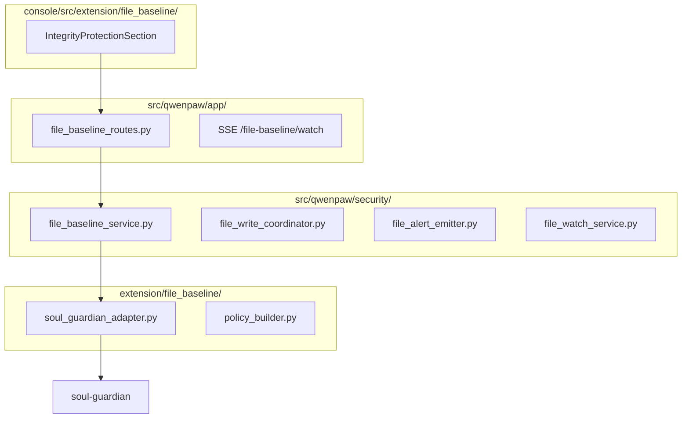

# File Baseline Protection Design

> **Slice ID:** `intent-file-baseline-protection`  
> **Supersedes:** `extension/Persona Baseline Guardian Design.md` (v0.6.7) — runtime semantics below inherit unchanged sections unless this document explicitly overrides them.  
> **Parent:** `extension/Intergrity  Protection Design.md`  
> **Version:** 1.0.4  
> **Product name (operator-facing):** 文件基线保护 / File Baseline Protection  
> **变更（1.0）：** 将「人格完整性保护 / Persona Baseline Guardian」一次性 breaking rename 为通用「文件基线保护」；Tab 改为「完整性保护」；补全受保护路径逐条点选 UI；默认仍仅 `SOUL.md` 试点默认值、功能默认关闭、规则完整性同 Tab 区块 B。  
> **变更（1.0.1）：** OS 只读（`attrib +R`）+ 唯一写通道 `temporary_os_writable`；shell/python 写 preflight。  
> **变更（1.0.2）：** rename/chmod mutate preflight；命令后 `verify_protected_baselines_after_command`（`post_command_restore`）；watch deleted。  
> **变更（1.0.3）：** 信任根 `integrity-protection/**` 不可写；frozen 快照；restore 优先 frozen；命令后 state hash 校验（`state_tamper`）。  
> **变更（1.0.4）：** 低层写入 preflight（`os.open`/`os.write`/Windows API 等）补洞；shell guard **fail-closed**（异常或无响应均不得裸跑）。

---

## 1. 决策摘要（已确认）

| # | 决策 | 定稿 |
|---|------|------|
| 1 | 对外功能名 | **文件基线保护**；代码目录/模块/类型/API 统一 `file_baseline` / `file_baseline_*` 命名 |
| 2 | 默认保护范围 | 试点默认 **`SOUL.md` only**（`DEFAULT_PILOT_TARGETS`）；不自动全开 Agent 三件套 |
| 3 | 规则完整性 | 与文件基线保护 **同一 Tab**（设置/安全/完整性保护），区块 B 不变 |
| 4 | 路径使能 | **默认不使能**；用户从预设/Skill 列表/自定义 **逐条点选** 加入 `protected_targets` 后再开总开关 |
| 5 | 迁移 | **一次性 breaking rename**；不保留 `persona_*` API/SSE/Inbox alias |

---

## 2. 目的与范围

### 2.1 要解决的问题

防止 Agent 工作区中 **用户指定的关键文件**（人格文件、`agent.json`、Skill 的 `SKILL.md` 等）被静默篡改，导致 prompt 投毒或行为偏离。机制为：建立 approved baseline → 检测 drift → 用户显式 **Restore** 或 **Accept**。

### 2.2 与 PRD 的关系

原 PRD「一、人格完整性保护」语义由本切片承载并 **泛化命名**；能力边界不变：

| 能力 | 状态 |
|------|------|
| soul-guardian 基线 + drift | ✅ |
| 实时告警 + Restore/Accept | ✅ |
| 动态 `protected_targets` | ✅（UI 补全增删） |
| 启动全量扫描（`enabled=true`） | ✅ |
| 开关默认关闭 | ✅ |
| 规则完整性（同 Tab） | ✅ 见总设计 |
| 来源可信校验 | ❌ 不在仓库范围 |

### 2.3 Out of Scope（继承 v0.6.7，仅更名）

| 项 | 说明 |
|----|------|
| read-time baseline 校验 | 不 hook PromptBuilder / read_file；读取不改变基线，**不得**因此产生 drift 告警 |
| drift 时自动 restore | 统一 `alert` 模式 |
| glob 批量 skill（v1） | v1 仅精确路径；用户逐条点选 Skill |
| API 兼容 alias | **不**保留 `/file-baseline/*` |

---

## 3. 命名与 Breaking Rename 矩阵

### 3.1 产品 / UI

| 旧 | 新 |
|----|-----|
| Tab「完整性检查」`integrityCheck` | **「完整性保护」** `integrityProtection` |
| 「人格完整性保护」 | **「文件基线保护」** |
| 「受保护的人格文件」 | **「受保护文件」** |
| 「人格漂移告警」 | **「文件基线漂移告警」** |
| Deep link `fileBaselineAlertId` | `fileBaselineAlertId` |
| 确认短语 `Confirm file baseline restore` | `Confirm file baseline restore` |
| 确认短语 `Confirm file baseline accept` | `Confirm file baseline accept` |
| 确认短语 `Confirm re-establish file baseline` | `Confirm re-establish file baseline` |

### 3.2 目录与模块

| 旧 | 新 |
|----|-----|
| `extension/file_baseline/` | `extension/file_baseline/` |
| `console/src/extension/file_baseline/` | `console/src/extension/file_baseline/` |
| `src/qwenpaw/security/file_baseline_service.py` | `file_baseline_service.py` |
| `persona_write_coordinator.py` | `file_write_coordinator.py` |
| `persona_alert_emitter.py` | `file_alert_emitter.py` |
| `file_baseline_watch_service.py` | `file_watch_service.py` |
| `file_baseline_protection_routes.py` | `file_baseline_routes.py` |
| `scripts/file-baseline-selftest.*` | `scripts/file-baseline-selftest.*` |
| `extension/selftest/file-baseline-wiring.test.js` | `file-baseline-wiring.test.js` |

### 3.3 数据路径（breaking，无自动迁移）

| 旧 | 新 |
|----|-----|
| `<WORKING_DIR>/integrity-protection/file-baseline/` | `<WORKING_DIR>/integrity-protection/file-baseline/` |

> 升级后旧目录 **不读取**；若用户曾启用过 persona 保护，需重新 Enable 并确认建新基线（与 Re-enable 流程一致）。

### 3.4 API（breaking）

| 旧 | 新 |
|----|-----|
| `GET/PUT /config/security/file-baseline/settings` | `/config/security/file-baseline/settings` |
| `GET /config/security/file-baseline/alerts` | `/config/security/file-baseline/alerts` |
| `POST .../file-baseline/restore` | `POST .../file-baseline/restore` |
| `POST .../file-baseline/accept` | `POST .../file-baseline/accept` |
| `GET .../file-baseline/watch` (SSE) | `GET .../file-baseline/watch` |

**Settings 聚合**（`GET /config/security/integrity-protection/settings`）字段：

| 旧 | 新 |
|----|-----|
| `file_baseline_enabled` | `file_baseline_enabled` |
| `protected_paths`（投影） | 保留键名或改为 `file_baseline_protected_paths`（实现时二选一，文档推荐后者以消歧） |

### 3.5 类型 / 服务 / 事件

| 旧 | 新 |
|----|-----|
| `FileBaselineService` | `FileBaselineService` |
| `FileBaselineWriteCoordinator` | `FileWriteCoordinator` |
| `FileBaselineAlertEmitter` | `FileBaselineAlertEmitter` |
| `FileBaselineWatchService` | `FileBaselineWatchService` |
| `FileBaselineGuardian`（legacy harness） | `FileBaselineGuardian` |
| `is_file_baseline_enabled()` | `is_file_baseline_enabled()` |
| SSE `file_baseline_drift` | `file_baseline_drift` |
| SSE `file_baseline_alert_resolved` | `file_baseline_alert_resolved` |
| SSE `file_baseline_updated` | `file_baseline_updated` |
| Inbox `source_type: file_baseline_protection` | **已移除**（2026-06）：漂移不再写入 Inbox；Console 不再展示「待处理基线漂移告警」表格或全局 notifier |
| Write proposal / approval `fileBaselineWrite` | `fileBaselineWrite`（Console ApprovalCard） |

### 3.6 测试标识

| 旧 | 新 |
|----|-----|
| `test_file_baseline_*` | `test_file_baseline_*` |
| 场景前缀 `PB-S*` | `FB-S*`（文档与 harness 注释） |
| `intent-persona-baseline-guardian` | `intent-file-baseline-protection` |

---

## 4. 架构分层（更名后）



职责划分与 v0.6.7 §3.1 相同，仅路径/类名替换。ClawSec `soul-guardian` **仍复用**，不因产品更名而替换引擎。

**`thirdparty/` 约束（定稿）：** `thirdparty/clawsec-main/` 及其中 `skills/soul-guardian/` **不做任何修改**。breaking rename 仅作用于 QwenPaw 自有代码（`extension/`、`src/qwenpaw/`、`console/`、测试与 manifest）。适配层通过 subprocess 调用既有 `soul_guardian.py` 路径即可。

**State dir 调用示例：**

```text
python3 .../soul_guardian.py \
  --state-dir <WORKING_DIR>/integrity-protection/file-baseline/<agent_id> \
  --workspace-root <agent_workspace> \
  <subcommand>
```

---

## 5. 保护范围与默认策略

### 5.1 试点默认

- `DEFAULT_PILOT_TARGETS = ("SOUL.md",)` — **不变**
- 新安装：`enabled=false`，`protected_targets=["SOUL.md"]` 作为 **建议默认清单**，用户可删改
- **开开关前**须至少 1 条路径（§5.4 继承）

### 5.2 用户逐条点选（v1 UI 必做）

Console **不提供**「一键保护全部 Skill / 三件套」；仅提供：

| 入口 | 行为 |
|------|------|
| **从预设添加** | 下拉：SOUL.md、AGENTS.md、PROFILE.md、HEARTBEAT.md（**不含** agent.json，见 §6） |
| **从工作区选择文件** | 「从工作区选择文件」按钮打开 Modal 文件浏览器；**默认目录 `skills/`**；选中文件后以 workspace 相对路径写入 `protected_targets`（v1 精确文件路径，不支持手填/glob） |
| **移除** | 从 `protected_targets` 删除；停止 watch/check 该 path |

约束：

- `enabled=true` 时允许增删路径（增量 init + check）；变更期间 UI loading
- `enabled=false` 时允许编辑清单（PUT settings）；运行时 no-op
- v1：**精确路径 only**；不支持 glob

### 5.3 生效路径（继承 v0.6.7 §5.4.3）

```text
effective_protected_paths(agent_id) =
  agents[agent_id].protected_targets ?? settings.protected_targets
```

---

## 6. Console 布局：设置 / 安全 / 完整性保护

Tab key: `integrityProtection`（i18n: `security.integrityProtection.tabs.integrityProtection`）

```
完整性保护 Tab
├── 区块 A — 文件基线保护（Card）
│   ├── 总开关 Switch
│   ├── 说明文案
│   ├── 受保护文件列表（对齐工作区「核心文件」样式）
│   │   └── 预设路径各行：名称 + 描述 + 路径 + Switch（使能/去使能）
│   └── 自定义路径区：已有路径 Switch 列表 + **「从工作区选择文件」**（默认 `skills/`，In-app 文件浏览器）
└── 区块 B — 内置规则完整性
```

**动态使能（FB-S16 / FB-S17）：**
- 总开关 **关**：可切换各文件 Switch，仅更新 `protected_targets`（不 scan/watch）
- 总开关 **开**：切换 Switch 立即 PUT `protected_targets` 并 `_refresh_all_agents`（增量 init + check）

**调试（Python 写保护漏网复现）：** 复现 `execute_python_code` 写 SOUL.md 时，在后端日志检索前缀 `file_baseline_python_` / `file_baseline_command_guard`：
- `file_baseline_python_tool_enter wrapper=qwenpaw` — 确认走了 QwenPaw 包装层（若无此行则可能走了 AgentScope 原生工具）
- `file_baseline_python_preflight` — 静态检测是否命中 `write_signal` / `rel_paths`
- `file_baseline_command_guard outcome=direct` — 未触发审批的原因
- `file_baseline_python_tool_bypass` — guard 异常或 direct 放行后仍执行

**只读不误报（FB-S19）：**
- `read_file` / Console 读文件 **不** 触发 drift
- `watch` / `on_file_saved` 在 emit 前比对 `approvedSha` 与 `currentSha`；内容一致则跳过
- shell / `execute_python_code` **纯读**（无写意图信号）**不** 触发写前审批

**Agent Chat 严格写保护（OS 只读 + 唯一写通道，v1.0.1）：**
- `enabled=true` 时，对每个 agent 的 `effective_protected_paths` 在工作区内的**现有文件**设置 OS 只读（Windows `attrib +R`；非 Windows `chmod` 去写权限）
- **目的**：同一 Windows 用户下的 Agent 子进程（`python -c`、`copy` 等）**物理上无法落盘**，即便 shell preflight 静态漏检
- **不**试图阻止机器管理员 / 外部编辑器（Notepad++ 管理员）；外部改动仍由 watch / startup scan 以 `external_watch` 检测
- **唯一写通道**：`commit_approved_write`（Agent `write_file`/`edit_file` 审批后、Console Save 审批后）与 **已审批** shell/python 执行前，对目标路径 **短暂 `attrib -R` → 写入 → 再 `+R`**
- **Console 技能编辑器**：`PUT /skills/save` 在落盘 `skills/<name>/SKILL.md` 前与「工作区核心文件 / Coding Mode 保存」相同，走 `try_guarded_operator_file_write`；审批通过后由 `commit_approved_write` 写入，路由侧跳过重复 `write_text`，映射 `denied`/`timeout`/`conflict` 为 403/408/409（禁止裸 `PermissionError` → 500）
- **Console 全局审批 Modal（FB-SUI-OPERATOR-APPROVAL）**：`MainLayout` 挂载 `GlobalOperatorApprovalOverlay`；`ConsolePollService` 写入的 `operator_console_save` / `persona-console:*` 待审批在任意页面（技能、工作区、Coding Mode 等）弹出 Modal；Agent Chat session 审批仍仅 Chat / Inbox 展示，避免重复
- Restore / soul-guardian maintenance 写入同理走 `temporary_writable` 上下文
- `enabled=false` 时对所有曾受保护路径 **`attrib -R` 恢复**，避免文件长期带只读属性
- shell preflight 扩展：`python -c` / `python script.py` 复用 Python 写检测（只为**写**弹审批；读仍 direct）

**Rename/chmod 偷梁换柱防护（v1.0.2 P0/P1）：**
- Python **mutate** 信号：`os.rename` / `os.replace` / `os.chmod` / `shutil.move` / `Path.rename` 等；命令中出现受保护路径名（源或目标）→ 写前审批
- shell 补充 `\bren\b`（Windows `ren`）
- **命令后校验（fail-closed）**：每次 shell/python 执行完毕（含无 preflight 的 direct 路径）调用 `verify_protected_baselines_after_command`；baseline 不一致或文件缺失 → **restore + drift（`post_command_restore`）+ 向 Agent 返回 Error**
- Windows：`attrib +R` 阻止同用户直接写；**不**叠加 `icacls /deny`（实测会阻断同用户读，导致 post-verify / soul-guardian 无法校验）。`rename`/`delete` 物理层不受 `+R` 阻止，由 mutate preflight + 命令后校验 + watch deleted 兜底
- watch：protected 路径 **deleted** 也 emit drift

| 场景 ID | 说明 | 优先级 |
|---------|------|--------|
| FB-S22 | shell `python -c` 写 protected → preflight 命中；未审批时 OS 只读阻止落盘 | P0 |
| FB-S23 | enable 后 `+R`；disable 后 `-R`；approved commit 可写并恢复 `+R` | P0 |
| FB-S24 | Python `os.rename`/`os.chmod`/`shutil.move` 命中 mutate preflight；rename 偷梁换柱需审批 | P0 |
| FB-S25 | 命令执行后 `verify_protected_baselines_after_command`：漂移则 restore + `post_command_restore` 告警 | P0 |
| FB-S26 | Windows `rename` 不受 `+R` 阻止；mutate preflight + post-command restore 阻断偷梁换柱四步攻击 | P0 |
| FB-S27 | watch 对 protected 路径 `deleted` 事件 emit drift（P1） | P1 |

**信任根防护（v1.0.3 — metadata 偷梁换柱）：**
- Agent **永远不能写** `<WORKING_DIR>/integrity-protection/**`（含 `baselines.json`、`approved/`、`settings.json`）；**无审批豁免**；仅 `file_baseline_maintenance_context` 内 QwenPaw 自身可写
- `write_file` / shell / python 三层拦截；shell/python 对 `integrity-protection/**` 的预检与 v1.0.4 **同源低层写信号**（`os.open(O_TRUNC/...)`、`os.write`、`SetFileAttributesW` 等），**无审批豁免**
- enable 时对 **`frozen/` 与 `trust_anchors.json`** 叠加 OS 只读（mutable state 由软件层拦截，避免阻断 soul-guardian 子进程 audit/approve）
- **frozen 快照**：enable / Operator Accept / 已审批写 commit 后，在 `integrity-protection/file-baseline/frozen/<agent_id>/` 封存 `approved` 副本与 sha 锚点；Agent 不可写
- **restore 来源**：workspace 还原 **优先** frozen 快照；mutable `approved/` 与 frozen 不一致则视为 state tamper，从 frozen 修复 state 再还原 workspace
- **命令后 state 校验**：shell/python 执行前后比对 state 目录 hash；Agent 触发的变更 → 从 frozen 修复 + drift（`state_tamper`）

| 场景 ID | 说明 | 优先级 |
|---------|------|--------|
| FB-S29 | Agent `write_file` 写 `integrity-protection/.../baselines.json` → 拒绝 | P0 |
| FB-S30 | 审批后 shell 夹带写 state → 仍拒绝（OS 只读 + 预检） | P0 |
| FB-S31 | poisoned `approved/` + restore → workspace 恢复为 frozen 内容 | P0 |
| FB-S32 | 命令后 state hash 漂移 → 从 frozen 修复 + 告警 | P1 |

**低层写入与 guard fail-closed（v1.0.4 — preflight 绕过补洞）：**
- Python preflight 覆盖低层文件 API：`os.open(..., O_WRONLY/O_RDWR/O_APPEND/O_TRUNC/O_CREAT)`、`os.write`/`os.writev`、`os.truncate`/`os.ftruncate`、`os.remove`/`os.unlink`、`Path.unlink`、`shutil.copyfile` 等；命中受保护路径 → 仍走现有审批链
- Windows 属性/原生 API 视作 mutate 信号：`SetFileAttributesA/W`、`CreateFileW`、`WriteFile`、`DeleteFileW`、`MoveFileExW`、`ReplaceFileW`、`CopyFileW`、`SetEndOfFile`；命中受保护路径 → 审批
- shell/PowerShell 补充 `attrib -R`、`del`/`erase`、`Remove-Item`、`fsutil file seteof`、`.NET FileStream/StreamWriter/OpenWrite/Create/Open` 等写/删/截断信号
- 语义不变：审批通过后仍使用 `temporary_os_writable` 执行，并通过 `notify_approved_paths` 接受新 baseline/frozen；未审批则不执行
- `execute_shell_command` 的 File Baseline guard **异常或无响应** 时必须 **fail-closed** 返回 Error，不得 fallback 到 unguarded shell

| 场景 ID | 说明 | 优先级 |
|---------|------|--------|
| FB-S33 | `python -c` 使用 `SetFileAttributesW + os.open(O_TRUNC) + os.write` 写 protected → preflight 命中审批 | P0 |
| FB-S34 | `open("SOUL.md", "r+")` / `Path.open("rb+")` 可写模式 → preflight 命中；纯读仍不命中 | P0 |
| FB-S35 | `attrib -R SOUL.md`、`del SOUL.md`、`os.remove/unlink/truncate` 等破坏性操作 → preflight 命中审批 | P0 |
| FB-S36 | File Baseline shell guard 异常 → 返回 Error，shell 不得裸跑 | P0 |
| FB-S37 | Console 技能 `PUT /skills/save` 对 protected `SKILL.md` 走 operator guard；审批后跳过重复 write | P0 |

**不推荐保护 agent.json：**
- 运行时会在每次 Console 会话 dispatch 时更新 `agent.json` 的 `last_dispatch` 等 bookkeeping 字段
- 若纳入基线保护会产生真实 drift，且 **不做** 静默 baseline refresh（用户原则：需要静默刷新的文件就不应保护）
- Console 预设列表 **不展示** agent.json；用户仍可通过自定义路径手动添加（自担误报风险）

**试点默认：** 预设列表全展示，默认仅 `SOUL.md` 在 `protected_targets` 中（用户自行点选其他文件）。

---

## 7. 运行时语义（继承，仅替换符号）

以下章节 **逻辑不变**，实现时按 §3 矩阵替换类名/路径/事件名：

| 主题 | 继承自 Persona Baseline Guardian Design (v0.6.7) |
|------|--------------------------------------------------|
| Enable Gate | §2 原则 3、§5.5 Enable Gate |
| startup scan-before-agents | §5.5 |
| write hook + watch | §5.5、§11 |
| Restore / Accept + 确认短语 | §7、§14 |
| Disable 保留清单 / 删基线 | §14.3（**不**改 workspace 受保护文件本身；仅删 `integrity-protection/file-baseline/` 元数据） |
| Re-enable 建新基线确认 | §14.3.2（以 **当前工作区磁盘内容** 建新基线；关闭期间对文件的修改不会被追溯） |
| 隐式 Accept（Console 编辑器保存） | §9 |
| Inbox + SSE + toast | §18.8 FB-S20（原 PB-S20） |
| Out of Scope read-time | §1.3 |

---

## 8. 场景化测试（更名）

| 场景 ID | 说明 | 优先级 |
|---------|------|--------|
| FB-S01 | 默认关，无 watch/scan | P0 |
| FB-S16 | disabled 时 PUT targets 允许 | P0 |
| FB-S17 | enabled 时动态增删 protected_targets | P0 |
| FB-S18 | Console 单文件 Switch 切换 protected_targets | P1 |
| FB-S19 | 只读访问不触发 drift 告警 | P0 |
| FB-S20 | Inbox → deep-link → 完整性保护 Tab | P0 |
| FB-S42 / FB-S44 | Restore / Accept + 确认短语 | P2 |

默认受保护路径：**SOUL.md**。Harness observation 类型更名为 `FileBaselineDriftObservation` 等。

**Entrypoints（rename 后）：**

- `tests/integration/security/test_integrity_protection.py::test_integrity_security_menu_default_off`
- `tests/integration/security/test_integrity_protection.py::test_file_baseline_drift_alert_restore_accept` (P2)
- `scripts/file-baseline-selftest.manifest.json`

---

## 9. 实施顺序（Coding 阶段）

1. **Design docs** — 本文 + 总设计 + PRD + ARCHITECTURE（当前步骤）
2. **Backend rename** — `extension/file_baseline/`，security bridge，routes，schemas，`integrity_protection.py` 投影字段
3. **Frontend rename** — `console/src/extension/file_baseline/`，Tab/i18n，路径增删 UI
4. **Harness + tests** — rename tests/manifests；跑 `file-baseline` selftest net
5. **删除** — 所有 `file_baseline` / `file-baseline` 路径与符号（无 alias）

**约束（继承总设计）：**

- 不 default-on
- 不 auto-restore / auto-accept / auto-repair
- 不修改 `design/KG/SystemArchitecture.json`

---

## 10. 与相邻能力边界

| 能力 | 区别 |
|------|------|
| File Guard | 访问控制；不建 baseline |
| Skill Scanner | 内容恶意性；不跟踪 drift |
| Health Check | 运行态 doctor；非篡改检测 |
