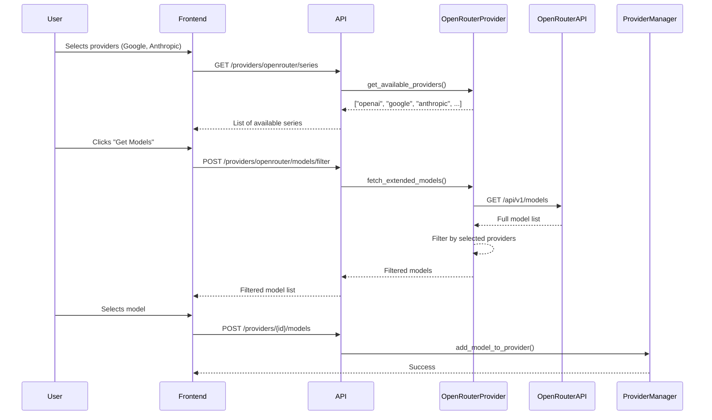

# OpenRouter Provider Enhancement Plan

## Overview

This plan outlines the improvements needed for the OpenRouter provider to support:
1. Loading models from OpenRouter API with proper metadata
2. Filtering models by provider/series (e.g., Google, Anthropic, OpenAI)
3. Extracting model name after the slash (e.g., "gpt-4o" from "openai/gpt-4o")
4. Supporting modality filtering (input/output)
5. Adding UI filters in frontend for selecting series/providers

## Current Implementation Analysis

### Files to Modify

| File | Purpose |
|------|---------|
| [`src/copaw/providers/provider.py`](src/copaw/providers/provider.py) | Base `ModelInfo` class - needs extended metadata fields |
| [`src/copaw/providers/openrouter_provider.py`](src/copaw/providers/openrouter_provider.py) | Main OpenRouter provider - needs enhanced model fetching |
| [`src/copaw/providers/provider_manager.py`](src/copaw/providers/provider_manager.py) | Provider manager - needs new methods for filtering |
| [`src/copaw/app/routers/providers.py`](src/copaw/app/routers/providers.py) | API routes - needs new endpoints |

---

## Implementation Steps

### Step 1: Extend ModelInfo with Extended Metadata

Create an `ExtendedModelInfo` class that includes:
- `id`: Model ID (e.g., "openai/gpt-4o")
- `name`: Human-readable name (e.g., "gpt-4o")
- `provider`: Provider/series (e.g., "openai", "google", "anthropic")
- `input_modalities`: List of supported input types (text, image, audio, video, file)
- `output_modalities`: List of supported output types (text, image, audio)
- `pricing`: Pricing information (prompt/completion costs)

```python
# New class in provider.py or models.py
class ExtendedModelInfo(ModelInfo):
    provider: str = ""  # e.g., "openai", "google"
    input_modalities: List[str] = Field(default_factory=list)
    output_modalities: List[str] = Field(default_factory=list)
    pricing: Dict[str, str] = Field(default_factory=dict)  # {"prompt": "0.000005", "completion": "0.000015"}
```

### Step 2: Enhance OpenRouterProvider

Modify [`openrouter_provider.py`](src/copaw/providers/openrouter_provider.py):

1. **Update `_normalize_models_payload`** to:
   - Extract provider from model ID (part before `/`)
   - Extract model name from model ID (part after `/`)
   - Store input/output modalities
   - Store pricing information

2. **Add new methods**:
   - `fetch_extended_models()`: Fetch all models with full metadata
   - `get_available_providers()`: Get list of unique providers from loaded models

```python
@staticmethod
def _extract_provider(model_id: str) -> str:
    """Extract provider from model ID (e.g., 'openai' from 'openai/gpt-4o')"""
    return model_id.split("/")[0] if "/" in model_id else ""

@staticmethod
def _extract_model_name(model_id: str) -> str:
    """Extract model name from model ID (e.g., 'gpt-4o' from 'openai/gpt-4o')"""
    return model_id.split("/")[-1] if "/" in model_id else model_id
```

### Step 3: Enhance ProviderManager

Modify [`provider_manager.py`](src/copaw/providers/provider_manager.py):

Add new methods:
- `fetch_provider_models_extended()`: Fetch models with extended metadata
- `filter_models_by_provider()`: Filter models by selected providers
- `filter_models_by_modalities()`: Filter models by input/output modalities
- `get_available_series()`: Get unique providers/series from OpenRouter models

### Step 4: Add New API Endpoints

Modify [`providers.py`](src/copaw/app/routers/providers.py):

Add new endpoints:

```
GET /providers/openrouter/series - Get available provider series
GET /providers/openrouter/models/filter - Get filtered models
POST /providers/openrouter/discover-extended - Discover models with full metadata
```

Request/Response models:
```python
class FilterModelsRequest(BaseModel):
    providers: List[str] = []  # e.g., ["openai", "google", "anthropic"]
    input_modalities: List[str] = []  # e.g., ["image"]
    output_modalities: List[str] = []  # e.g., ["text"]
    min_price: Optional[float] = None
    max_price: Optional[float] = None

class SeriesResponse(BaseModel):
    series: List[str] = Field(default_factory=list)  # e.g., ["openai", "google", "anthropic"]
```

### Step 5: Frontend Integration (Summary)

The frontend needs to be updated to:
1. Add checkboxes for selecting providers/series
2. Add dropdown/checkbox for modality filtering
3. Add "Fetch Models" button to load filtered models

Since the frontend is built separately, the backend API changes above will enable this functionality.

---

## API Flow Diagram



---

## Key Implementation Details

### Model ID Parsing

| Model ID | Provider | Model Name |
|----------|----------|------------|
| openai/gpt-4o | openai | gpt-4o |
| anthropic/claude-3.5-sonnet | anthropic | claude-3.5-sonnet |
| google/gemini-2.5-flash | google | gemini-2.5-flash |

### Modality Types

- **input_modalities**: text, image, audio, video, file
- **output_modalities**: text, image, audio

### Price Filtering

Price is stored as string in API response (e.g., "0.000005" per token).
For filtering, convert to float and compare against threshold (e.g., $1/1M tokens = 0.000001).

---

## Testing Considerations

1. Test model fetching with valid API key
2. Test filtering by single provider
3. Test filtering by multiple providers
4. Test modality filtering (e.g., vision models with image input)
5. Test price filtering
6. Test edge cases (empty results, invalid provider names)
