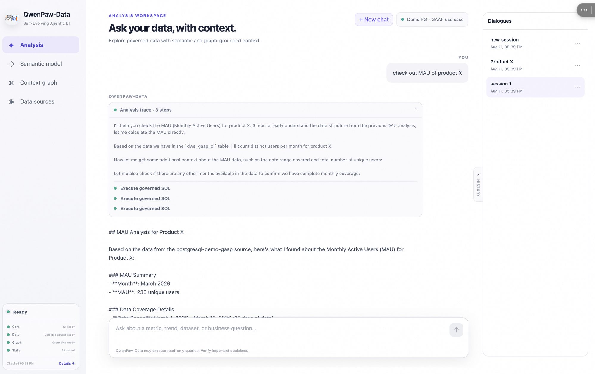

# datapaw

**Self-Evolving, Graph-Grounded Agentic BI at Enterprise Scale**

Source: https://github.com/agentscope-ai/QwenPaw-Data

[中文 README](./README_ZH.md)

datapaw is a native QwenPaw application. Its frontend is mounted at
`/apps/datapaw`, its backend is registered under `/api/datapaw`, and its
context service is private to the backend.

## Runtime shape

```text
QwenPaw-Data UI
  -> app-scoped PawApp SDK
  -> /api/datapaw/*
  -> QwenPaw-Data PawApp backend
  -> dependency status and typed lifecycle control
  -> managed QwenPaw-Data context service
```

The browser does not know the service port or bearer token. It does not call
the legacy plugin globals, a fixed port, or a second request client.
QwenPaw-Data explicitly enables the PawApp standard capabilities; existing PawApps
that do not opt in receive no additional chat, storage, toast, or notify routes.

## What is datapaw?

datapaw is the QwenPaw-native face of [QwenPaw-Data](https://github.com/agentscope-ai/QwenPaw-Data).
It brings autonomous, graph-grounded data analysis into the QwenPaw workspace so
users can ask business questions in natural language and get traceable,
artifact-rich answers backed by real enterprise data.

<p align="center">
  
</p>

## Core idea

Enterprise data analysis is open-ended, ambiguous, and constantly evolving. A
useful data agent must answer three questions on every task:

- **What facts to use**: business concepts, metrics, dimensions, tables, lineage,
  and historical context.
- **How to analyze**: reusable analytical methodology instead of ad-hoc reasoning
  for every request.
- **How to run**: a controllable runtime for long-horizon, artifact-centric
  workflows.

datapaw implements this through three collaborative layers:

| Layer | Role | What it manages |
| --- | --- | --- |
| **DataBridge** | Evidence grounding | Metadata graph, knowledge graph, semantic config, data sources, and task traces. |
| **Skill-Hub** | Method orchestration | Reusable analytical skills from coarse routing down to atomic SQL, visualization, and report generation. |
| **Host** | Execution control | DAG planning, tool invocation, artifact registry, and recovery. |

## End-to-end walkthrough

A typical request such as *"check out MAU of product X"* flows through the
following stages:

1. **Plan.** Host consults Skill-Hub to route the request and decompose it into a
   DAG: identify the metric, fetch data, compute MAU, and summarize findings.
2. **Ground.** DataBridge resolves "MAU" and "product X" through the semantic
   layer, mapping them to the `dws_gaap_di` table and the right filters.
3. **Execute.** Host runs governed SQL against the registered datasource and
   registers the result as an artifact.
4. **Report.** A final answer is assembled with methodology, source links, and
   coverage notes — everything in the chat pane.
5. **Evolve.** Traces, feedback, and confirmed definitions feed back into
   DataBridge and Skill-Hub for the next similar question.

## Quick start (recommended: PyPI)

The fastest way to run the datapaw app without a `QwenPaw-Data` source
workspace is to install the runtime packages from PyPI into the same Python
environment as QwenPaw.

```bash
pip install qwenpaw[datapaw]
```

Or use the convenience script if you want to pin compatible versions:

```bash
./plugins/apps/datapaw/scripts/setup-pypi.sh
```

Then start QwenPaw and enable the datapaw app. The PawApp lifecycle will
auto-detect the PyPI packages and start a managed context service on a dynamic
loopback port.

```bash
qwenpaw app
```

> This path is recommended for users who only need the datapaw app and already
> have their own Neo4j / PostgreSQL infrastructure, or who want to try the app
> without demo data.

### PyPI + docker-compose demo data

If you also want the bundled GAAP demo data (Neo4j graph + PostgreSQL
 datasource), start the infrastructure containers and run QwenPaw in external
context mode:

```bash
cd plugins/apps/datapaw
cp .env.example .env
docker compose up -d neo4j postgres context seed

# in another terminal
DATAPAW_CONTEXT_MODE=external \
DATAPAW_CONTEXT_URL=http://127.0.0.1:8765 \
DATAPAW_CONTEXT_TOKEN=datapaw-demo-token \
qwenpaw app
```

This is the **recommended one-shot demo** path: you get a fully seeded graph
and datasource without compiling QwenPaw inside Docker.

## Local package setup

The source workspace defaults to `~/dev/QwenPaw-Data`. Its isolated
`.venv` contains editable installs of `datapaw-context`, `datapaw-host-core`,
`datapaw-cli`, and `datapaw-skills` so their dependency versions do not alter
QwenPaw's environment.

```bash
./scripts/setup-dev.sh
cd ui && npm install && npm run build
```

The UI is shipped as a browser-native ES module. Its Vite configuration
replaces `process.env.NODE_ENV` at build time so bundled dependencies do not
leak the Node-only `process` global into the QwenPaw Console.

`setup-dev.sh` runs the QwenPaw-Data workspace sync and creates ignored development
links under this app. Set `DATAPAW_SOURCE_DIR` to use another checkout. At
runtime, use `DATAPAW_CONTEXT_MODE=external` with `DATAPAW_CONTEXT_URL` and
`DATAPAW_CONTEXT_TOKEN` only when another process manager owns the service.

To build, stage, and install the app into a local QwenPaw instance in one
step, run `./scripts/dev.sh`. `QWENPAW_BIN` and `QWENPAW_WORKING_DIR` select
the target instance. The installer targets `127.0.0.1:8089` by default;
override it with `QWENPAW_HOST` and `QWENPAW_PORT` when needed.

## Docker compose demo

A one-shot demo stack is available for users who want Neo4j + PostgreSQL +
seeded GAAP data without a local `QwenPaw-Data` source workspace. The stack
uses the `datapaw-context` and `datapaw-cli` packages from PyPI.

```bash
cd plugins/apps/datapaw
cp .env.example .env
docker compose up -d
```

This starts:

- `neo4j` — graph store (port 7687 / 7474)
- `postgres` — GAAP demo datasource (port 55432)
- `context` — external context service (port 8765)
- `seed` — injects the bundled demo SQL, imports the semantic workbook, and weaves it into Neo4j
- `qwenpaw` *(optional)* — builds the full QwenPaw image from the repo root

If the `qwenpaw` service is too heavy or fails to build (e.g. ACR base images
unavailable), start only the infrastructure and run QwenPaw locally:

```bash
docker compose up -d neo4j postgres context seed
# in another terminal, from the QwenPaw repo root
DATAPAW_CONTEXT_MODE=external DATAPAW_CONTEXT_URL=http://127.0.0.1:8765 DATAPAW_CONTEXT_TOKEN=datapaw-demo-token qwenpaw app
```

To re-run the seed container manually (for example after wiping Postgres
volumes):

```bash
./scripts/init-demo.sh
```

## Runtime health and local services

- Configure and activate a language model in QwenPaw's **Settings → Models**
  before using the Analysis chat. A fresh `QWENPAW_WORKING_DIR` intentionally
  contains no provider credentials or active model.
- QwenPaw-Data declares the Context API, Graph Store, and discovered data
  sources through the PawApp dependency contract. The Data sources page shows
  readiness, capability impact, remediation, and the actions that are actually
  available.
- The app does not invoke Docker or provision Graph Store/data-source
  infrastructure. Those resources are external dependencies and receive
  read-only readiness checks. Local lifecycle and diagnostics belong to the
  `datapaw-cli` package; production lifecycle belongs to the deployment's
  service owner.

Missing host configuration is reported through the PawApp SDK as a structured
service-unavailable error. QwenPaw-Data turns `MODEL_NOT_CONFIGURED` into an
actionable UI message instead of displaying a generic HTTP 500.

The app also opts into the generic `datapaw_dependency_status` and
`datapaw_dependency_action` tools. The agent can inspect the same control plane
as the UI and request only pre-registered actions; the host remains responsible
for tool governance and audit.

### Local infrastructure quick reference

Service endpoints are environment-driven with local defaults; nothing is
hardcoded. `datapaw-context` resolves them at startup (see
`packages/datapaw-context/src/context_manager/config.py` and
`packages/datapaw-context/README.md` in the QwenPaw-Data workspace):

| Dependency | Configuration | Local default |
| --- | --- | --- |
| Graph Store (Neo4j) | `NEO4J_URI`, `NEO4J_USER`, `NEO4J_PASSWORD`, `NEO4J_DATABASE` in the workspace `.env` | `bolt://localhost:7687` |
| Data sources (PostgreSQL / MySQL / ODPS / ...) | registered through the DataBridge semantic-config layer (`/api/semantic-config/datasource`), not read from `.env` | none |
| LLM / Embedding | `OPENAI_API_KEY`, `OPENAI_BASE_URL`, `LLM_MODEL`, `EMBED_*` | — |

Local lifecycle, by owner:

- **Graph Store (Neo4j)** — owned by the QwenPaw-Data workspace tooling:
  `scripts/start_databridge.sh` reuses a Neo4j that is already reachable on
  the bolt port, otherwise it runs
  `packages/datapaw-context/docker-compose.yml`. This requires a running
  Docker daemon (for example `colima start`) and `NEO4J_PASSWORD` in the
  workspace `.env`.
- **Diagnostics** — `datapaw doctor --json` reports Docker, Neo4j, DataBridge
  API, and model-configuration readiness with remediation hints. It is
  read-only.
- **Data-source servers** — external infrastructure. DataPaw packages manage
  their registration and readiness, never their provisioning.

The standalone DataBridge API (`127.0.0.1:8765`) is only used when running
QwenPaw-Data outside QwenPaw. Inside QwenPaw, the PawApp lifecycle manages a
private context service on a dynamic loopback port, so a `doctor` failure on
8765 alone does not affect this app.

## Package responsibilities

- `datapaw-context`: context APIs, semantic configuration, and graph memory.
  It also owns the local Graph Store definition
  (`docker-compose.yml`) and the datasource registrations in the
  semantic-config layer.
- `datapaw-host-core`: shared analysis runtime and orchestration contracts.
  It does not touch infrastructure.
- `datapaw-skills`: app-provided data analysis skills.
- `datapaw-cli`: standalone lifecycle and diagnostic tooling (`doctor`,
  `datasource`, `semantic`); it is the only DataPaw package intended to own
  local infrastructure commands. Data-source servers themselves remain
  external infrastructure.

QwenPaw remains the only UI/backend process the user starts. In managed mode,
the PawApp lifecycle starts and stops the context service automatically.

The first migration slice uses QwenPaw's app-scoped chat with QwenPaw-Data context
tools. It does not start a second agent from `datapaw-host-core`. The host-core
task graph, artifacts, and tool-renderer adapter will be added after the
PawApp runtime-hook contract is reviewed, which prevents two agent runtimes
from owning the same chat turn.
