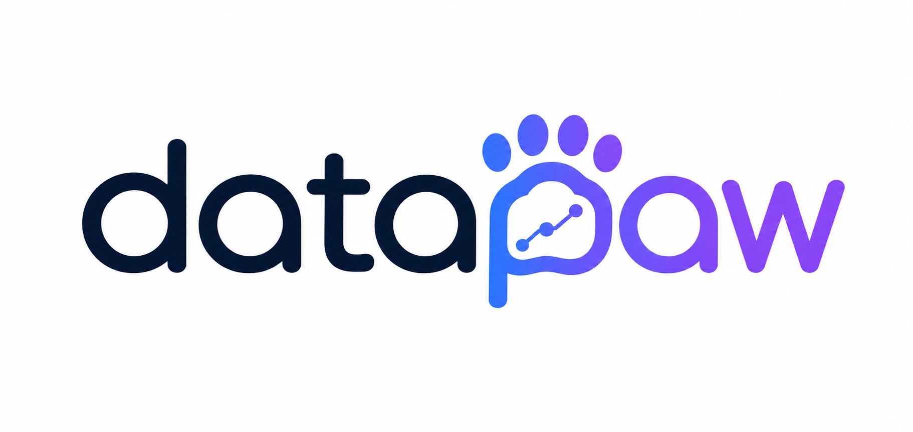

<p align="center">
  
</p>

<p align="center">
  <strong>QwenPaw 数据分析插件</strong>
</p>

<p align="center">
  <a href="#"></a>
  <a href="https://www.python.org/downloads/"></a>
  <a href="#"></a>
</p>

<p align="center">
  <a href="README.md">English</a> | <b>中文</b>
</p>

---

DataPaw 是 QwenPaw 上的数据分析插件。它把零散的数据分析需求转成可观测、可中断、可续跑的结构化执行：一份 DAG 任务图驱动 agent 一步步推进，一个侧边任务面板让你在运行中编辑节点，加上 SSE 实时推流，节点状态变化即时反映到 UI。

DataPaw 适合那些「光让 LLM 直接答」不够用的分析场景：

- **多步 BI 分析** —— 加载 → 清洗 → 分析 → 下钻 → 出报告，全流程拆成命名 DAG 节点，可以暂停、修改、续跑。
- **指标异动归因** —— 指标波动时，agent 用自带的自适应阈值、时间因素拆解、维度下钻技能跑分析，最后出 HTML 报告。
- **本地文件工作流** —— 在聊天里**上传**文件、**贴绝对路径**、或把 CSV / Excel / Parquet 放到 agent workspace 下，三种方式都行。Agent 通过 `execute_shell_command` 跑 Python 完成加载、变换、可视化、出报告。

DataPaw 完全在你的本地环境运行，数据不出域。

## 快速开始

### 前置要求

| 项 | 要求 |
|---|---|
| **QwenPaw 版本** | **≥ v1.1.7** |
| **Python** | 3.10 ~ 3.13 |
| **LLM 模型** | 已在 QwenPaw 中配置（DataPaw 直接继承活跃模型） |

> QwenPaw 版本低于 v1.1.7，请先升级：`pip install --upgrade "qwenpaw>=1.1.7"`。

### 1. 安装 DataPaw 插件

**通过 Console（推荐）：**

1. 启动 QwenPaw（`qwenpaw app`），打开 http://127.0.0.1:8088/。
2. 在左侧 Settings 下点击「Plugin Manager」，再点「Install Plugin」。
3. 把 `datapaw/` 目录拖进安装对话框，或选 ZIP 文件（DataPaw 已内置在 QwenPaw 的 `plugins/bundle/datapaw/`）。
4. 等安装完成。

**通过 CLI：**

```bash
qwenpaw plugin install /path/to/datapaw
```

> 装完之后**强制刷新浏览器**（`Cmd+Shift+R` / `Ctrl+Shift+R`），让 agent 下拉里出现新的「DataPaw」选项。

### 2. 完成必要配置

#### LLM 模型

在 console「Settings → Models」配置一个 LLM provider 和 API key。DataPaw 不需要单独配置模型，直接继承你当前的活跃模型。详见 [QwenPaw Models 文档](https://qwenpaw.agentscope.io/docs/models)。

DataPaw 不内置任何取数工具。把数据交给 agent 有三种方式，按便利程度排序：

- **聊天里上传文件** —— console 的文件上传会把文件放到 agent workspace 的 `media/` / `file_store/` 下，agent 可以直接读。
- **在消息里贴绝对路径** —— 例如 `/Users/me/Downloads/data.csv`，agent 用 `read_file` / `execute_shell_command` 直接打开。
- **把文件放进 workspace** —— 把 CSV / Excel / Parquet 拷到 `~/.qwenpaw/workspaces/datapaw/` 下，按相对路径引用。

分析过程中的中间产物、图表、报告统一落到 `~/.qwenpaw/workspaces/datapaw/artifacts/<session_id>/<graph_id>/<node_id>/` 下，详见下方 [产物路径](#产物路径) 一节。

### 3. 开始使用

在聊天页面 agent 下拉里选 **DataPaw**，发个需求试试：

```
分析产品 X 25 年 12 月的日访问趋势，输出 HTML 报告。
```

预期能看到：

- agent 调 `analysis-plan-builder` 出分析计划。
- 任务面板显示出 DAG。
- 每个节点状态依次 `pending → ready → in_progress → done`，状态变化实时同步到面板。
- 末尾节点调 `bi-report-generation`，在 artifacts 根目录下生成 HTML 文件。

## 架构

DataPaw 通过 QwenPaw 原生 plugin 系统接入，不修改任何 host 源码，所有扩展在启动时挂上。

```
plugins/bundle/datapaw/
├── plugin.json                # plugin manifest
├── plugin.py                  # 入口：注册 startup / shutdown hook
├── constants.py               # 常量 + sys.path 引导
├── agents_setup.py            # 启动时写内置 agent profile + workspace + skills
├── routers_setup.py           # 把 tasks_router 挂到 host FastAPI app
├── hooks.py                   # monkey-patch：smart agent factory、channel SSE、unload 清理
├── prompts/MASTER.md          # 运行时机制段（DAG / plan 工具 / 产物落盘规则）
├── agents/datapaw/{zh,en}/    # 中英文 SOUL.md + PROFILE.md
├── skills/                    # 12 个内置 BI 技能
└── core/                      # 核心实现（DataPawAgent / RuntimeStateManager / tasks router）
    ├── agents/base.py
    ├── orchestration/
    ├── routers/tasks.py
    └── path_context.py
```

系统提示词分三层装配：

1. host 标准 `AGENTS.md` / `SOUL.md` / `PROFILE.md`（host 的 per-agent prompt 规范）。
2. plugin 的 `MASTER.md` —— DAG 运行时规则与 plan 工具说明，追加在 host 三件套之后。
3. 动态的 `<datapaw-analysis-environment>` 段，注入当前请求的 workspace 路径、artifacts 根目录、执行规范。

## 功能

- **DAG 任务图** —— 多步分析转成结构化、持久化的计划，可观测、可编辑、可续跑。
- **任务面板 + SSE 推流** —— 节点状态变化（`pending` → `ready` → `in_progress` → `done` / `failed` / `stale`）实时反映到 UI，混在常规 SSE 消息流里下发。
- **运行中编辑** —— 在面板里改节点 prompt 或依赖，agent 在下一轮 reply 通过 `[外部变更通知]` 这种 system 消息感知到。
- **12 个内置 BI 技能** —— 详见下表。
- **单 agent 极简** —— 没有编排 / 子 agent / delegate 这类机制，整个分析跑在一个由 DAG 驱动的 ReAct 循环里。
- **本地文件工作流** —— 输入支持聊天上传、贴绝对路径、放到 workspace 三种方式；端到端通过 `execute_shell_command` 跑分析。

## 内置 Skills

DataPaw 自带 12 个 BI 风格技能，启动时自动安装到 agent workspace 并启用：

| 类别 | Skill |
|---|---|
| 规划 | `analysis-plan-builder`（把分析需求转成结构化计划）；`runtime-guide`（执行时的通用策略指引）；`data-intent-router`（数据请求路由到对应处理链路） |
| 阈值与检测 | `bi-adaptive-threshold`、`bi-anomaly-detection` |
| 归因 | `bi-attribution-analysis`、`bi-dimension-drilldown`、`bi-time-impact-attribution`、`bi-new-dimension-analysis` |
| 端到端 | `bi-metric-analysis`（单指标的指标观测 + 异常检测 + 维度下钻闭环） |
| 语义层 | `bi-semantic-layer-guide`（指标 / 维度语义层使用指引；存在语义层时使用） |
| 报告 | `bi-report-generation`（把分析结果组织成 HTML 报告） |

## 产物路径

所有分析产物落到 agent workspace 下，按 session / graph / node 三层切分：

```
~/.qwenpaw/workspaces/datapaw/artifacts/
└── <session_id>/
    └── <graph_id>/
        └── <node_id>/
            ├── data.csv
            ├── chart.png
            └── report.html
```

调 `finish_subtask(files=...)` 时填的是相对路径（不带 `artifacts/` 前缀），运行时通过 `PathContext.resolve_artifact_path` 解析回 host 绝对路径。

## 使用示例

**日趋势分析 + HTML 报告**

> 分析产品 X 25 年 12 月的日访问趋势，做异常检测，归因下跌原因，输出 HTML 报告。

DataPaw 会先用 `analysis-plan-builder` 规划 DAG，按依赖顺序串联 `bi-anomaly-detection` → `bi-attribution-analysis` → `bi-report-generation`，最后在 artifacts 根目录下出 `report.html`。

**一次性的简单查询**

> `sessions.csv` 里 session 时长的中位数是多少？

足够简单的问题 DataPaw 会跳过 `create_plan`，直接 `execute_shell_command` 算完返回。

## 致谢

- 基于 [QwenPaw](https://github.com/agentscope-ai/QwenPaw) 与 [agentscope](https://github.com/modelscope/agentscope) 构建。
- DAG 任务图扩展自 agentscope 的 `Plan` / `PlanNotebook` / `SubTask` 基类。
