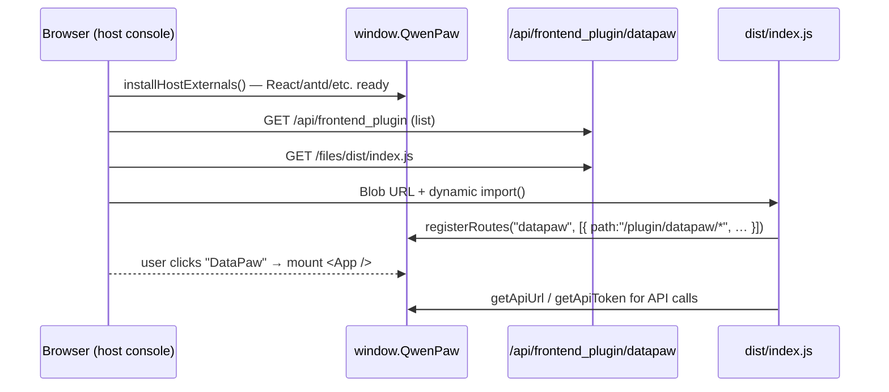

# DataPaw plugin — frontend bundle

This folder packages the upstream DataPaw console (originally a standalone
React 18 SPA at `1/datapaw/console`) as a single ES-module bundle that the
QwenPaw host console loads at runtime through its plugin system.

The layout intentionally mirrors `plugins/bundle/qwenpaw-pet/frontend/` so the
two plugins share the same conventions:

```
frontend/
├── .npmrc                ← pin registry (same as qwenpaw-pet)
├── .prettierignore       ← skip dist/, node_modules/, locales/
├── package.json          ← name, build script, deps
├── tsconfig.json         ← single tsconfig, `@/*` alias, react-jsx
├── vite.config.ts        ← library mode → ../dist/index.js
├── README.md             ← you are here
└── src/
    ├── index.ts          ← plugin entry — bootstrap (routes + host /chat)
    ├── plugin/
    │   ├── bootstrap.ts  ← registerRoutes + setupDataPawHostChat
    │   └── constants.ts
    ├── qwenpaw-host.d.ts ← types for window.QwenPaw.host
    ├── shims/            ← react/react-dom shims (host singletons)
    │   ├── react.ts
    │   ├── react-dom.ts
    │   ├── react-dom-client.ts
    │   └── react-jsx-runtime.ts
    ├── App.tsx           ← copied from upstream, patched to use the
    │                       /plugin/datapaw basename
    ├── api/
    │   └── config.ts     ← patched to prefer host.getApiUrl / getApiToken
    └── (every other file)  copied verbatim from 1/datapaw/console/src/
```

## How the bundle slots into the host



The flow matches the qwenpaw-pet plugin one-to-one (only the registered
route and the component differ).

## Why a multi-MB bundle is unavoidable

The upstream DataPaw console pulls in many heavy dependencies:
`@agentscope-ai/{chat,design,icons}`, `antd`, `antd-style`,
`react-router-dom`, `i18next`, `react-i18next`, `react-markdown`,
`remark-gfm`, `@dnd-kit/*`, `lucide-react`, `dayjs`, `zustand`, …

The host's plugin loader executes bundles via:

```ts
const blobUrl = URL.createObjectURL(new Blob([jsText], { type: "application/javascript" }));
await import(/* @vite-ignore */ blobUrl);
```

That browser-level dynamic import has no importmap, so **any bare specifier
left in the bundle would fail to resolve**. The only safe options are:

1. **Bundle the dependency** — it ends up inside `dist/index.js`.
2. **Alias it to a shim that reads `window.QwenPaw.host.*`** — used for
   React only, because two React instances in the same DOM would crash
   hooks ("Invalid Hook Call").

Bundling everything but React keeps things simple at the cost of bundle
size; gzip should still bring this down to ~1.5 MB on the wire. If you need
to shave more, add `antd` / `@ant-design/icons` to the shim list (the host
already serves them on `window.QwenPaw.host.antd` / `.antdIcons`) — but
that requires enumerating all named exports your code touches, which is
fragile across antd minor releases.

## Documentation

| 文档 | 用途 |
|------|------|
| [**会议讲解稿（推荐）**](./docs/MEETING_SUMMARY.md) | 会上 8–10 分钟，一页纸讲清背景与方案 B |
| [双构建架构说明](./docs/DUAL_BUILD_ARCHITECTURE.md) | 架构细节、产物对比、FAQ |
| [方案 B 实现方案](./docs/SCHEME_B_IMPLEMENTATION_PLAN.md) | 分 PR、文件合并表、验收脚本 |

## Build

```bash
cd plugins/bundle/datapaw/frontend
npm install
npm run build
```

This emits `plugins/bundle/datapaw/dist/index.js`, which is what
`plugin.json`'s `entry.frontend` points at. The bundle should be committed
to git (same convention as qwenpaw-pet) so end users do not have to run
`npm install` themselves.

For active development:

```bash
npm run dev   # vite build --watch — rebuilds on save
```

Then in another terminal, restart the QwenPaw host console (or just hard
reload the browser tab) to fetch the new bundle.

## How the route is exposed

`src/plugin/bootstrap.ts` registers a sidebar route and host `/chat` hooks:

```ts
window.QwenPaw.registerRoutes("datapaw", [
  {
    path: "/plugin/datapaw/*",
    component: App,
    label: "DataPaw",
    icon: "🐾",
    priority: 50,
  },
]);
setupDataPawHostChat(); // patch Chat/index when agent === datapaw
```

Inside `App.tsx`, the patched `getRouterBasename()` now recognises the
`/plugin/datapaw` prefix and configures `BrowserRouter` with that
basename, so `/plugin/datapaw/chat`, `/plugin/datapaw/agent/skills`, etc.
all resolve correctly to the original console's pages.

## Backend changes? — None

Per the original brief, this work does **not** touch any backend code. The
existing `plugin.py`, `hooks.py`, `agents_setup.py`, etc. continue to run
exactly as before. Only the manifest gains a new `entry.frontend` field
(plus a small `meta.frontend` hint for sidebars that want to know where to
deep-link to).

## i18n / theming caveats

The host console has its own i18next + antd ConfigProvider; the plugin
also bundles its own (separate JS module instance). Both read
`localStorage.getItem("language")` for the initial language, so they stay
synchronised across page reloads. Changing language *at runtime* in the
host UI does not propagate to the plugin until the page is reloaded —
acceptable for a first pass; revisit if it becomes a usability issue.

## When the upstream console changes

The simplest re-sync is:

```bash
cd plugins/bundle/datapaw/frontend
rm -rf src
mkdir -p src/shims
cp -R ../../../1/datapaw/console/src/. src/
rm src/main.tsx src/vite-env.d.ts
# Then re-apply the App.tsx and api/config.ts patches (small, search
# for "/plugin/datapaw" and "getHost" respectively), and re-create the
# files under src/shims/ + src/index.tsx + src/qwenpaw-host.d.ts.
npm run build
```

A future improvement worth doing: extract the upstream `src/` into a git
submodule so the `cp` step becomes a `git submodule update`, and the
patches live as a small post-checkout diff.
