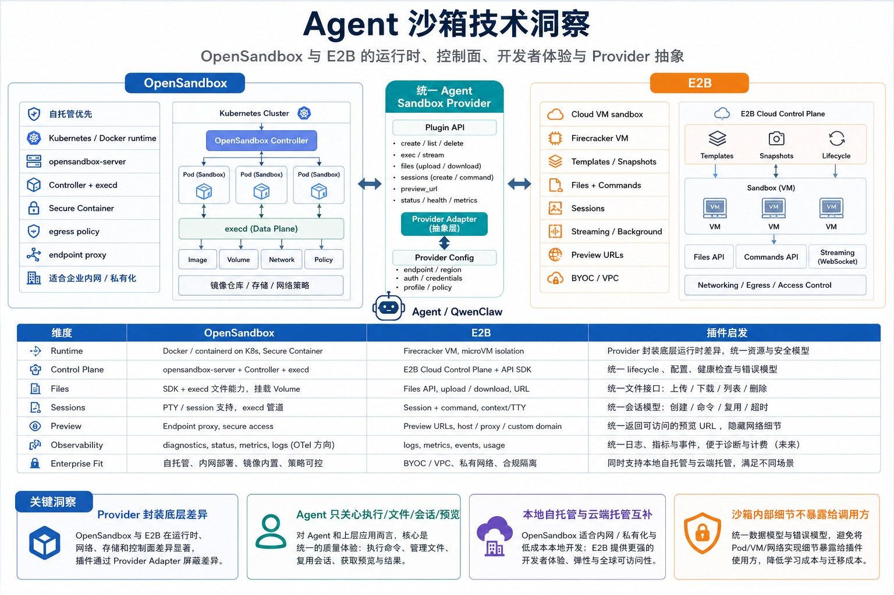
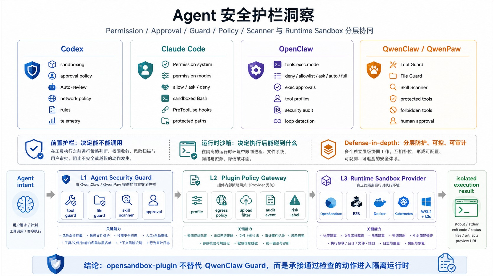
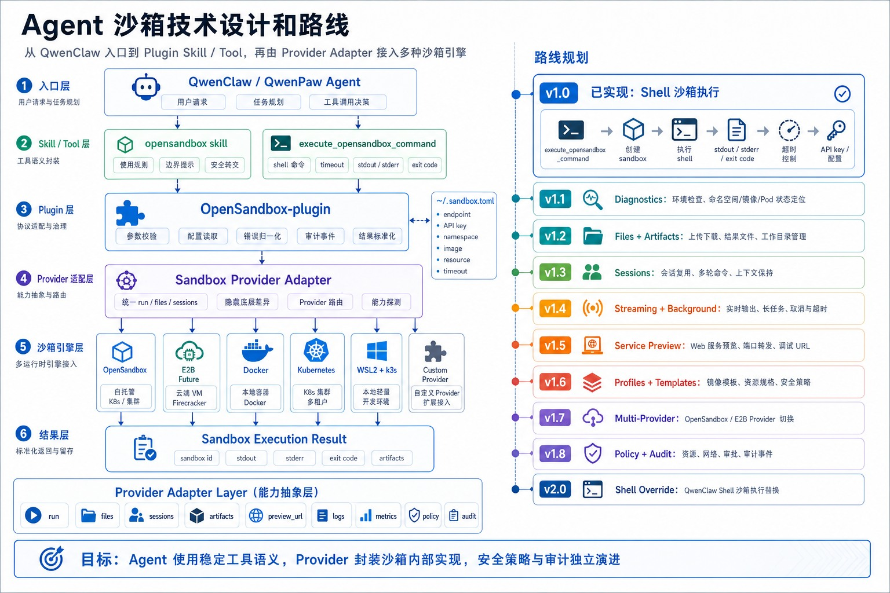
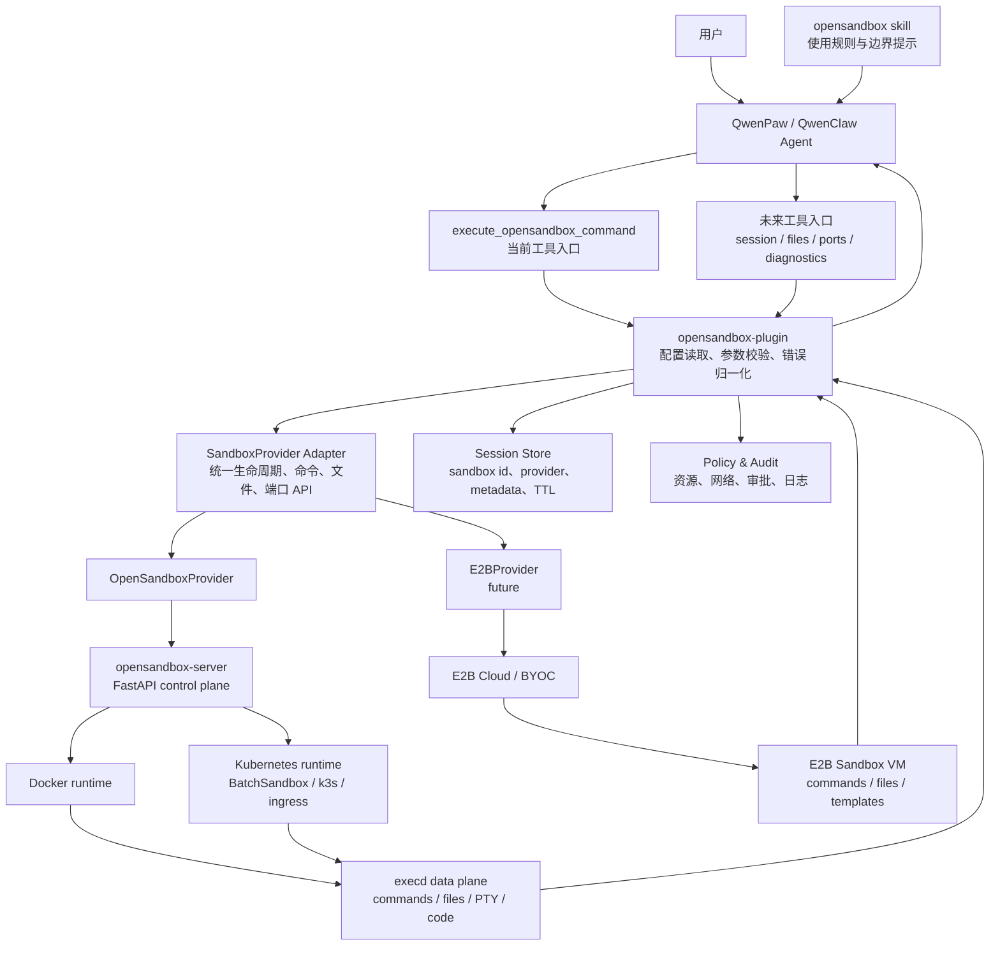

# OpenSandbox Plugin 设计文档

本文档说明 OpenSandbox 插件接入 QwenPaw 的设计边界、竞品/同类项目调研、未来演进路标，以及面向多沙箱后端的架构设计。

调研时间：2026-06-04。

## 调研范围

本次重点调研两个沙箱项目：

- [alibaba/OpenSandbox](https://github.com/alibaba/OpenSandbox)：自托管优先、协议优先的 AI Agent 沙箱平台。
- [e2b-dev/e2b](https://github.com/e2b-dev/e2b)：面向 AI Agent 的云端安全 VM 沙箱和 SDK 平台。

调研目标不是简单复制能力，而是提炼对 `opensandbox-plugin` 有价值的产品能力和工程边界：

- QwenPaw/QwenClaw Agent 如何安全执行 shell 命令。
- 如何支持宿主文件上传、产物下载、session 复用和长任务。
- 如何在 Docker、WSL2 + k3s、Kubernetes、E2B cloud/BYOC 等后端之间保持统一工具体验。
- 如何把安全、可观测性、策略和用户手动选择放进插件，而不是过早侵入 QwenPaw 核心。

## 项目调研总结

### alibaba/OpenSandbox

OpenSandbox 是通用 AI 应用沙箱平台。它的核心优势是开放协议、自托管控制面和 runtime 中立能力。

核心能力：

- 多语言 SDK 和工具入口：提供 Python、JavaScript/TypeScript、Java/Kotlin、C#、Go SDK，同时包含 CLI 和 MCP server。
- 协议优先：通过 `specs/` 中的 OpenAPI 合约定义生命周期、诊断、sandbox 内执行和 egress policy。
- 生命周期控制面：`opensandbox-server` 是 FastAPI 服务，负责认证、配置校验、生命周期编排、状态记录和 runtime 分发。
- 多 runtime 后端：支持 Docker、本地单机部署和 Kubernetes runtime；Kubernetes 侧可通过 BatchSandbox、agent-sandbox 等 workload provider 创建沙箱。
- sandbox data plane：用户容器内注入 `execd`，处理命令、文件、session、PTY、Jupyter/code-interpreter 等 sandbox 内操作。
- 服务暴露：支持 endpoint 解析、server proxy、Kubernetes ingress gateway、HTTP/WebSocket 反向代理和 secure access headers。
- 网络与安全：支持 API key、资源限制、capability drops、secure runtime、egress policy、endpoint secure access、Kubernetes 网络隔离。
- 强隔离 runtime：文档中说明可通过 gVisor、Kata、Firecracker 等 secure container runtime 增强隔离。
- 生命周期增强：支持 TTL、renew-expiration、pause/resume、snapshot、client-side pool、BatchSandbox pool 等方向。
- 运维与诊断：server 有 health、status transition、diagnostics route、structured errors；项目路标中也把 OpenTelemetry、audit trail、Kubernetes 部署、network isolation 放在重点方向。

对插件的启发：

- `opensandbox-plugin` 应优先把 OpenSandbox 作为默认后端，因为它符合本地/自托管、Docker/Kubernetes、Windows WSL2 + k3s 的目标。
- 插件不应该把 Docker/Kubernetes 细节泄露给 Agent，而应该通过统一工具参数和状态诊断屏蔽底层 runtime 差异。
- OpenSandbox 的 `execd` 能力意味着插件未来可以自然扩展到命令、文件、session、PTY、code interpreter、endpoint proxy 等能力。
- OpenSandbox 的安全模型适合插件增加“策略模板”：本地开发、受限联网、生产隔离、高安全 runtime 等。

### e2b-dev/e2b

E2B 是面向 AI Agent 的云端 sandbox 平台，强调“快速创建安全 Linux VM、SDK 易用、模板/快照体验、持久化和云端运维”。

核心能力：

- 云端 sandbox：E2B 文档将 Sandbox 定义为按需创建的 fast, secure Linux VM；主要通过 JavaScript/Python SDK 管理。
- 命令执行：SDK 提供 `commands.run()`，支持 stdout/stderr 结果返回、流式输出回调，以及 background command 和 kill。
- 文件系统：每个 sandbox 有隔离文件系统；SDK 支持 read/write、watch、upload/download，也支持面向浏览器等非授权环境的预签名上传/下载 URL。
- 生命周期：支持 create、connect、set timeout、get info、kill；CLI 也支持 create/connect/kill。
- 持久化：支持 pause/resume，暂停时保存文件系统和内存状态，恢复后进程、变量和数据仍在。
- auto-resume：sandbox 可以在 timeout 后 pause，并在 SDK 操作或 HTTP 请求到来时自动恢复。
- 模板与快照：Template 能定义基础镜像、环境变量、复制文件、构建命令、start/ready command；构建后会保存运行中进程和文件系统快照，用于快速启动。
- code interpreter：提供 `@e2b/code-interpreter` / `e2b-code-interpreter`，支持 `runCode`、不同 code context、流式 stdout/stderr 和结果。
- 交互式调试：CLI 可 connect 到已运行 sandbox，断开终端不会杀掉 sandbox，方便调试文件系统和进程。
- 部署形态：默认是 E2B Cloud，也提供 BYOC，把 sandbox templates、snapshots、runtime logs 存在客户 VPC，敏感流量直接进入客户 VPC。

对插件的启发：

- E2B 的用户体验很值得借鉴：session 复用、后台命令、流式输出、文件上传/下载、模板预热、preview URL 都应进入插件路标。
- E2B 可以作为未来可选后端，让用户在“本地/自托管 OpenSandbox”和“云端 E2B/BYOC”之间切换。
- 插件应该把“沙箱会话”作为一等概念，而不是每条命令都创建一个新 sandbox。
- 模板/快照能力应抽象成“sandbox profile”，用于 QwenPaw 任务类型：shell、Python data analysis、Node.js dev server、browser/desktop、agent eval。

## 能力对比

下图把 OpenSandbox 与 E2B 的关键能力放到同一张 Agent 沙箱技术视角中，用于解释后续 Provider 抽象和路线规划。



| 维度 | OpenSandbox | E2B | 对 opensandbox-plugin 的影响 |
| --- | --- | --- | --- |
| 部署形态 | 自托管优先，Docker/Kubernetes，适合本地、WSL2 + k3s、企业集群 | E2B Cloud 优先，BYOC 可进入客户 VPC | 默认接 OpenSandbox，未来以 provider adapter 支持 E2B |
| 核心抽象 | Sandbox lifecycle API + execd data plane + runtime provider | Sandbox + Template + SDK + cloud control plane | 插件内部应抽象 `SandboxProvider`，避免工具绑定单一 SDK |
| 命令执行 | execd 支持命令、session、PTY、结构化响应和流式通道 | `commands.run()` 支持结果、streaming、background | 路标中加入 streaming、background、session command |
| 文件能力 | SDK 包含 lifecycle、command、file operations；execd 可处理文件操作 | `files.read/write`、upload/download、预签名 URL | 优先实现宿主文件上传和产物下载，再支持目录同步 |
| 生命周期 | create、pause、resume、delete、TTL、renew、snapshot | create、connect、timeout、pause/resume、auto-resume、kill | 插件需要 session store、显式清理、TTL 和恢复策略 |
| 模板/预热 | 镜像、BatchSandbox pool、snapshot、client-side pool 等方向 | Template 可构建基础镜像、文件、依赖、start command，并保存运行快照 | 引入 `sandbox_profile`，用于预设镜像、entrypoint、依赖和启动服务 |
| 服务预览 | endpoint proxy、secure access | host/proxy/custom domain，HTTP 请求可触发 auto-resume | 插件需要返回用户可打开的预览 URL，并隐藏底层网络实现 |
| 安全隔离 | API key、resource limit、secure runtime、egress policy、network isolation | secure sandbox、access token、BYOC 私有流量、云端隔离 | 插件应提供安全 profile、egress policy 和审计输出 |
| 可观测性 | diagnostics、status reason/message、OpenTelemetry 方向 | logs、metrics、BYOC monitoring | 插件需要健康检查工具和可读错误诊断 |
| 适配难度 | 已经是当前插件依赖，适合本地 Windows 调试 | 需要引入 E2B SDK 和 API key，部分能力与 OpenSandbox 语义不同 | 后续通过 provider adapter 渐进接入 |

## 前置安全护栏洞察

QwenClaw/QwenPaw 已经有 Tool Guard、File Guard 和 Skill Scanner，这些能力可以视为 Agent 调用层的前置安全护栏。它们和 OpenSandbox/E2B 的运行时沙箱并不冲突：前置护栏决定“这次工具调用是否应该发生”，运行时沙箱决定“调用发生后实际进程能碰到什么”。



### 行业命名和能力分层

| Agent / 项目 | 官方或生态命名 | 主要控制点 | 对插件的启发 |
| --- | --- | --- | --- |
| OpenAI Codex | `sandboxing`、`approval policy`、`Auto-review mode`、network policy、rules、agent-native telemetry | sandbox 定义写入范围、网络和受保护路径；approval policy 决定越界动作是否请求用户；rules 对常见安全/危险命令做 allow/require/block；OpenTelemetry 和 Compliance Logs 记录用户提示、审批、工具结果、MCP 和网络策略事件。 | “审批”和“沙箱”应并列建模：低风险动作在边界内自动执行，高风险或越界动作进入审批/auto-review；插件需要把 sandbox 执行日志变成可审计事件。 |
| Claude Code | `Permission system`、`permission modes`、allow/ask/deny rules、`sandboxed Bash tool`、`PreToolUse` / `PermissionRequest` hooks、protected paths | permission rules 在工具运行前生效，覆盖 Bash、Read、Edit、WebFetch、MCP 等工具；sandboxed Bash 用 OS 级边界限制 Bash 及子进程的文件和网络访问；`auto` 模式用分类器减少提示，`dontAsk` 和 `bypassPermissions` 分别代表锁定和跳过权限层。 | Claude Code 明确把 permissions 和 sandboxing 定义为互补层，验证了本插件应继续尊重 QwenClaw 的前置安全护栏，而不是用运行时沙箱替代它。 |
| OpenClaw | `tools.exec.mode`、exec approvals、tool allow/deny、tool profiles、tool groups、provider-specific tool policy、security audit、loop-detection | `tools.exec.mode` 将 host exec 权限归一为 deny/allowlist/ask/auto/full；`auto` 先跑确定性 allowlist，再走 OpenClaw/Codex auto reviewer 或人工审批；工具 profile、group、provider-specific policy 控制模型能看到哪些工具；security audit 检查沙箱、工具策略、危险配置和插件可达性。 | `opensandbox-plugin` 应把“命令在哪运行”和“命令如何被批准”分开：Provider 选择 runtime，Policy Gateway 处理 allowlist、审批、审计和安全模式。 |
| QwenPaw / QwenClaw | Tool Guard、File Access Guard、Skill Security Scanner、工具防护、文件防护、技能扫描器 | Tool Guard 拦截危险 shell 命令；File Guard 限制敏感路径访问；Skill Scanner 在技能启用/安装前扫描 prompt injection、command injection、hardcoded keys、data exfiltration 等风险。 | 插件应接在这些 guard 之后：只有通过工具/文件/技能安全检查的动作，才进入 OpenSandbox/E2B Provider。 |

### 关键洞察

- 前置护栏的主流命名不是“sandbox”，而是 permission、approval、guard、policy、scanner、audit。它们表达的是工具调用治理，而不是进程隔离。
- 运行时沙箱的主流命名仍然是 sandbox、sandboxed Bash、workspace-write、isolated container、VM sandbox。它表达的是 OS/容器/VM 边界。
- Claude Code 文档特别强调：Read/Edit deny rule 这类前置规则不一定能约束任意子进程，真正要阻止子进程读写敏感路径，需要 OS 级 sandbox。这个结论对 QwenClaw + OpenSandbox 的组合非常关键。
- 纯命令字符串 allowlist/denylist 很脆弱。Claude Code 文档提醒 Bash 参数模式难以可靠约束 URL、wrapper、复合命令；OpenClaw 也把 exec approval 和工具 policy 拆成更明确的配置层。因此插件应优先提供结构化工具能力，例如 files、sessions、preview_url、logs，而不是把所有行为都塞进 shell 字符串过滤。
- `auto-review` / `auto mode` 正在成为行业常见折中：先用规则放行明显低风险动作，再用模型/分类器/审查器处理灰区动作，最后才打断用户。这适合 `opensandbox-plugin` 的 v1.8 安全策略阶段。
- break-glass 模式必须显式命名和显式开启。Codex 有 Full Access/approval bypass 语义，Claude Code 有 `bypassPermissions`，OpenClaw 有 `tools.exec.mode: "full"`；本插件的 `execute_shell_command` override 也应保持默认关闭。

### 对 opensandbox-plugin 的设计结论

建议把安全边界命名为三层：

| 层级 | 建议名称 | 职责 | 示例能力 |
| --- | --- | --- | --- |
| L1 | Agent Security Guard | Agent 调用前治理，由 QwenClaw/QwenPaw 提供。 | Tool Guard、File Guard、Skill Scanner、用户审批。 |
| L2 | Plugin Policy Gateway | 插件内部策略网关，做 provider 无关的参数校验、profile、审计和风险归一化。 | resource profile、egress policy、文件上传过滤、命令风险标签、审计事件。 |
| L3 | Runtime Sandbox Provider | 真正执行命令/文件/session/服务的隔离环境。 | OpenSandbox、E2B、Docker、Kubernetes、WSL2 + k3s。 |

因此，`opensandbox-plugin` 不应该绕开 QwenClaw 的安全系统，也不应该把自己命名成唯一的“安全层”。更准确的产品表述是：

```text
QwenClaw Guard 决定能不能调用；
opensandbox-plugin 决定如何按策略进入沙箱；
OpenSandbox/E2B Provider 负责在隔离运行时中执行。
```

## 设计目标

- 让 Agent 可以在沙箱中执行 shell 命令，并把 sandbox id、exit code、stdout、stderr、错误原因清楚返回给用户。
- 让用户能选择本地 OpenSandbox、WSL2 + k3s、Kubernetes OpenSandbox，未来也能选择 E2B Cloud/BYOC。
- 插件默认不替换本地 `execute_shell_command`，除非用户明确启用透明接管。
- 插件同时提供工具和 skill：工具负责执行，skill 负责 Agent 决策规则。
- 不把 `opensandbox` 或 `e2b` SDK 放进 QwenPaw 主依赖；依赖由插件按需安装。
- 支持安全可控的文件上传、产物下载、session 复用、命令流式输出、后台任务和服务预览。
- 保留运行时策略和审计空间：resource limit、egress policy、API key、secure runtime、操作记录。

## 当前插件能力

当前版本同时注册 shell 工具并安装配套 skill。工具负责执行，skill 负责给 Agent 注入使用规则。

Shell 工具：

```text
execute_opensandbox_command
```

配套 skill：

```text
opensandbox
```

`plugin.py` 会在插件启动时通过 startup hook 把 `skills/opensandbox/SKILL.md` 安装到共享 skill pool，并同步到已有 Agent workspace。同步后的 skill 默认 disabled，需要用户按需启用。

`opensandbox` skill 给 Agent 注入决策规则：

- 何时应该用 OpenSandbox：不可信命令、Linux 环境探测、依赖安装实验、一次性 CLI 验证。
- 何时不应该用 OpenSandbox：需要访问宿主项目文件、Windows 路径、本地凭证、GUI、浏览器会话、需要跨命令保留状态。
- 如何说明当前边界：当前版本没有宿主目录自动同步或挂载。

## 插件形态

```text
plugins/tool/opensandbox/
  plugin.json
  requirements.txt
  plugin.py
  README.md
  DESIGN.md
  opensandbox_in_windows.md
  skills/
    opensandbox/
      SKILL.md
  tools/
    __init__.py
    shell.py
```

发布给普通用户时，建议打包为 zip 插件。zip 根目录应直接包含 `plugin.json`，不要再套一层 `opensandbox/` 目录。

推荐 zip 内容：

```text
plugin.json
requirements.txt
plugin.py
README.md
DESIGN.md
opensandbox_in_windows.md
skills/
  opensandbox/
    SKILL.md
tools/
  __init__.py
  shell.py
```

不应包含：

- `__pycache__/`
- `*.pyc`
- `.git/`
- 本地日志、临时文件、虚拟环境目录

## 架构设计图

下图把当前插件设计、Provider 抽象层和后续路线放在同一张图里；后面的 Mermaid 图保留为可读的文本化架构说明。





设计原则：

- Agent 只看到稳定工具语义，不直接理解 Docker、k3s、Kubernetes 或 E2B。
- Provider adapter 负责把统一能力映射到底层 SDK/API。
- Session Store 让多条命令复用同一个 sandbox，并为用户提供显式清理。
- Policy & Audit 在插件层记录“谁、何时、用哪个后端、执行了什么、访问了哪些文件/端口”。

## 能力路标

| 版本 | 目标 | 主要能力 | 关键来源 |
| --- | --- | --- | --- |
| v1.0 | Shell 沙箱执行 | 注册 `execute_opensandbox_command`；支持命令执行、超时、API key、镜像、entrypoint、resource、stdout/stderr/exit code 返回。 | OpenSandbox command execution |
| v1.1 | Provider 接入和插件诊断 | 增加 provider 连通性、鉴权、配置完整性、sandbox 创建、命令执行 smoke test；诊断输出面向用户，底层 runtime 和控制面细节由 provider 封装。 | OpenSandbox diagnostics / E2B health checks |
| v1.2 | 文件上传和产物回传 | 支持上传宿主文件到 `/workspace`；命令结束后下载指定文件；支持小目录打包上传和产物清单。 | E2B files read/write、OpenSandbox file operations |
| v1.3 | Session 级 sandbox | 支持 create/connect/list/kill；多条命令共享工作目录和进程状态；记录 sandbox id、provider、metadata、TTL。 | E2B connect/persistence、OpenSandbox lifecycle |
| v1.4 | 流式输出和后台任务 | 支持 stdout/stderr streaming；支持 background command、查询状态、kill command；改善长任务体验。 | E2B streaming/background、OpenSandbox SSE/WebSocket |
| v1.5 | 沙箱内服务预览 | Agent 在 sandbox 中启动 Web 应用、API server、Notebook 或调试服务后，返回用户可打开的预览 URL，并允许 Agent 做 HTTP 健康检查；底层端口映射、proxy、ingress 由 provider 封装。 | OpenSandbox endpoint proxy、E2B host/proxy |
| v1.6 | Sandbox profile 和模板预热 | 提供 shell、python、node、browser、agent-eval 等 profile；支持 OpenSandbox 镜像/snapshot/pool 和 E2B template。 | E2B templates/snapshots、OpenSandbox pool/snapshot |
| v1.7 | 多后端 Provider | 引入 `SandboxProvider` 抽象；默认 OpenSandbox；可选 E2B Cloud/BYOC；工具参数保持稳定。 | OpenSandbox runtime neutral API、E2B cloud/BYOC |
| v1.8 | 安全、策略和审计 | 支持 resource profile、egress policy、secure runtime 提示、操作审计、敏感文件过滤、审批策略。 | OpenSandbox secure runtime/egress、E2B secure access |
| v2.0 | 透明 shell 接管和团队治理 | 提供可选 `execute_shell_command` override；支持工作区默认沙箱策略、团队配额、集中日志和策略模板。 | QwenPaw plugin override 设计 |

## 阶段设计细节

### v1.0 Shell 沙箱执行

当前实现重点：

- 添加 `plugin.json`。
- 添加 `requirements.txt`，隔离安装 `opensandbox>=0.1.9`。
- 添加 `plugin.py` 注册插件、工具和 skill。
- 添加 `tools/shell.py` 实现 `execute_opensandbox_command`。
- 每次工具调用创建一个 sandbox，执行命令后清理。
- 返回 sandbox id、exit code、stdout、stderr。

验收标准：

- 插件安装后，工具列表出现 `execute_opensandbox_command`。
- 启用 skill 和工具后，Agent 可以执行简单 shell 命令。
- `cat /etc/os-release` 显示 sandbox 内 Linux 环境，而不是 Windows。
- OpenSandbox server 未启动、API key 错误、sandbox ready 超时等场景有可读错误信息。

### v1.1 Provider 接入和插件诊断

新增工具或 HTTP route：

```text
check_opensandbox_status
```

v1.1 的目标是验证“插件是否已经能使用某个 provider 创建并操作 sandbox”，而不是把沙箱内部实现细节暴露给 Agent 或普通用户。底层 runtime、控制面和网络实现差异应由 provider adapter 封装。

建议检查项：

- 当前启用的 provider 是否可达，例如 `opensandbox` 或 `e2b`。
- provider 鉴权是否有效，例如 API key、endpoint、protocol。
- 插件配置是否完整，例如 image/template/profile、timeout、resource、server proxy 策略。
- 是否能创建一个临时 sandbox。
- 是否能在临时 sandbox 中执行最小 smoke command，例如 `echo ok`。
- 是否能正确销毁临时 sandbox，避免诊断留下资源。
- 配置是否存在明显冲突，例如 Windows 调用 WSL2/k3s 后端却没有启用 server proxy。

输出应按“检查项、结果、用户可执行的修复建议”组织，而不是只抛原始异常。provider 内部细节可以放在 debug 日志中，默认诊断报告只描述用户需要知道的动作。

### v1.2 文件上传和产物回传

建议新增参数：

```python
async def execute_opensandbox_command(
    command: str,
    cwd: str = "/workspace",
    timeout: float = 60.0,
    upload_paths: list[str] | None = None,
    download_paths: list[str] | None = None,
    max_upload_bytes: int | None = None,
) -> ToolResponse:
    ...
```

实现策略：

- 对单文件使用 SDK file write/read。
- 对目录先打包为 tar，再上传到 sandbox 解包。
- 下载产物时返回本地保存路径和文件大小。
- 默认过滤 `.git/`、虚拟环境、缓存目录、日志和敏感配置文件。
- 上传前给用户可见摘要，必要时走审批。

### v1.3 Session 级 sandbox

建议新增工具：

```text
sandbox_session_create
sandbox_session_run
sandbox_session_list
sandbox_session_kill
```

Session metadata：

```json
{
  "session_id": "local-visible-id",
  "provider": "opensandbox",
  "sandbox_id": "provider-sandbox-id",
  "profile": "python",
  "cwd": "/workspace",
  "created_at": "...",
  "expires_at": "...",
  "metadata": {
    "workspace": "...",
    "agent": "..."
  }
}
```

设计重点：

- 让多条命令共享文件系统和运行状态。
- 支持显式 kill，避免用户不知道后台资源仍在运行。
- 支持 TTL 续期和过期清理。
- 对 E2B provider 映射为 `Sandbox.connect()` / `pause()` / `kill()`。
- 对 OpenSandbox provider 映射为 lifecycle API、renew-expiration、pause/resume 或 snapshot。

### v1.4 流式输出和后台任务

目标：

- 长命令不再等到结束才返回。
- Agent 可以启动 dev server、测试 watcher、训练任务，再单独查询日志或终止。

建议新增能力：

- `stream=true`：将 stdout/stderr 逐段写入工具响应或事件流。
- `background=true`：立即返回 command id，后续可查询/kill。
- `sandbox_command_status`：查询后台命令状态和最近日志。
- `sandbox_command_kill`：终止后台命令。

### v1.5 沙箱内服务预览

目标：

- 让 Agent 可以在 sandbox 中启动临时 Web 应用、API server、Jupyter/Notebook、文档站或调试服务。
- 让用户获得一个可打开的预览 URL，而不是需要理解 sandbox IP、端口映射、ingress、proxy 或 WSL2 网络。
- 让 Agent 可以通过该 URL 做 HTTP 健康检查、截图验证或接口测试。
- 让所有网络暴露都经过 provider adapter 和策略层，默认带过期时间和必要鉴权信息。

建议新增工具：

```text
sandbox_get_preview_url
```

返回内容：

- `url`
- `headers`
- `provider`
- `sandbox_id`
- `port`
- `service_name`
- `access_policy`
- `expires_at`

典型用户价值：

- 前端开发：Agent 在 sandbox 里运行 `npm run dev`，返回一个浏览器可打开的预览 URL。
- API 调试：Agent 启动 FastAPI/Flask/Express 服务，用户和 Agent 都可以访问同一个临时 URL。
- 数据分析：Agent 启动 Notebook 或可视化页面，用户可以直接查看结果。
- 安全隔离：服务运行在 sandbox 内，不需要把开发服务直接开在宿主机。

Provider 映射由 adapter 内部处理：

- OpenSandbox Docker：Docker mapped endpoint 或 server proxy。
- OpenSandbox Kubernetes：ingress gateway、server proxy、secure access headers。
- E2B：sandbox host/proxy/custom domain。

### v1.6 Sandbox profile 和模板预热

目标是把“每次临时拉镜像、临时装依赖”变成“按任务类型选择预配置环境”。

建议 profile：

- `shell-basic`：通用 Linux shell。
- `python-data`：Python、pip、常用数据分析包。
- `node-dev`：Node.js、pnpm/npm、常用前端工具。
- `browser`：Playwright/Chrome。
- `agent-eval`：用于 Agent benchmark 和批量任务。

OpenSandbox 映射：

- image、entrypoint、env、resource、snapshot、poolRef。

E2B 映射：

- template tag、start command、ready command、snapshot。

### v1.7 多后端 Provider

抽象接口草案：

```python
class SandboxProvider(Protocol):
    async def create(self, spec: SandboxSpec) -> SandboxHandle: ...
    async def connect(self, sandbox_id: str) -> SandboxHandle: ...
    async def run(self, handle: SandboxHandle, command: CommandSpec) -> CommandResult: ...
    async def upload(self, handle: SandboxHandle, files: list[FileSpec]) -> None: ...
    async def download(self, handle: SandboxHandle, paths: list[str]) -> list[Artifact]: ...
    async def endpoint(self, handle: SandboxHandle, port: int) -> EndpointInfo: ...
    async def kill(self, handle: SandboxHandle) -> None: ...
```

配置示例：

```text
provider: opensandbox
domain: 127.0.0.1:8080
protocol: http
api_key_env: OPEN_SANDBOX_API_KEY
```

```text
provider: e2b
api_key_env: E2B_API_KEY
template: base
secure: true
```

### v1.8 安全、策略和审计

策略维度：

- 资源：CPU、memory、timeout、disk。
- 网络：允许联网、禁止联网、allowlist、egress policy。
- 文件：上传 allowlist、敏感文件 denylist、最大字节数。
- 后端：允许本地 OpenSandbox、允许 E2B、禁止云后端。
- 审计：命令、文件、endpoint、provider、sandbox id、duration、exit code。

输出中应包含：

```text
Sandbox provider: opensandbox
Sandbox id: ...
Profile: python-data
Policy: local-dev
Network: restricted
Artifacts: ...
```

## Manifest 关键字段

完整配置以 [plugin.json](./plugin.json) 为准。`meta.tools` 暴露工具元数据；配套 skill 位于 `skills/opensandbox/SKILL.md`，由 `plugin.py` 的 startup hook 安装和同步。

关键结构如下：

```json
{
  "id": "opensandbox",
  "name": "OpenSandbox",
  "version": "0.1.0",
  "type": "tool",
  "description": "Run agent workloads inside OpenSandbox sandboxes",
  "author": "QwenPaw Team",
  "entry": {
    "backend": "plugin.py"
  },
  "dependencies": ["opensandbox>=0.1.9"],
  "min_version": "1.1.6",
  "meta": {
    "tools": [
      {
        "name": "execute_opensandbox_command",
        "description": "Execute shell commands inside an OpenSandbox sandbox",
        "icon": "terminal",
        "requires_config": true
      }
    ]
  }
}
```

`requirements.txt`：

```text
opensandbox>=0.1.9
```

未来如接入 E2B，不建议直接把 `e2b` 变成强制依赖；可以使用可选 extras、独立 provider package，或在启用 E2B provider 时提示安装。

## 当前限制

- 当前工具名不是 `execute_shell_command`，模型需要选择 `execute_opensandbox_command`。
- 如果 Coding Mode 的系统提示仍硬编码 `execute_shell_command`，模型可能被提示词语义影响。
- 每条命令新建 sandbox，性能和状态连续性一般。
- sandbox 内 `/workspace` 不等同于宿主项目目录，涉及项目源码的 build/test/edit 任务需要文件同步能力后再完整支持。
- 当前插件只接 OpenSandbox SDK，尚未抽象 provider。

## 可选核心扩展点：工具覆盖机制

后续为了让用户继续使用 `execute_shell_command`，但实际执行由插件接管，可以在核心新增通用工具 override 机制：

```python
api.register_tool_override(
    target_tool_name="execute_shell_command",
    tool_func=execute_opensandbox_command,
    plugin_id="opensandbox",
)
```

或者在现有 `register_tool` 上加参数：

```python
api.register_tool(
    tool_name="execute_shell_command",
    tool_func=execute_opensandbox_command,
    description="Execute shell commands inside OpenSandbox",
    enabled=False,
    override_existing=True,
)
```

核心改动只涉及插件系统和工具注册：

- `src/qwenpaw/plugins/api.py`
  - 增加 `register_tool_override()` 或 `override_existing` 参数。
- `src/qwenpaw/plugins/registry.py`
  - 保存 override 关系和对应 callable。
- `src/qwenpaw/agents/react_agent.py`
  - `_create_toolkit()` 构造 `tool_functions` 后，应用显式启用的 override。
- 可选：`src/qwenpaw/app/routers/tools.py`
  - 在工具详情中显示当前工具由哪个插件接管。

不需要改：

- `src/qwenpaw/agents/tools/shell.py`
- `src/qwenpaw/config/config.py` 的 OpenSandbox 专用模型
- `src/qwenpaw/config/context.py` 的 OpenSandbox 专用 context
- 主 `pyproject.toml` 的 `opensandbox` 依赖

启用规则：

- 安装插件不会自动替换 shell。
- 用户进入工具设置，显式选择启用 OpenSandbox override。
- 插件禁用或卸载后，自动恢复本地实现。
- Tool Guard、审批流、async execution 等行为仍然沿用同名工具策略。

## 参考资料

- OpenSandbox GitHub: https://github.com/alibaba/OpenSandbox
- OpenSandbox Architecture: https://github.com/alibaba/OpenSandbox/blob/main/docs/architecture.md
- OpenSandbox Server README: https://github.com/alibaba/OpenSandbox/blob/main/server/README.md
- OpenSandbox Secure Container Runtime Guide: https://github.com/alibaba/OpenSandbox/blob/main/docs/secure-container.md
- OpenSandbox Roadmap: https://github.com/alibaba/OpenSandbox/blob/main/ROADMAP.md
- E2B GitHub: https://github.com/e2b-dev/e2b
- E2B Documentation: https://www.e2b.dev/docs
- E2B Commands: https://e2b.dev/docs/commands
- E2B Command Streaming: https://e2b.dev/docs/commands/streaming
- E2B Background Commands: https://e2b.dev/docs/commands/background
- E2B Filesystem: https://e2b.dev/docs/filesystem
- E2B Sandbox Persistence: https://e2b.dev/docs/sandbox/persistence
- E2B Templates: https://e2b.dev/docs/template/quickstart
- E2B Template Internals: https://e2b.dev/docs/template/how-it-works
- E2B BYOC: https://e2b.dev/docs/byoc
- OpenAI Running Codex Safely: https://openai.com/index/running-codex-safely/
- OpenAI Codex Docs: https://developers.openai.com/codex/
- Claude Code Permissions: https://code.claude.com/docs/en/permissions
- Claude Code Settings and Permissions: https://code.claude.com/docs/en/settings
- Claude Code Security: https://code.claude.com/docs/en/security
- Claude Code Hooks: https://code.claude.com/docs/en/hooks-guide
- OpenClaw Permission Modes: https://docs.openclaw.ai/tools/permission-modes
- OpenClaw Security Guide: https://docs.openclaw.ai/gateway/security
- OpenClaw Security Audits: https://docs.openclaw.ai/clawhub/security-audits
- QwenPaw Configuration and Security: https://qwenpaw.agentscope.io/docs/config/
