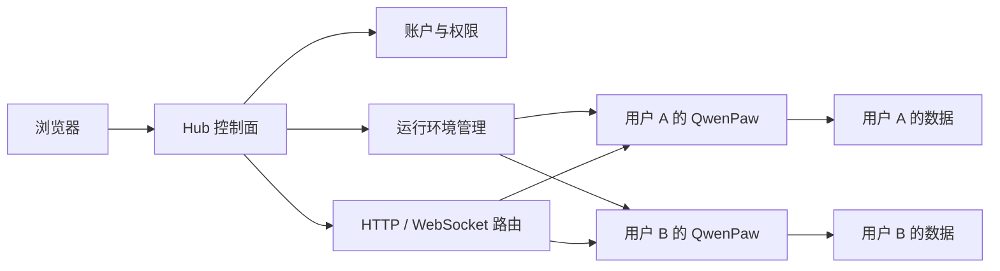

# QwenPaw Hub：在自己的服务器上为团队提供 QwenPaw

从 QwenPaw 2.2.0 开始，非桌面版新增 QwenPaw Hub。你可以通过它在自己的服务器上为团队提供 QwenPaw。

团队成员访问同一个地址并使用各自的账户登录。每个人都有自己的 QwenPaw，工作区、配置、凭据和会话分别保存。管理员则可以在一个管理中心里维护用户和运行环境。

如果你只在自己的电脑上使用 QwenPaw，不需要改变现有方式，继续使用桌面版 App 即可。桌面版是面向个人的 App，不包含 Hub；Hub 服务于服务器上的多用户场景。


## 每个人都有自己的 QwenPaw

过去，如果一个团队想共用服务器上的 QwenPaw，通常需要分别部署和维护多个实例。账户、端口、数据目录和进程都要单独处理，人数增加后很快就会变得难以管理。

Hub 把这些工作收进一个入口：

- 成员使用自己的账户登录；
- 登录后直接进入自己的 QwenPaw Console；
- 文件、模型配置和集成凭据按用户保存；
- 用户无需了解内部端口、容器或服务器目录。

对成员来说，它仍然是熟悉的 QwenPaw。区别只是打开一个团队地址，不再需要每个人自行安装和维护服务。

## Hub 的架构

Hub 由一个控制面和多个用户运行环境组成：



控制面不替用户执行 Agent 任务。它负责验证身份、确定请求属于哪个用户、管理对应运行环境的生命周期，再把 HTTP 和 WebSocket 请求转发给那个环境。模型调用、工具执行、会话和工作区操作仍由用户自己的 QwenPaw 完成。

一次访问大致经过四步：

1. Hub 验证用户登录状态；
2. 根据账户找到其默认运行环境，首次使用时创建记录；
3. Hub 确认环境可用，并在启动策略允许时按管理员设置的 Local 或 Docker 方案启动它；
4. 环境就绪后，Hub 将 Console API 和流式连接代理过去。

无论底层选择 Local 进程还是 Docker 容器，上层的账户、权限和路由方式都相同。因此管理员可以更换运行策略，而用户仍然通过原来的地址进入自己的 QwenPaw。

## 管理员统一管理运行环境

管理员可以创建账户，查看每个人的运行状态，并在需要时停止、重启或禁止某个环境继续启动。团队不再需要靠服务器进程列表判断“谁的 QwenPaw 出了问题”。

Hub 提供 Local 和 Docker 两种运行方式：

- **Local** 直接使用宿主机上的 QwenPaw 和 Python 环境，适合快速部署；
- **Docker** 为每个用户运行一个容器，便于统一镜像并限制 CPU、内存和进程数。

运行方式、Docker 镜像和资源限制由管理员统一设置，普通用户不需要做基础设施选择。


## 控制数据与用户数据分开保存

Hub 的控制数据库保存账户、系统配置、运行环境记录和管理操作。凭据库保存系统密钥以及按用户隔离的模型和集成凭据。每个用户另有独立的工作区、私密配置、备份和日志目录。

使用 Docker 时，用户目录仍保存在宿主机上，再挂载到对应容器中。容器本身不是用户数据的唯一副本。

因此，停止、重启、重建容器或切换运行方式都不会删除用户数据。管理员也可以对 Hub 的数据库、凭据和用户目录进行统一备份。

服务器和备份仍然由部署者控制。团队成员应只登录自己或可信组织运营的 Hub，不应把第三方 Hub 当作由 QwenPaw 团队托管的云服务。

## 为团队访问而设计

Hub 可以放在团队现有的 HTTPS 入口之后，并提供账户管理、自助注册开关、登录与注册限流、IP 黑名单和管理操作记录。

当用户连接 OpenRouter、MCP 等需要浏览器授权的服务时，Hub 也会使用公开访问地址生成回调链接，并把结果转回对应用户的 QwenPaw。

对于内部团队，推荐关闭自助注册，由管理员创建账户；对外开放时，则应同时配置 HTTPS、访问限制、日志监控和定期备份。

## Hub 的隔离边界

Hub 会分开保存不同用户的数据、凭据和运行进程，但不会为每个用户提供一台独立虚拟机。

Local 环境共享宿主机内核，Docker 环境共享 Docker Engine 使用的 Linux 内核。它适合可信团队的自托管协作；如果用户彼此不信任，或需要运行高风险代码，还应使用独立虚拟机、MicroVM 或专用节点提供更强的隔离。

## 开始使用

QwenPaw Hub 从 2.2.0 版本开始在非桌面版中提供。通过 Python 包升级并安装 Hub 可选依赖：

```bash
pip install -U "qwenpaw[hub]"
```

然后在本机启动：

```bash
qwenpaw hub --host 127.0.0.1 --port 8000
```

第一个注册的账户会成为管理员。完成初始化后，就可以选择 Local 或 Docker、创建团队账户，并通过 HTTPS 反向代理提供访问。

完整步骤见 [QwenPaw Hub 使用文档](/docs/hub)。
