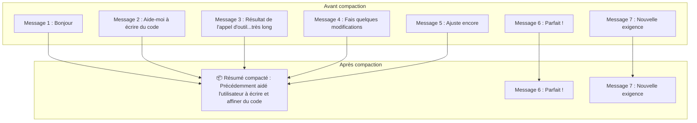
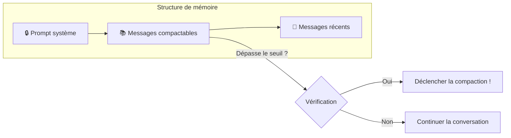
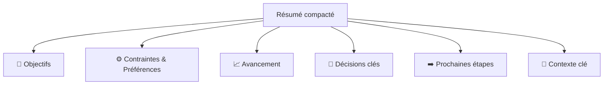

# Compaction

## Contexte : Pourquoi avons-nous besoin de la compaction ?

Imaginez la fenêtre de contexte du LLM comme un **sac à dos à capacité limitée** 🎒. À chaque tour de conversation, chaque résultat d'appel d'outil ajoute quelque chose dans le sac à dos. Au fur et à mesure que la conversation avance, le sac se remplit de plus en plus...


Que se passe-t-il quand le sac à dos est plein ?

- 🚫 **Conversation interrompue** - Impossible de continuer l'échange
- 📉 **Dégradation de la qualité** - L'IA commence à « oublier »
- ❌ **Erreurs API** - Échec complet

**La compaction** est la magie qui vous aide à « ranger votre sac à dos » ✨ — en compressant les anciens éléments dans une petite boîte (résumé), libérant de la place pour les nouvelles choses !

## Qu'est-ce que la compaction ?

La compaction, c'est comme rédiger un **compte-rendu de réunion** : condenser une longue discussion en points clés, tout en laissant le contenu récent de la conversation intact.



Après compaction, les requêtes suivantes utilisent :

- 📦 **Résumé compacté** (remplaçant les anciens messages)
- 💬 **Messages récents** (conservés tels quels)

Le résumé compacté est persisté, vous n'avez donc pas à craindre de le perdre !

> Le mécanisme de compaction est inspiré d'[OpenClaw](https://github.com/openclaw/openclaw) et implémenté par [ReMe](https://github.com/agentscope-ai/ReMe).

## Configuration

### Variables d'environnement

| Variable d'environnement               | Défaut   | Description                                                                      |
| -------------------------------------- | -------- | -------------------------------------------------------------------------------- |
| `COPAW_MEMORY_COMPACT_THRESHOLD`       | `100000` | Seuil de tokens qui déclenche la compaction automatique (ligne d'avertissement)  |
| `COPAW_MEMORY_COMPACT_KEEP_RECENT`     | `3`      | Nombre de messages récents à conserver après compaction                          |
| `COPAW_MEMORY_COMPACT_RATIO`           | `0.7`    | Ratio de seuil pour déclencher la compaction (relatif à la fenêtre de contexte)  |

## Quand la compaction se déclenche-t-elle ?

CoPaw offre deux modes de compaction : **automatique** et **manuel** 🚗

### 1. 🤖 Compaction automatique (quand on approche du seuil de contexte)

CoPaw agit comme un majordome attentionné, vérifiant combien d'espace reste dans le « sac à dos » avant chaque tour de conversation. Lorsque le nombre de tokens des messages compactables dépasse le seuil, il range automatiquement pour vous !

**Diagramme de la structure de mémoire :**



| Zone                          | Description                    | Traitement                                                                                |
| ----------------------------- | ------------------------------ | ----------------------------------------------------------------------------------------- |
| 🔒 **Prompt système**         | Le « guide de persona » de l'IA | Toujours conservé, jamais compacté                                                       |
| 📚 **Messages compactables**  | Journal de conversation historique | Nombre de tokens calculé ; compacté en résumé quand le seuil est dépassé             |
| 💬 **Messages récents**       | Derniers N messages             | Conservés tels quels (N configuré par `KEEP_RECENT`)                                     |

### 2. 🎮 Compaction manuelle (commande /compact)

Parfois vous voulez proactivement « vider votre sac à dos » ? Pas de problème ! Envoyez la formule magique :

```bash
/compact
```

Après exécution, vous verrez une réponse comme celle-ci :

```text
**Compaction terminée !**

- Messages compactés : 12
**Résumé compressé :**
<contenu du résumé compacté>
- Tâche de résumé démarrée en arrière-plan
```

Détail de la réponse :

- 📊 **Messages compactés** - Combien de messages ont été compactés
- 📝 **Résumé compressé** - Le contenu du résumé généré
- ⏳ **Tâche de résumé** - Une tâche en arrière-plan démarre également pour stocker le résumé dans la mémoire à long terme

## Contenu de la compaction : Que contient le résumé ?

Le résumé compacté ressemble à un **document de passation de projet**, contenant toutes les informations clés nécessaires pour continuer le travail :



| Section                          | Contenu                                   | Exemple                                                  |
| -------------------------------- | ----------------------------------------- | -------------------------------------------------------- |
| 🎯 **Objectifs**                 | Ce que l'utilisateur veut accomplir       | « Construire un système de connexion utilisateur »       |
| ⚙️ **Contraintes & Préférences** | Exigences mentionnées par l'utilisateur   | « Utiliser TypeScript, sans framework »                  |
| 📈 **Avancement**                | Tâches terminées / en cours / bloquées    | « API de connexion terminée, API d'inscription en cours » |
| 🔑 **Décisions clés**            | Décisions prises et leur raisonnement     | « Choix de JWT plutôt que Sessions pour la sans-état »   |
| ➡️ **Prochaines étapes**         | Quoi faire ensuite                        | « Implémenter la fonctionnalité de réinitialisation du mot de passe » |
| 📌 **Contexte clé**              | Données nécessaires pour continuer        | « Le fichier principal est à src/auth.ts »               |

> 💡 **Conseil** : La compaction préserve les chemins de fichiers exacts, les noms de fonctions et les messages d'erreur, garantissant que l'IA ne « perd pas la mémoire » et que les transitions de contexte se font en douceur !
