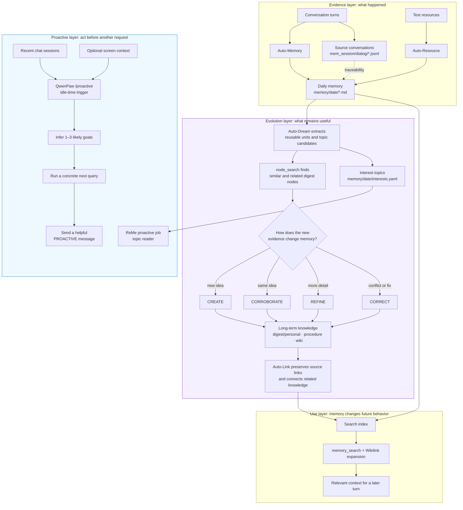
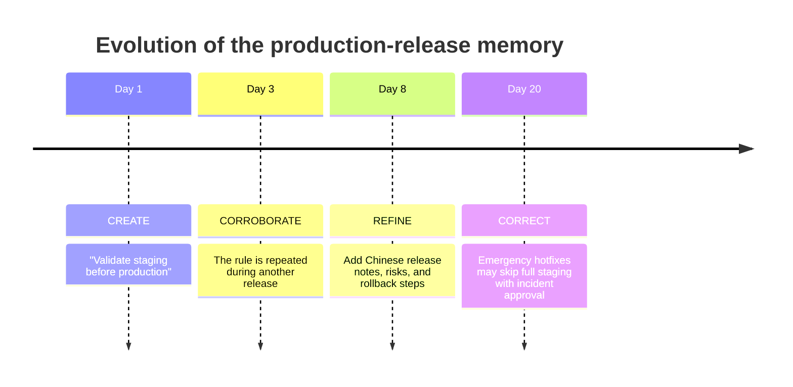
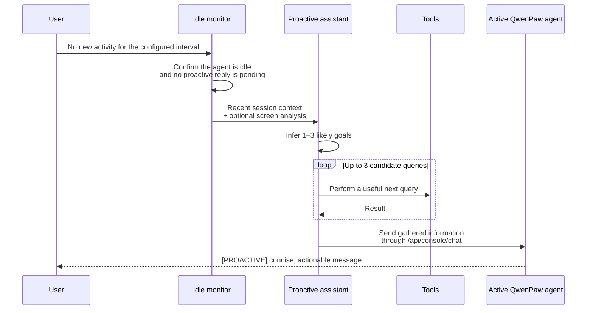

# Memory Evolution and Proactive Interaction (Beta)

> This page focuses on two questions: **how memory improves itself over time**, and **how QwenPaw can act before the user asks again**. For memory directories, configuration, capture, and search basics, see [Long-Term Memory](./memory).

QwenPaw does not treat memory as a growing transcript. Recent events remain as evidence, while Auto-Dream continually turns that evidence into reusable knowledge: it finds an existing idea, decides how new evidence changes it, updates the idea, and preserves links to its sources. Proactive interaction is the next step—using current activity to identify a useful next action and bring it to the user at the right time.

## The Big Picture



There are two important loops:

- The **evolution loop** runs from daily evidence to durable `digest/` knowledge and then back into later conversations through retrieval.
- The **proactive loop** watches for an appropriate moment, infers what may help next, does preparatory work, and starts a new interaction.

These loops are related conceptually but are not fully connected in the current implementation. In particular, QwenPaw's `/proactive` command reads recent sessions and optional screen context; it does **not** currently read Auto-Dream's `interests.yaml` or `digest/` directly.

## What “Self-Evolving” Means

A static memory system can only append or retrieve. An evolving memory system must also decide what new evidence means for knowledge it already has.

Auto-Dream processes changed daily notes and compares each reusable unit with existing `digest/` nodes. It then applies one of four semantic updates:

| Action        | Effect on the knowledge base                                                | Typical signal                                          |
| ------------- | --------------------------------------------------------------------------- | ------------------------------------------------------- |
| `CREATE`      | Creates a durable node because no equivalent idea exists                    | A new preference, procedure, fact, or principle         |
| `CORROBORATE` | Keeps the existing conclusion and adds supporting evidence                  | The same preference or practice appears again           |
| `REFINE`      | Makes a node more precise by adding scope, steps, conditions, or exceptions | A later conversation fills in missing detail            |
| `CORRECT`     | Revises a stale or conflicting conclusion while retaining provenance        | The user changes a decision or corrects an earlier fact |

This makes `digest/` a maintained model of the user and their work, not a pile of summaries. Daily notes stay as the historical record; long-term nodes can become more confident, more specific, or more accurate.

### Why links matter

Every evolution also strengthens the graph around the knowledge:

- **Source links** connect a conclusion to the daily notes that support or changed it.
- **Relationship links** connect preferences, procedures, projects, and concepts that should be recalled together.
- Existing links are preserved when a node is updated, so a correction does not erase its history.

The result is both usable and auditable: retrieval can expand from one matching node to related context, while a person can follow the links back to the evidence.

## Example: A Release Process Learns Over Time

Suppose a team discusses releases across several days. Auto-Memory records each conversation as daily evidence; Auto-Dream evolves one long-term procedure instead of creating four near-duplicate summaries.



After Day 1, Auto-Dream may create:

```markdown
---
name: Production release procedure
description: Validate staging before every production release.
---

# Production release

1. Validate the release in staging.
2. Proceed to production only after validation passes.

## Sources

- [[memory/2026-08-01/release-planning.md]]
```

By Day 20, the same node can have evolved into:

```markdown
---
name: Production release procedure
description: Standard releases require staging validation; emergency hotfixes use an approved exception path.
---

# Production release

## Standard path

1. Validate the release in staging.
2. Write release notes in Chinese, including risks and rollback steps.
3. Proceed only after validation passes.

## Emergency hotfix exception

A full staging run may be skipped only with incident-lead approval. Record the reason and run the omitted checks afterward.

relates_to:: [[digest/personal/release-communication-preference.md]]
depends_on:: [[digest/procedure/rollback-verification.md]]

## Sources

- [[memory/2026-08-01/release-planning.md]]
- [[memory/2026-08-03/release-review.md]]
- [[memory/2026-08-08/release-notes.md]]
- [[memory/2026-08-20/hotfix-retrospective.md]]
```

The important change is not the extra text. It is the accumulated judgment:

1. repetition increases confidence without creating another node;
2. new detail becomes an executable procedure;
3. an apparent contradiction becomes a scoped exception rather than silently overwriting the old rule;
4. source and relationship links make the final procedure explainable and easier to retrieve.

On a later release request, `memory_search` can retrieve this procedure and expand its links, giving the Agent the communication preference and rollback verification context together.

## From Evolution to Interest Topics

During the same Auto-Dream run, recent evidence can also produce a small set of non-repetitive interest topics in `memory/<date>/interests.yaml`. A topic contains a title, a reason, evidence, keywords, and relevant paths. For the release example, one topic might be:

```yaml
- title: Verify the emergency rollback path
  reason: The hotfix exception was added, but the follow-up checks are not yet documented.
  evidence:
    - Emergency staging bypass discussed in the hotfix retrospective.
  keywords: [hotfix, rollback, release]
  paths:
    - memory/2026-08-20/hotfix-retrospective.md
```

ReMe exposes a low-level `proactive` job that reads this file and returns its metadata and, optionally, its raw content. This makes interest topics available to integrations. If the file does not exist, the job returns a normal skipped result.

## Proactive Interaction in QwenPaw

QwenPaw's user-facing proactive mode is enabled per session:

```text
/proactive           # enable; trigger after 30 minutes of inactivity
/proactive on        # same as above
/proactive 45        # use a 45-minute idle threshold
/proactive off       # stop proactive monitoring
```

Once enabled, the runtime follows this sequence:



The monitor checks every 30 seconds. When the configured idle threshold is reached, it uses sessions updated in the last seven days; if fewer than five match, it falls back to the latest five sessions. It considers up to 100 recent text messages with a 50,000-character cap. If the active model supports multimodal input, it may also capture and analyze the current desktop.

The proactive assistant infers one to three likely goals, attempts concrete queries for up to three candidates, and stops after the first successful result. If the user becomes active while this work is running, the attempt is interrupted. It also avoids sending another proactive message while the previous `[PROACTIVE]` message remains unanswered.

### Example proactive message

Assume recent chats show that a production release is approaching and the team has repeatedly discussed rollback risk. After the idle threshold, the proactive assistant might check the repository for the current rollback checklist and send:

```text
[PROACTIVE] I noticed the production release is approaching. The current checklist
covers staging validation and rollback ownership, but it does not include the
post-hotfix verification step discussed in the retrospective. Would you like me
to add that step to the release checklist?
```

This example illustrates the current boundary precisely: the trigger and task inference come from recent chat activity (and possibly the screen), even if Auto-Dream independently produced a similar interest topic.

### Privacy and safety boundary

Proactive mode can read historical session context, may take a desktop screenshot when multimodal analysis is available, and initializes its own tool-enabled assistant. The `/proactive` command warns that this assistant bypasses normal tool-protection mechanisms. Enable it only when that access is appropriate, and use `/proactive off` to stop the in-memory monitoring task.

In short: Auto-Dream makes memory better over time; `memory_search` lets future conversations benefit from that evolution; and `/proactive` decides when recent activity justifies doing useful work before the next request.
