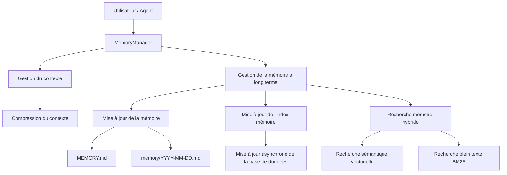
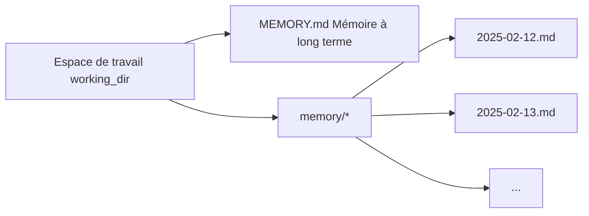
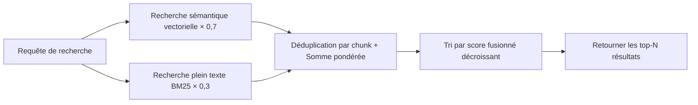

# Mémoire

La **Mémoire** donne à CoPAW une mémoire persistante à travers les conversations : il gère automatiquement la fenêtre de contexte et écrit les informations clés dans des fichiers pour le stockage à long terme.

Le système de mémoire fournit deux capacités principales :

- **Gestion du contexte** — Compresse automatiquement les conversations en résumés concis avant que la fenêtre de contexte ne déborde
- **Gestion de la mémoire à long terme** — Écrit les informations clés dans des fichiers Markdown via des outils de fichiers, avec recherche sémantique pour rappel à tout moment

> La conception de la mémoire est inspirée de l'architecture mémoire d'[OpenClaw](https://github.com/openclaw/openclaw) et implémentée par [ReMe](https://github.com/agentscope-ai/ReMe).

---

## Vue d'ensemble de l'architecture



La gestion de la mémoire à long terme comprend les capacités suivantes :

| Capacité                  | Description                                                                                                                        |
| ------------------------- | ---------------------------------------------------------------------------------------------------------------------------------- |
| **Persistance mémoire**   | Écrit les informations clés dans des fichiers Markdown via des outils de fichiers (`read` / `write` / `edit`) ; les fichiers sont la source de vérité |
| **Surveillance de fichiers** | Surveille les changements de fichiers via `watchfile`, mettant à jour de façon asynchrone la base de données locale (index sémantique & index vectoriel) |
| **Recherche sémantique**  | Rappelle les mémoires pertinentes par sémantique en utilisant des embeddings vectoriels + recherche hybride BM25                   |
| **Lecture de fichiers**   | Lit directement les fichiers Markdown de mémoire correspondants via des outils de fichiers, chargement à la demande pour garder le contexte léger |

---

## Structure des fichiers mémoire

Les mémoires sont stockées comme des fichiers Markdown simples, exploités directement par l'Agent via des outils de fichiers. L'espace de travail par défaut utilise une structure à deux niveaux :



### MEMORY.md (Mémoire à long terme, optionnel)

Stocke les informations clés durables qui changent rarement.

- **Emplacement** : `{working_dir}/MEMORY.md`
- **Objectif** : Stocker les décisions, préférences et faits persistants
- **Mises à jour** : Écrit par l'Agent via les outils de fichiers `write` / `edit`

### memory/YYYY-MM-DD.md (Journal quotidien)

Une page par jour, complétée avec le travail et les interactions du jour.

- **Emplacement** : `{working_dir}/memory/YYYY-MM-DD.md`
- **Objectif** : Enregistrer les notes quotidiennes et le contexte runtime
- **Mises à jour** : Ajouté par l'Agent via les outils de fichiers `write` / `edit` ; déclenché automatiquement quand les conversations deviennent trop longues et nécessitent une synthèse

### Quand écrire en mémoire ?

| Type d'information                          | Cible d'écriture           | Méthode                          | Exemple                                                                                               |
| ------------------------------------------- | -------------------------- | -------------------------------- | ----------------------------------------------------------------------------------------------------- |
| Décisions, préférences, faits persistants   | `MEMORY.md`                | Outils `write` / `edit`          | « Le projet utilise Python 3.12 », « Préfère le framework pytest »                                    |
| Notes quotidiennes, contexte runtime        | `memory/YYYY-MM-DD.md`     | Outils `write` / `edit`          | « Bug de connexion corrigé aujourd'hui », « Déployé v2.1 »                                            |
| Résumé automatique lors du débordement de contexte | `memory/YYYY-MM-DD.md` | Déclenché automatiquement (`summary_memory`) | Quand les tokens de contexte dépassent le seuil, le système écrit automatiquement un résumé de conversation dans le journal |
| L'utilisateur dit « souviens-toi de ça »   | Écrire dans le fichier immédiatement | Outil `write`            | Ne sauvegardez pas uniquement en mémoire !                                                            |

---

## Configuration de la mémoire

### Configuration LLM

Les paramètres LLM du gestionnaire de mémoire sont cohérents avec la configuration globale, lisant automatiquement la config LLM active (`api_key`, `base_url`, `model`) depuis `providers.json`. La langue des prompts liés à la mémoire suit également le champ `agents.language` dans `config.json` (`zh` = chinois, sinon anglais).

### Configuration de l'embedding

Configurez le service Embedding via les variables d'environnement suivantes pour la recherche sémantique vectorielle :

| Variable d'environnement      | Description                                                    | Défaut                                               |
| ----------------------------- | -------------------------------------------------------------- | ---------------------------------------------------- |
| `EMBEDDING_API_KEY`           | Clé API pour le service Embedding                              | (vide ; la recherche vectorielle est désactivée si non configurée) |
| `EMBEDDING_BASE_URL`          | URL du service Embedding                                       | `https://dashscope.aliyuncs.com/compatible-mode/v1`  |
| `EMBEDDING_MODEL_NAME`        | Nom du modèle d'embedding                                      | `text-embedding-v4`                                  |
| `EMBEDDING_DIMENSIONS`        | Dimensions vectorielles pour l'initialisation de la base vectorielle | `1024`                                          |
| `EMBEDDING_CACHE_ENABLED`     | Activer le cache d'embedding                                   | `true`                                               |
| `EMBEDDING_MAX_CACHE_SIZE`    | Nombre maximum d'entrées dans le cache d'embedding             | `2000`                                               |
| `EMBEDDING_MAX_INPUT_LENGTH`  | Longueur maximale d'entrée par requête d'embedding             | `8192`                                               |
| `EMBEDDING_MAX_BATCH_SIZE`    | Taille maximale de lot pour les requêtes d'embedding           | `10`                                                 |

### Configuration du mode de recherche

| Variable d'environnement | Description                                    | Défaut |
| ------------------------ | ---------------------------------------------- | ------ |
| `FTS_ENABLED`            | Activer la recherche plein texte BM25          | `true` |

**Comportement du mode de recherche :**

| Recherche vectorielle (`EMBEDDING_API_KEY` configuré) | Recherche plein texte (`FTS_ENABLED=true`) | Mode de recherche effectif                                              |
| :---------------------------------------------------: | :----------------------------------------: | :---------------------------------------------------------------------: |
|                          ✅                           |                    ✅                      | Recherche hybride vectorielle + BM25 (recommandé, meilleurs résultats)  |
|                          ✅                           |                    ❌                      | Recherche sémantique vectorielle uniquement                             |
|                          ❌                           |                    ✅                      | Recherche plein texte BM25 uniquement (mauvais résultats dans certains scénarios) |
|                          ❌                           |                    ❌                      | ⚠️ **Non autorisé** — au moins un mode de recherche doit être activé   |

> **Recommandé** : Configurez `EMBEDDING_API_KEY` et gardez `FTS_ENABLED=true` pour utiliser la recherche hybride Vectorielle + BM25 pour un rappel optimal.

### Base de données sous-jacente

Configurez le backend de stockage mémoire via la variable d'environnement `MEMORY_STORE_BACKEND` :

| Variable d'environnement | Description                                                    | Défaut |
| ------------------------ | -------------------------------------------------------------- | ------ |
| `MEMORY_STORE_BACKEND`   | Backend de stockage mémoire : `auto`, `local`, `chroma` ou `sqlite` | `auto` |

**Options de backend de stockage :**

| Backend  | Description                                                                                      |
| -------- | ------------------------------------------------------------------------------------------------ |
| `auto`   | Sélection automatique : utilise `local` sur Windows, `chroma` sur les autres systèmes           |
| `local`  | Stockage local de fichiers, pas de dépendances supplémentaires, meilleure compatibilité          |
| `chroma` | Base de données vectorielle Chroma, supporte la récupération vectorielle efficace ; peut planter sur certains environnements Windows |
| `sqlite` | Base de données SQLite + extension vectorielle ; peut se bloquer ou planter sur macOS 14 et inférieur |

> **Recommandé** : Utilisez le mode `auto` par défaut, qui sélectionne automatiquement le backend le plus stable pour votre plateforme.

---

## Recherche dans la mémoire

L'Agent dispose de deux façons de récupérer les mémoires passées :

| Méthode           | Outil           | Cas d'usage                                                         | Exemple                                          |
| ----------------- | --------------- | ------------------------------------------------------------------- | ------------------------------------------------ |
| Recherche sémantique | `memory_search` | Incertain du fichier contenant l'info ; rappel flou par intention | « Discussion précédente sur le processus de déploiement » |
| Lecture directe   | `read_file`     | Date ou chemin de fichier spécifique connus ; recherche précise    | Lire `memory/2025-02-13.md`                      |

---

## Explication de la recherche hybride

La recherche mémoire utilise par défaut la **recherche hybride Vectorielle + BM25**. Les deux méthodes de recherche se complètent mutuellement.

### Recherche sémantique vectorielle

Projette le texte dans un espace vectoriel de haute dimension et mesure la distance sémantique via la similarité cosinus, capturant le contenu ayant une signification similaire mais une formulation différente :

| Requête                                     | Mémoire rappelée                                        | Pourquoi ça correspond                                                     |
| ------------------------------------------- | ------------------------------------------------------- | -------------------------------------------------------------------------- |
| « Choix de base de données pour le projet » | « Finalement décidé de remplacer MySQL par PostgreSQL » | Lié sémantiquement : tous deux discutent des choix de technologie de BDD   |
| « Comment réduire les reconstructions inutiles » | « Configuré la compilation incrémentale pour éviter les builds complets » | Équivalence sémantique : réduire les reconstructions ≈ compilation incrémentale |
| « Problème de performance discuté la dernière fois » | « Optimisé la latence P99 de 800ms à 200ms » | Association sémantique : problème de performance ≈ optimisation de latence |

Cependant, la recherche vectorielle est plus faible sur les **tokens précis à fort signal**, car les modèles d'embedding tendent à capturer la sémantique globale plutôt que les correspondances exactes de tokens individuels.

### Recherche plein texte BM25

Basée sur les statistiques de fréquence des termes pour la correspondance de sous-chaînes, excellente pour les hits de tokens précis, mais plus faible en compréhension sémantique (synonymes, reformulation).

| Requête                    | Hits BM25                                          | Ratés BM25                                            |
| -------------------------- | -------------------------------------------------- | ----------------------------------------------------- |
| `handleWebSocketReconnect` | Fragments de mémoire contenant ce nom de fonction  | « Logique de gestion de la reconnexion WebSocket » |
| `ECONNREFUSED`             | Entrées de log contenant ce code d'erreur          | « Connexion à la base de données refusée »            |

**Logique de scoring** : Divise la requête en termes, compte le ratio de hits de chaque terme dans le texte cible, et accorde un bonus pour les correspondances de phrase complète :

```
base_score = termes_touchés / total_termes_requête           # plage [0, 1]
phrase_bonus = 0.2 (seulement quand la requête multi-mots correspond à la phrase complète)
score = min(1.0, base_score + phrase_bonus)                   # plafonné à 1.0
```

Exemple : Requête `"délai de connexion base de données"` touche un passage contenant seulement "base de données" et "délai" → `base_score = 2/3 ≈ 0,67`, pas de correspondance de phrase complète → `score = 0,67`

> Pour gérer le comportement `$contains` sensible à la casse de ChromaDB, la recherche génère automatiquement plusieurs variantes de casse pour chaque terme (original, minuscules, capitalisé, majuscules) pour améliorer le rappel.

### Fusion de la recherche hybride

Utilise simultanément les signaux de rappel vectoriel et BM25, effectuant une **fusion pondérée** sur les résultats (poids vectoriel par défaut `0.7`, poids BM25 `0.3`) :

1. **Élargir le pool de candidats** : Multiplier le nombre de résultats souhaité par `candidate_multiplier` (par défaut 3×, plafonné à 200) ; chaque chemin récupère plus de candidats indépendamment
2. **Scoring indépendant** : Vectoriel et BM25 retournent chacun des listes de résultats scorés
3. **Fusion pondérée** : Déduplication et fusion par identifiant unique du chunk (`path + start_line + end_line`)
   - Rappelé uniquement par vectoriel → `score_final = score_vectoriel × 0,7`
   - Rappelé uniquement par BM25 → `score_final = score_bm25 × 0,3`
   - **Rappelé par les deux** → `score_final = score_vectoriel × 0,7 + score_bm25 × 0,3`
4. **Tri et troncature** : Trier par `score_final` décroissant, retourner les top-N résultats

**Exemple** : Requête `"handleWebSocketReconnect déconnexion reconnexion"`

| Fragment de mémoire                                                           | Score vectoriel | Score BM25 | Score fusionné                      | Rang |
| ----------------------------------------------------------------------------- | --------------- | ---------- | ----------------------------------- | ---- |
| « handleWebSocketReconnect gère la déconnexion et reconnexion WebSocket »     | 0,85            | 1,0        | 0,85×0,7 + 1,0×0,3 = **0,895**     | 1    |
| « Logique de nouvelle tentative automatique après déconnexion réseau »        | 0,78            | 0,0        | 0,78×0,7 = **0,546**               | 2    |
| « Exception de pointeur nul corrigée dans handleWebSocketReconnect »          | 0,40            | 0,5        | 0,40×0,7 + 0,5×0,3 = **0,430**     | 3    |



> **Résumé** : Utiliser une seule méthode de recherche a des angles morts. La recherche hybride permet aux deux signaux de se compléter, offrant un rappel fiable que vous posiez votre question en langage naturel ou recherchiez des termes exacts.

---

## Pages associées

- [Introduction](./intro.fr.md) — Ce que ce projet peut faire
- [Console](./console.fr.md) — Gérer la mémoire et la configuration dans la console
- [Skills](./skills.fr.md) — Capacités intégrées et personnalisées
- [Configuration & Répertoire de travail](./config.fr.md) — Répertoire de travail et configuration
